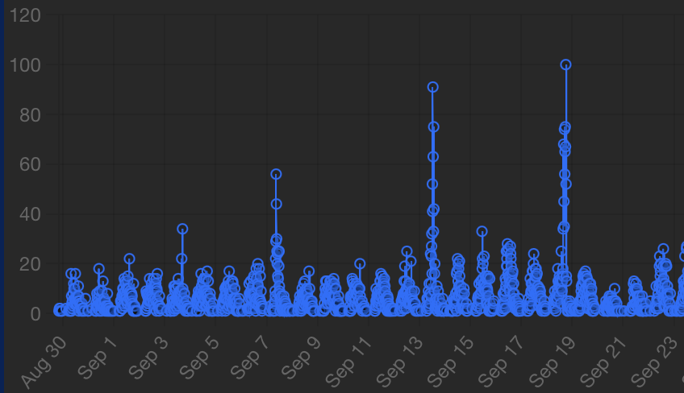

---
execute:
  echo: false
jupyter: mas2901
---

```{ojs}
// Global helpers (no theme logic needed)
ACCENT  = "var(--brand-teal)"
ACCENT2 = "var(--brand-red)"
GRID    = "var(--border)"

// Numerical helpers
linspace = (a, b, n=401) => Array.from({length:n}, (_,i)=> a + (b-a)*(i/(n-1)))

// Log-Gamma (Lanczos) and friends (for stable PMFs/PDFs)
function logGamma(z){
  const g = 7;
  const p = [
    0.99999999999980993, 676.5203681218851, -1259.1392167224028,
    771.32342877765313, -176.61502916214059, 12.507343278686905,
    -0.13857109526572012, 9.9843695780195716e-6, 1.5056327351493116e-7
  ];
  if(z < 0.5){
    return Math.log(Math.PI) - Math.log(Math.sin(Math.PI*z)) - logGamma(1 - z);
  }
  z -= 1;
  let x = p[0];
  for(let i=1; i<p.length; i++) x += p[i] / (z + i);
  const t = z + g + 0.5;
  return 0.5*Math.log(2*Math.PI) + (z+0.5)*Math.log(t) - t + Math.log(x);
}

logChoose = (n,k) => logGamma(n+1) - logGamma(k+1) - logGamma(n-k+1)

// Discrete PMFs (stable in log-domain)
binomPMF = (n,p,k) => Math.exp(logChoose(n,k) + k*Math.log(p) + (n-k)*Math.log(1-p))
poisPMF  = (lambda,k) => Math.exp(k*Math.log(lambda) - lambda - logGamma(k+1))
geomPMF1 = (p,k) => p * Math.pow(1-p, k-1) // support {1,2,...}
negbinPMF = (r,p,x) => {
  if(x < r) return 0;
  return Math.exp(logChoose(x-1, r-1) + r*Math.log(p) + (x-r)*Math.log(1-p));
}

// Continuous PDFs
normPDF = (x,mu,sig) => Math.exp(-0.5*((x-mu)/sig)**2)/(sig*Math.sqrt(2*Math.PI))
lognormPDF = (x,mu,sig) => x<=0 ? 0 : Math.exp(-((Math.log(x)-mu)**2)/(2*sig*sig)) / (x*sig*Math.sqrt(2*Math.PI))
unifPDF = (x,a,b) => (x>a && x<b) ? 1/(b-a) : 0
expPDF = (x,lambda) => x>0 ? lambda*Math.exp(-lambda*x) : 0
gammaPDF = (x,a,b) => { // shape a, rate b
  if(x<=0) return 0;
  return Math.exp(a*Math.log(b) - logGamma(a) + (a-1)*Math.log(x) - b*x)
}
betaPDF = (x,a,b) => {
  if(x<=0 || x>=1) return 0;
  const logB = logGamma(a)+logGamma(b)-logGamma(a+b);
  return Math.exp((a-1)*Math.log(x) + (b-1)*Math.log(1-x) - logB)
}
chisqPDF = (x,nu) => gammaPDF(x, nu/2, 1/2)
tPDF = (x,nu) => {
  const logC = logGamma((nu+1)/2) - (0.5*Math.log(nu*Math.PI) + logGamma(nu/2));
  return Math.exp(logC - ((nu+1)/2)*Math.log(1 + (x*x)/nu));
}
fPDF = (x,d1,d2) => {
  if(x<=0) return 0;
  const logC = logGamma((d1+d2)/2) - (logGamma(d1/2)+logGamma(d2/2)) + (d1/2)*Math.log(d1/d2);
  return Math.exp(logC + (d1/2 - 1)*Math.log(x) - ((d1+d2)/2)*Math.log(1 + (d1/d2)*x))
}

// Convenient domain heuristics
domainNormal = (mu,sig) => [mu - 4*sig, mu + 4*sig]
domainGamma  = (a,b) => [0, Math.max(5, a/b + 6*Math.sqrt(a)/b)]
domainExp    = (lambda) => [0, Math.max(5, 6/lambda)]
domainBeta   = [0,1]
domainPos    = [0, 10]
```


# Overview of Machine Learning {#sec-overview-of-ml}

::: {.remark #rem-terminology}
### A comment on terminology
Some modules (including MAS2909) introduce the term "distribution" as a synonym for "(cumulative) distribution function", and this is classically how the term "distribution" has been used.

However, in recent decades it has become more common to talk about probability measures as "distributions" and to make statements such as "a random variable $X$ has distribution $P$" (a classical statistician would say "$X$ has law $P$").

In our opinion there are good reasons to prefer the modern terminology (for one, this is almost certainly the terminology that you learned at school), and so in this module we will use "distribution" exclusively to mean "probability measure" throughout.
:::

## What is Machine Learning? {#sec-what-is-ml}

You might be surprised to learn that *machine learning* is not just a buzzword; it is a rich collection of mathematical concepts that can be rigorously studied.

### Tasks

This course focuses mainly on the so-called *supervised learning* task:

::: {.definition #def-supervised-learning-task}
### Supervised Learning Task
Fix sets $\mathcal{X}$, $\mathcal{Y}$, and $\mathcal{Z}$, an (unknown) probability distribution $P$ on $\mathcal{X} \times \mathcal{Y}$, and a loss function $L : \mathcal{Y} \times \mathcal{Z} \rightarrow \mathbb{R}$.
Given a *training dataset* $\{(\mathbf{x}_i,\mathbf{y}_i)\}_{i=1}^n$ consisting of $n$ independent samples from $P$, the *supervised learning* task is to try to find a function $f : \mathcal{X} \rightarrow \mathcal{Z}$ for which 
$$
\mathbb{E}_{(\mathbf{X},\mathbf{Y}) \sim P} [ L(\mathbf{Y},f(\mathbf{X})) ]
$$ 
is minimal.

:::

To unpack this definition we are going to recap some of the prerequisite mathematical concepts, which you should have already studied (mostly we will need MAS2909 or MAS8600):

::: {.recap #recap-set-notation1}
###### Set Notation I
A *set* is a collection of objects, e.g. $\mathbb{N}$ is the set of natural numbers, $\mathbb{N}_0 = \{0\} \cup \mathbb{N}$ is the set of non-negative integers, and $\mathbb{R}$ is the set of real numbers.

Given a pair of sets, say $\mathcal{X}$ and $\mathcal{Y}$, the *Cartesian product* of $\mathcal{X}$ and $\mathcal{Y}$ consists of all (ordered) pairs $(x,y)$ where $x$ is an element of $\mathcal{X}$ and $y$ is an element of $\mathcal{Y}$.

As a shorthand for set membership we can write $x \in \mathcal{X}$ and $y \in \mathcal{Y}$.

The Cartesian product of $\mathcal{X}$ and $\mathcal{Y}$ is denoted $\mathcal{X} \times \mathcal{Y}$.

For example, $\mathbb{R} \times \mathbb{R}$ is the two-dimensional Euclidean plane; we often abbreviate this to $\mathbb{R}^2$.

More generally we could consider $d$-fold Cartesian products such as $\mathbb{R}^d$.
:::

::: {.recap #recap-pmf}
###### Probability mass functions

Let $P$ be a probability distribution on a countable set $\mathcal{X} = \{x_1, x_2, \dots \}$.

Then $P$ is characterised by its *probability mass function* $p : \mathcal{X} \rightarrow [0,\infty)$; indeed, $P$ assigns an amount of probability $P(S) = \sum_{x \in S} p(x)$ to each set subset $S$ of $\mathcal{X}$.

From the definition of a *probability* measure it must hold that $p(\mathcal{X}) = \sum_{x \in \mathcal{X}} p(x) = 1$.
:::

::: {#exm-bernoulli-distribution}
### Bernoulli Distribution
The <span class="xref-no-num">[Bernoulli Distribution @sec-bern]</span> (with **success parameter** $\rho \in [0,1]$) is a probability distribution on $\mathcal{X} = \{0,1\}$ with probability mass function 
$$
p(x) = \rho^x (1-\rho)^{1-x}.
$$
In shorthand, this is denoted $\mathrm{Bern}(\rho)$.
:::

::: {#exm-binomial-distribution}
### Binomial Distribution
The <span class="xref-no-num">[Binomial Distribution @sec-binom]</span> (with $n$ **trials** and **success parameter** $\rho \in [0,1]$) is a probability distribution on $\mathcal{X} = \{0,1,2, \dots , n \}$ with probability mass function 
$$
p(x) = \binom{n}{x} \rho^x (1-\rho)^{n-x}.
$$
In shorthand, this is denoted $\mathrm{Binom}(n,\rho)$.

Intuitively, $X$ has the distribution of the sum of $n$ independent random variables each distributed as $\mathrm{Bern}(\rho)$.

---

```{=html}
<details>
<summary><strong>Show Visualisation</strong></summary>
```

```{ojs}

{
  const n = binom_n, p = binom_p;
  const data = Array.from({ length: n + 1 }, (_, k) => ({ x: k, y: binomPMF(n, p, k) }));
  const xDomain = Array.from({ length: n + 1 }, (_, k) => k);  // <-- 0..n categories

  const stats = md`**Mean** ${tex`= n\rho`} = ${(n * p).toFixed(2)}; 
  **Variance** ${tex`= n\rho(1-\rho)`} = ${(n * p * (1 - p)).toFixed(2)}.`;

  const plot = Plot.plot({
        width, height: 260,
    style: {
    background: "var(--plot-panel-bg)",
    color: "var(--brand-fg)"           // drives 'currentColor'
    },
    y: { label: "PMF" },
    x: { label: "x", type: "band", domain: xDomain, padding: 0.05 },  // <-- band scale
    marks: [
      Plot.barY(data, { x: "x", y: "y", fill: ACCENT }),
      Plot.ruleY([0], { stroke: GRID, strokeOpacity: 0.6 })
    ]
  });

  return html`<div class="dist-panel"><div class="stats">${stats}</div>${plot}</div>`;
}

```

```{ojs}
viewof binom_n = Inputs.range([1, 200], { value: 20, step: 1,  label: md`${tex`n`}` })
viewof binom_p = Inputs.range([0.01, 0.99], { value: 0.3, step: 0.01, label: md`${tex`\rho`}` })
```


```{=html}
</details>
```

:::

::: {#exm-poisson-distribution}
### Poisson Distribution
The <span class="xref-no-num">[Poisson Distribution @sec-pois]</span> (with **rate parameter** $\lambda > 0$) is a probability distribution on $\mathcal{X} = \{0,1,2, \dots \}$ with probability mass function 
$$
p(x) = \frac{ e^{-\lambda} \lambda^x }{ x! } .
$$
In shorthand this is denoted $\mathrm{Pois}(\lambda)$.

---

```{=html}
<details>
<summary><strong>Show Visualisation</strong></summary>
```

```{ojs}

{
  // compute locally (no exported names)
  const L     = pois_lambda;
  const kmax  = Math.max(15, Math.ceil(L + 6*Math.sqrt(L)));
  const pois_data = Array.from({length: kmax + 1}, (_, k) => ({ x: k, y: poisPMF(L, k) }));

  // build the UI bits
  const stats = md`**Mean** ${tex`= \lambda`} = ${L.toFixed(2)}; 
  **Variance** ${tex`= \lambda`} = ${L.toFixed(2)}.`;

  const plot = Plot.plot({
        width, height: 260,
    style: {
    background: "var(--plot-panel-bg)",
    color: "var(--brand-fg)"           // drives 'currentColor'
    },

    y: { label: "PMF" },
    x: { label: "x" },
    marks: [
      Plot.barY(pois_data, { x: "x", y: "y", fill: "var(--brand-teal)" }),
      Plot.ruleY([0], { stroke: "var(--border)", strokeOpacity: 0.6 })
    ]
  });

  // return both in a single wrapper
  return html`<div class="dist-panel">
    <div class="stats">${stats}</div>
    ${plot}
  </div>`;
}
```

```{ojs}
viewof pois_lambda = Inputs.range([0.2, 30], {
  value: 6, step: 0.2, label: md`${tex`\lambda`}`
})
```

```{=html}
</details>
```

:::

::: {.recap #recap-set-notation2}
###### Set Notation II
If a set $\mathcal{X}$ is contained in another set $\mathcal{Y}$ we write $\mathcal{X} \subset \mathcal{Y}$.

In this case, the *indicator function* of the set $\mathcal{X}$ is the function $1_{\mathcal{X}} : \mathcal{Y} \rightarrow \{0,1\}$ for which $f_{\mathcal{X}}(y) = 1$ if and only if $y \in \mathcal{X}$.

For example, $1_{[0,1]}(x)$ is equal to $1$ when $0 \leq x \leq 1$ and equal to $0$ if $x$ lies outside $[0,1]$.
:::

::: {.recap #recap-pdf}
###### Probability Density Function
Let $P$ be a sufficiently regular[^absolutely-continuous] probability distribution on $\mathbb{R}^d$.

Then $P$ is characterised by its **probability density function** 
$$
p : \mathbb{R}^d \rightarrow [0,\infty).
$$
Indeed, $P$ assigns an amount of probability $P(S) = \int 1_S(\mathbf{x}) p(\mathbf{x}) \; \mathrm{d}\mathbf{x}$ to each set $S \subset \mathbb{R}^d$.

From the definition of a **probability measure** it must hold that $\int p(\mathbf{x}) \; \mathrm{d}\mathbf{x} = 1$.
:::


::: {#exm-uniform-distribution}
### Uniform Distribution
The <span class="xref-no-num">[Uniform Distribution @sec-unif]</span> on an interval $[a,b]$ with $a < b$ has probability density function 
$$
p(x) = \frac{1}{b-a} 1_{[a,b]}(x).
$$
In shorthand this is denoted $\mathcal{U}(a,b)$. 

---

```{=html}
<details>
<summary><strong>Show Visualisation</strong></summary>
```

```{ojs}

{
  const a = unif_a, b = unif_b;
  const data = linspace(a - 1, b + 1, 401).map(x => ({ x, y: unifPDF(x, a, b) }));

  const stats = md`**Mean** ${tex`= (a+b)/2`} = ${(((a+b)/2)).toFixed(2)}; 
  **Variance** ${tex`= (b-a)^2/12`} = ${(((b-a)**2)/12).toFixed(3)}.`;

  const plot = Plot.plot({
        width, height: 260,
    style: {
    background: "var(--plot-panel-bg)",
    color: "var(--brand-fg)"           // drives 'currentColor'
    },
 y: { label: "PDF" }, x: { label: "x" },
    marks: [
      Plot.lineY(data, { x: "x", y: "y", stroke: ACCENT, strokeWidth: 2 }),
      Plot.areaY(data, { x: "x", y: "y", fill: ACCENT, fillOpacity: 0.18 }),
      Plot.ruleY([0], { stroke: GRID, strokeOpacity: 0.6 })
    ]
  });

  return html`<div class="dist-panel"><div class="stats">${stats}</div>${plot}</div>`;
}
```

```{ojs}
viewof unif_a = Inputs.range([-5, 5], {value: -2, step: 0.1, label: md`${tex`a`}`})
viewof unif_b = Inputs.range([unif_a + 0.2, unif_a + 10], {value: 3, step: 0.1, label: md`${tex`b`}`})
```

```{=html}
</details>
```

:::


::: {#exm-normal-distribution}
### Normal Distribution on $\mathbb{R}$
The <span class="xref-no-num">[Normal Distribution @sec-normal]</span> (with *mean* parameter $\mu \in \mathbb{R}$ and *standard deviation* parameter $\sigma > 0$) has probability density function 
$$
p(x) = \frac{1}{\sqrt{2 \pi \sigma^2}} \exp\left( - \frac{1}{2 \sigma^2} (x-\mu)^2 \right). 
$$
In shorthand this is denoted $\mathcal{N}(\mu,\sigma^2)$.

---

```{=html}
<details>
<summary><strong>Show Visualisation</strong></summary>
```


```{ojs}
{
  const μ = norm_mu, σ = norm_sig;
  const [lo, hi] = domainNormal(μ, σ);
  const data = linspace(lo, hi).map(x => ({ x, y: normPDF(x, μ, σ) }));

  const stats = md`**Mean** ${tex`= \mu`} = ${μ.toFixed(2)}; 
  **Variance** ${tex`= \sigma^2`} = ${(σ**2).toFixed(2)}.`;

  const plot = Plot.plot({
    width, height: 260,
    style: { background: "var(--plot-panel-bg)", color: "var(--brand-fg)" },
    x: { label: "x" }, y: { label: "PDF" },
    marks: [
      // shaded area under the PDF:
      Plot.areaY(data, { x: "x", y: "y", fill: ACCENT, fillOpacity: 0.18 }),

      // PDF outline:
      Plot.lineY(data, { x: "x", y: "y", stroke: ACCENT, strokeWidth: 2 }),

      Plot.ruleY([0], { stroke: GRID, strokeOpacity: 0.6 })
    ]
  });

  return html`<div class="dist-panel"><div class="stats">${stats}</div>${plot}</div>`;
}

```

```{ojs}
viewof norm_mu  = Inputs.range([-3, 3], {value: 0, step: 0.05, label: md`${tex`\mu`}`})
viewof norm_sig = Inputs.range([0.05, 3], {value: 1, step: 0.05, label: md`${tex`\sigma`}`})
```

```{=html}
</details>
```

:::

::: {.remark #rem-terminology-normal}
### Normal vs. Gaussian

In machine learning the normal distribution is often called the **Gaussian distribution**; although we will try and use the former, it is quite possible that we will use both terms interchangeably in lectures due to force of habit!

:::

::: {#exm-mvnormal-distribution}
### Normal distribution on $\mathbb{R}^d$
The <span class="xref-no-num">[Normal Distribution @sec-mvnorm]</span> (with *mean vector* $\bm{\mu} \in \mathbb{R}^{d \times 1}$ and positive definite *covariance matrix* $\bm{\Sigma} \in \mathbb{R}^{d \times d}$) has probability density function 
$$
p(\mathbf{x}) = \frac{1}{\sqrt{\mathrm{det}( 2 \pi \bm{\Sigma})}} \exp\left( - \frac{1}{2} (\mathbf{x}-\bm{\mu})^\top \bm{\Sigma}^{-1} (\mathbf{x} - \bm{\mu}) \right).
$$
In shorthand this is denoted $\mathcal{N}(\bm{\mu},\bm{\Sigma})$.

:::

Random variables were formally defined in MAS2909/MAS8600. Following standard convention, we will (as far as possible) use upper-case Roman letters (e.g. $X$ or $\mathbf{X}$) for random variables and lower-case Roman letters (e.g. $x$ or $\mathbf{x}$) for specific fixed values that could be taken by the random variable.

::: {.recap #recap-rv-distribution}
###### Distribution of Random Variables
Let $X$ be a random variable taking values in a set $\mathcal{X}$.

The *distribution* of $X$ is the probability distribution $P$ for which $P(S) = \mathrm{Prob}(X \in S)$ for each $S \subset \mathcal{X}$.
:::

It is common to write $X \sim P$ as shorthand for "$X$ has distribution $P$".

Another reasonably common notation, which will be used in this module, is $\mathcal{P}(\mathcal{X})$ to denote the set of probability distributions on a set $\mathcal{X}$.

To calibrate our expectations on the prerequisite skills you will need for this module, we expect that you will find @exr-coin-tossing straightforward:


::: {#exr-coin-tossing}
### Coin Tossing
A biased coin, which with probability $0.6$ lands on heads, is tossed $10$ times in total.

What is the probability of observing at least $8$ heads?

```{=html}
<details>
<summary><strong>Solution</strong></summary>
```

Let $X$ denote the number of heads.

Then $X$ is a random variable with distribution $P = \mathrm{Binom}(10,0.6)$.
We have 
$$
\begin{align*}
P(\{8,9,10\}) &= p(8) + p(9) + p(10) \\
 &= \binom{10}{8} 0.6^8 (1-0.6)^{2} + \binom{10}{9} 0.6^9 (1-0.6)^1 + \binom{10}{10} 0.6^{10} (1-0.6)^0 \\
 &= 0.1673 \quad \text{(4 s.f.)}
\end{align*}
$$


```{=html}
</details>
```

:::

::: {.recap #recap-probabilistic-calculus}
###### Probabilistic calculus

Which of the following equivalent statements do you think is most natural?

1. $Z = X_1 + X_2$ where $X_1 \sim \mathcal{U}(0,1)$ and $X_2 \sim \mathcal{U}(0,1)$ are independent
2. $Z$ has probability density function 
   $$
   p(z) = \int 1_{[0,1]}(x) 1_{[0,1]}(z-x) \; \mathrm{d}x
   $$

It of course depends on what we are trying to do - a good rule of thumb is to "use random variables for intuition, and use densities for computation".

:::


::: {.recap #recap-joint-distribution}
###### Joint distribution

Given random variables $X_1$ and $X_2$, we can define a new random variable as $\mathbf{X} = (X_1,X_2)$.

The distribution of $\mathbf{X}$ is called the *joint distribution* of $X_1$ and $X_2$.

The concept naturally extends to more than two random variables as well.

:::


::: {.recap #recap-marginal-distribution}
###### Marginal distribution

Given a random variable $\mathbf{X} = (X_1,X_2)$ with probability (mass or) density function $p$.

The distribution of $X_1$ is called the *marginal distribution* of $X_1$; i.e. the probability distribution whose probability (mass or) density function is $p_1(x_1) = \int p(\mathbf{x}) \; \mathrm{d}x_2$ where $\mathbf{x} = (x_1,x_2)$.

(For probability mass functions this integral should be replaced by a sum.)

Intuitively, the marginal distribution of $X_1$ is just the distribution of $X_1$ if we have not observed $X_2$.
:::

::: {.recap #recap-conditional-distribution}
###### Conditional distribution

Given a random variable $\mathbf{X} = (X_1,X_2)$ with probability (mass or) density function $p$, let $p_1$ and $p_2$ denote probability (mass or) density functions for the marginal distributions of $X_1$ and $X_2$.

The *conditional distribution* of $X_1$ given $X_2 = x_2$ is the probability distribution whose probability (mass or) density function is $p(\mathbf{x}) / p_2(x_2)$ where $\mathbf{x} = (x_1,x_2)$.

The associated random variable is usually denoted $X_1 | X_2 = x_2$.

Intuitively, the conditional distribution of $X_1$ given $X_2$ represents our understanding of $X_1$ if we had observed the value of $X_2$ (e.g. our understanding of the weather given we had observed someone putting on a coat).

:::


::: {.recap #recap-independence}
###### Independence

Two random variables $X_1$ and $X_2$ are *independent* if their joint distribution admits a probability (mass or) density function of the form $p(\mathbf{x}) = p_1(x_1) p_2(x_2)$ where $p_i$ is a probability density function for $X_i$ and $\mathbf{x} = (x_1,x_2)$.

Intuitively, if $X_1$ and $X_2$ are independent, then observing $X_2$ tells us nothing about $X_1$ (and vice versa).

The concept naturally extends to multiple random variables; we say $X_1,\dots,X_n$ are independent if $p(\mathbf{x}) = p_1(x_1) \cdots p_n(x_n)$ where $\mathbf{x} = (x_1,\dots,x_n)$.

:::

Again, to calibrate our expectations, we expect that you will be able to follow each step of the following calculation, even if you cannot remember the formula for a multivariate normal distribution off-by-heart:

:::{#exr-mvn}
### Normal distribution on $\mathbb{R}^d$
Let $X_1 , \dots X_d$ be independent with $X_i \sim \mathcal{N}(\mu_i , \sigma_i^2)$ for each $i \in \{1,\dots,d\}$. Let $\mathbf{X} = (X_1, \dots , X_d)$.

Show that $\mathbf{X} \sim \mathcal{N}(\bm{\mu},\bm{\Sigma})$ where $\bm{\mu} = (\mu_1,\dots,\mu_d)^\top$ and $\bm{\Sigma} = \mathrm{diag}(\sigma_1^2 , \dots , \sigma_d^2)$.


```{=html}
<details>
<summary><strong>Solution</strong></summary>
```

From independence we know that $\mathbf{X}$ has distribution $p(\mathbf{x}) = p_1(x_1) \cdots p_d(x_d)$ where $p_i(x_i) = \frac{1}{\sqrt{2 \pi \sigma_i^2}} \exp( - \frac{1}{2 \sigma_i^2} (x_i-\mu_i)^2 )$ (cf. @exm-normal-distribution).

Therefore
$$
\begin{align*}
    p(\mathbf{x}) & = \prod_{i=1}^d \frac{1}{\sqrt{2 \pi \sigma_i^2}} \exp\left( - \frac{1}{2 \sigma_i^2} (x_i-\mu_i)^2 \right)  = \frac{1}{\sqrt{\prod_{i=1}^d (2 \pi \sigma_i^2) }} \exp\left( - \sum_{i=1}^d \frac{1}{2\sigma_i^2} (x_i - \mu_i)^2 \right) .
\end{align*}
$$
Now we recall properties of matrix determinants and inverses, to check that
$$
\begin{align*}
    \mathrm{det}(2 \pi \bm{\Sigma}) = \mathrm{det}\left( \begin{array}{ccc} 2 \pi \sigma_1^2 & & \\ & \ddots & \\ & & 2 \pi \sigma_d^2 \end{array} \right) = \prod_{i=1}^d (2 \pi \sigma_i^2)
\end{align*}
$$
and 
$$
\begin{align*}
    (\mathbf{x}-\bm{\mu})^\top \bm{\Sigma}^{-1} (\mathbf{x} - \bm{\mu}) & = (\mathbf{x}-\bm{\mu})^\top \left( \begin{array}{ccc} \sigma_1^{-2} & & \\ & \ddots & \\ & & \sigma_d^{-2} \end{array} \right) (\mathbf{x} - \bm{\mu}) = \sum_{i=1}^d \frac{1}{ \sigma_i^2} (x_i - \mu_i)^2 .
\end{align*}
$$
These identities enable us to re-write $p(\mathbf{x})$ as
$$
\begin{align*}    
    p(\mathbf{x}) & = \frac{1}{\sqrt{\mathrm{det}( 2 \pi \bm{\Sigma})}} \exp\left( - \frac{1}{2} (\mathbf{x}-\bm{\mu})^\top \bm{\Sigma}^{-1} (\mathbf{x} - \bm{\mu}) \right) ,
\end{align*}
$$
which is the density of a multivariate normal distribution $\mathcal{N}(\bm{\mu},\bm{\Sigma})$ from @exm-mvnormal-distribution.

```{=html}
</details>
```

:::

::: {.recap #recap-notation-expectation}
###### Notation for Expectations 
Let $P$ be a probability distribution on a set $\mathcal{X}$ and let $f : \mathcal{X} \rightarrow \mathbb{R}$ be a function whose average value, or *expectation*, is of interest.

The following notations are all equivalent and widely-used:

- $\mathbb{E}_{X \sim P}[f(X)]$
- $\mathbb{E}[f(X)]$ where $X \sim P$
- $P(f)$
- $\int f \; \mathrm{d}P$
- $\int f(x) p(x) \; \mathrm{d}x$ (if $P$ has a probability density function $p$)
- $\sum_{x \in \mathcal{X}} f(x) p(x)$ (if $P$ has a probability mass function $p$)
:::

::: {.remark #rem-mas3716}
### Disclaimer
This course does not require MAS3716 and so we will not work rigorously with measure theory; any expectations that we write down will always be assumed to exist.
:::

Now we are ready to unpack @def-supervised-learning-task.
Let's start with some warm up exercises, to practice calculating expectations.
@exm-normal-expect will be useful when we explore squared error loss functions:

::: {#exm-normal-expect}
### Expectation and a bivariate normal

Let the random variables $X$ and $Y$ each be jointly normal, with zero expectation $\mathbb{E}[X] = \mathbb{E}[Y] = 0$, unit variances $\mathbb{V}[X] = \mathbb{V}[Y] = 1$ and positive covariance $\rho = \mathbb{C}[X,Y] > 0$, so that 
$$
\left[ \begin{array}{c} X \\ Y \end{array} \right] \sim \mathcal{N} \left( \left[ \begin{array}{c} 0 \\ 0 \end{array} \right] , \left[ \begin{array}{cc} 1 & \rho \\ \rho & 1 \end{array} \right] \right) .
$$

Calculate the expected squared distance $\mathbb{E}[(X-Y)^2]$.
Deduce the maximum value of $\rho$ for which this problem is well-defined.

```{=html}
<details>
<summary><strong>Solution</strong></summary>
```

Recall the following formulae for the *variance* and *covariance* of scalar-valued random variables $Z,Z_1,Z_2$:
$$
\begin{align*}
    \mathbb{V}[Z] & = \mathbb{E}[Z^2] - \mathbb{E}[Z]^2 \\
    \mathbb{C}[Z_1,Z_2] & = \mathbb{E}[Z_1 Z_2] - \mathbb{E}[Z_1] \mathbb{E}[Z_2] 
\end{align*}
$$
(The first formula is actually a special case of the second, since the variance $\mathbb{V}[Z]$ of a random variable $Z$ is just the covariance of that random variable with itself, i.e. $\mathbb{C}[Z,Z]$.)
Expanding the square inside the expectation, using linearity of the expectation, and using this formula for the variance,
$$
\begin{align*}
    \mathbb{E}[(X-Y)^2] & = \mathbb{E}[X^2 -2 X Y + Y^2] \\
    & = \mathbb{E}[X^2] - 2 \mathbb{E}[XY] + \mathbb{E}[Y^2] \\
    & = \mathbb{V}[X] - 2 \mathbb{C}[X,Y] + \mathbb{V}[Y] .
\end{align*}
$$
These quantities can be read off from the covariance matrix in the statement of the exercise; $\mathbb{V}[X] = \mathbb{V}[Y] = 1$ and $\mathbb{C}[X,Y] = \rho$.

Thus $\mathbb{E}[(X-Y)^2] = 2(1 - \rho)$.

Since the expectation of a positive random variable cannot be negative, we deduce that $\rho \leq 1$.

```{=html}
</details>
```

:::

The next example concerns **cross entropy**, which will be useful when we explore loss functions for cases where the outputs $Y$ are categorical:


::: {#exm-cross-ent-expected}
### Cross-entropy

Let $P$ and $P_0$ be Bernoulli distributions with, respectively, success parameters $\rho$ and $\rho_0$ (cf. @exm-bernoulli-distribution).

Let $\rho_0$ be given and fixed, and let $p$ be the probability mass function of $P$.

Show that the **cross-entropy** $\mathbb{E}_{X \sim P_0}[- \log p(X)]$ is minimised when $\rho$ is equal to $\rho_0$.

```{=html}
<details>
<summary><strong>Solution</strong></summary>
```

Recalling @exm-bernoulli-distribution, and using linearity of the expectation,
$$
\begin{align*}
    \mathbb{E}_{X \sim P_0}[- \log p(X)] & = \mathbb{E}_{X \sim P_0}\left[- \log \left( \rho^X (1-\rho)^{1-X} \right) \right] \\
    & = \mathbb{E}_{X \sim P_0}[ - X \log \rho - (1-X) \log(1 - \rho) ] \\
    & = - \mathbb{E}_{X \sim P_0}[X] \log \rho - (1 - \mathbb{E}_{X \sim P_0}[X]) \log (1 - \rho) \\
    & = - \rho_0 \log \rho - (1 - \rho_0) \log (1 - \rho) .
\end{align*}
$$
Differentiating this expression with respect to $\rho$ and setting equal to $0$,
$$
\begin{align*}
    0 & = - \frac{\rho_0}{\rho} + \frac{1 - \rho_0}{1 - \rho} .
\end{align*}
$$
Solving for $\rho$, we get $\rho = \rho_0$, as required.

```{=html}
</details>
```

:::

Now we are warmed up, let's take a closer look at the definition of a supervised learning task.
The easiest way to do this is to see some examples of supervised learning tasks:

::: {#exm-regression}
### Regression

Regression models are powerful statistical tools used to understand the relationship between variables and make predictions. 

At their core, these models aim to identify how one or more *independent variables* $\mathbf{X}$ (also often called *covariates* or *predictors*), influence one or more *dependent variables* $\mathbf{Y}$ (also often called *response variables*) of interest.

{#fig-map width=70%}

For example, suppose we are interested in the (statistical) relationship between the frequency of pedestrians walking up the Queen Victoria Road next to campus and the time of day (see @fig-map).

The independent variable here is the time of day, which we denote $X$, and the dependent variable is the frequency of pedestrians (i.e. the number of pedestrians per unit time), which we denote $Y$.

It is reasonable to suppose $X \in \mathbb{R}$ and $Y \in [0,\infty)$.

You can download the most recent data via the university's [Urban Observatory](https://urbanobservatory.ac.uk/sensors/PER_PEOPLE_NCLQUEENVICTORIARDBEDSONBUILDING_FROM_NORTH_TO_SOUTH/); the data shown in @fig-map are from September 2025.

Predicting pedestrian footfall has important applications in transport, retail, and public safety; other independent variables that could be of interest in this context include the weather and whether or not large public events (e.g. the freshers' fair) are being held.

The goal in regression is to find a function $f(X)$ that directly predicts the dependent variable $Y$ (i.e. the output set $\mathcal{Z}$ of the function $f$ is the set $\mathcal{Y}$ of values that could be taken by $Y$; cf. @def-supervised-learning-task).

Simple examples of loss functions, which measure the loss incurred when a true response $y$ is predicted as $y'$, include the *absolute error* loss $L(y,y') = |y-y'|$ and the *squared error* loss $L(y,y') = (y-y')^2$ (cf. @exm-normal-expect).


{#fig-footfall-data width=70%}

Regression models are widely used, for example in economics for analysing financial trends, in medicine for assessing treatment effects, and in social sciences for understanding behavioral patterns. 

:::

::: {.remark #rem-scale-loss}
### Scale of the loss function
Note that the *scale* of the loss is irrelevant; the supervised learning task is invariant to whether we use the loss function $L(y,z)$ of the loss function $cL(y,z)$ for any constant $c > 0$, since we only care about the function $f$ for which the expected loss is minimised; cf. @def-supervised-learning-task.

:::


::: {#exm-classification}
### Classification

Continuing on from @exm-regression, how do you think these footfall data were collected?

It will not be a surprise to you that CCTV cameras are abundant in large cities such as Newcastle; take a look at the latest feed for yourself:

<https://api.newcastle.urbanobservatory.ac.uk/camera/>

Counting the number of people in an image obtained from CCTV is an example of a **classification task**.

Classification is a fundamental concept in machine learning that involves categorising data into predefined groups or classes.

Here $\mathbf{X}$ is the CCTV image, which we can consider as an element of $\mathcal{X} = \mathbb{R}^{w \times h \times 3}$, where the image is $w$ pixels wide, $h$ pixels high, and contains information for each of the red, green and blue colour channels, and $Y$ is the number of pedestrians in the image, which is an element of $\mathcal{Y} = \mathbb{N}_0$.

The goal in classification is to assign probabilities $f(\mathbf{X})$ to each class according to how likely we believe each class is to contain $Y$  (i.e. the output set $\mathcal{Z}$ of the function $f$ is $\mathcal{P}(\mathcal{Y})$, the set of probability distributions on $\mathcal{Y}$; cf. @def-supervised-learning-task).

The most common loss function used in classification applications is the cross-entropy loss $L(y,P) = - \log p(y)$ where $p$ is the probability mass function for $P$ (cf. @exm-cross-ent-expected).

 is taken from one such company.}.](figures/counting_people.png){#fig-counting-people width=70%}

Classification is widely used in various fields, from spam detection in emails to diagnosing diseases in the medical field. 

:::

::: {#exm-text-to-vid}
### Text-to-Video
Text-to-video technology represents a groundbreaking development in the field of artificial intelligence and multimedia content generation.

By employing advanced algorithms, this technology can transform textual descriptions $\mathbf{X}$ into dynamic video content $f(\mathbf{X})$, offering a novel way to create visual media without the traditional constraints of video production.

In the setting of @def-supervised-learning-task, $\mathcal{X}$ is the set of text strings and $\mathcal{Z}$ is the set of all possible video content.

For coherence with @def-supervised-learning-task, we can define $\mathbf{Y}$ equal to $\mathbf{X}$ and interpret the loss function $L(\mathbf{Y},f(\mathbf{X}))$ as a critical assessment of whether the video content $f(\mathbf{X})$ is an accurate instantiation of the text string $\mathbf{X}$.

:::

### Models {#sec-models}

Now that we have seen several examples of supervised learning tasks, a natural question is **how to solve them**? That is, in the notation of @def-supervised-learning-task, how do we find a suitable function $f : \mathcal{X} \rightarrow \mathcal{Z}$?

The answer to this question will be broken down into two parts:

1. First we will talk about how to identify a set $\mathcal{F}$ whose elements are candidates for the function $f$ in a given learning task; this set $\mathcal{F}$ is called the **machine learning model**.
2. Then we will see how to identify a suitable element $f \in \mathcal{F}$; this second step is called **training** the machine learning model, and we will defer this discussion to @sec-training.

::: {.definition #def-ml-model}
### Machine Learning Model
A **machine learning model** (or simply **model**) for a supervised learning task as in @def-supervised-learning-task is a collection $\mathcal{F}$ of maps 
$$
f : \mathcal{X} \rightarrow \mathcal{Y}.
$$
:::

In practice the elements of $\mathcal{F}$ are usually parametrised, denoted $f_\theta : \mathcal{X} \rightarrow \mathcal{Y}$ for some *parameters* $\theta$ from a suitable index set $\Theta$.

It is then equivalent to specify either the set $\mathcal{F}$ or the form of the parametric function $f_\theta$ together with the set of allowed parameters $\Theta$.

@def-ml-model might be new, but you are already familiar with some instances of machine learning models:

::: {#exm-linear-regression}
### Linear Model for Regression

Linear models are one of the simplest examples of a machine learning model, and you will already be familiar with their use for regression tasks (cf. @exm-regression).

Recall that linear regression refers to using a linear function 
$$
f_{\bm{\theta}}(\mathbf{x}) = \theta_1 x_1 + \dots + \theta_d x_d
$$ {#eq-lin-reg}

to predict the value of a dependent variable $Y \in \mathbb{R}$ based on the values of the independent variables $\mathbf{X} \in \mathbb{R}^d$.

Despite their simplicity, linear models are widely used in applications where scientific interpretation of the parameters $\bm{\theta}$ is required.

Indeed, $\theta_i$ carries the interpretation of how the prediction for the dependent variable $Y$ changes per unit change in the associated independent variable $X_i$ in @eq-lin-reg.

In fact, linear regression models can be quite sophisticated, e.g.
$$
f_{\bm{\theta}}(\mathbf{x}) = \theta_1 \phi_1(\mathbf{x}) + \dots + \theta_p \phi_p(\mathbf{x})
$$ {#eq-lin-model-basis}

for a fixed collection of $\bm{\theta}$-independent functions $\phi_i$, $i = 1 , \dots , p$, called **features** (cf. @sec-featurisation) which could include an intercept ($\phi_i(\mathbf{x}) = 1$), nonlinearities (e.g. $\phi_i(\mathbf{x}) = x_1^2$), and interactions (e.g. $\phi_i(\mathbf{x}) = x_1 x_2$).

In this module a **linear model** refers to a machine learning model $f_{\bm{\theta}}$ that is **linear in the parameters** $\bm{\theta}$; the map $f_{\bm{\theta}}(\mathbf{x})$ need not be linear in $\mathbf{x}$, as @eq-lin-model-basis demonstrated.

Note also that no concepts from probability appear in our definition of a linear regression model (though sometimes concepts from probability are used to **train** such a model; see @sec-training). 

We will work through a simple example of fitting a linear model to the footfall data of @exm-regression in @sec-practical-pytorch-training.


:::

::: {#exm-logistic-classifier}
### Logistic Classifier

A **logistic classifier** is a machine learning model used for binary classification tasks, i.e. where the classes can be represented using the binary labels $\mathcal{Y} = \{0,1\}$. 

Given input data $\mathbf{X} \in \mathcal{X}$, the aim in binary classification is to return a probability distribution over the classes $\{0,1\}$ (cf. @exm-classification, where here $\mathcal{Z} = \mathcal{P}(\{0,1\})$). 

$$
\begin{align*}
    f_{\bm{\theta}}(\mathbf{x}) = \mathrm{Bern}(\sigma( g_{\bm{\theta}}(\textbf{x}) ) ) 
\end{align*}
$$
where $g_{\bm{\theta}} : \mathcal{X} \rightarrow \mathbb{R}$ is a linear regression model of the form @eq-lin-reg parametrised by $\bm{\theta}$, and $\sigma(\cdot)$ is the *logistic* function
$$
\sigma(z) = \frac{1}{1 + e^{-z}} ,
$${#eq-logistic}

also known as the *sigmoid* function, which converts the output $g_{\bm{\theta}}(\mathbf{x})$ from the linear regression model into a success parameter taking values in $(0,1)$.

Logistic classifiers are widely used in various fields, including finance for credit scoring, healthcare for disease prediction, and marketing for customer segmentation.
:::

::: {#exm-glm-forecast}
### Generalised Linear Models for Forecasting
Probabilistic *forecasting* requires that we determine a function $f : \mathcal{X} \rightarrow \mathcal{P}(\mathcal{Y})$, which takes the independent variables $\mathbf{X}$ and returns a probability distribution representing a guess for the relative probabilities of possible outcomes $\mathbf{Y}$.

Since $\mathcal{P}(\mathcal{Y})$ can be large (e.g. it is uncountable whenever $\mathcal{Y}$ contains more than a single element), in practice we usually restrict attention to a parametric class $\{P_{\bm{\psi}}\}_{\bm{\psi} \in \Psi} \subset \mathcal{P}(\mathcal{Y})$ and seek a parameter $\bm{\psi} \in \Psi$ such that $P_{\bm{\psi}}$ represents a guess for the relative probabilities of possible outcomes $\mathbf{Y}$.

You have already seen an example; the logistic classifier from @exm-logistic-classifier has $P_\psi = \mathrm{Bern}(\psi)$.

Consider predicting footfall $Y$ on the Queen Victoria Road at time $t + 1$, based on data $\mathbf{X}$ collected up to time $t$.
An example of a *generalised linear model* (GLM) we could use here is
$$
\begin{align*}
    f_{\bm{\theta}}(\mathbf{x}) &= \mathrm{Pois}(\lambda(\mathbf{x})) , \qquad \lambda(\mathbf{x}) = \mathrm{softplus}(\theta_1 \phi_1(\mathbf{x}) + \dots + \theta_p \phi_p(\mathbf{x}) ) ,
\end{align*}
$$
where $\mathrm{Poiss}(\lambda)$ denotes the Poisson distribution on $\mathcal{Y} = \mathbb{N}_0$ with rate $\lambda \in (0,\infty)$ (cf. @exm-poisson-distribution), and 
$$
\mathrm{softplus}(z) = \log(1 + e^z) 
$${#eq-softplus}
is a smooth approximation to $\max\{0,z\}$ which maps $(-\infty,\infty)$ into $(0,\infty)$.

Here $\mathrm{softplus}(\cdot)$ is an example of a *link function*, which maps the linear predictor $\theta_1 \phi_1(\mathbf{x}) + \dots + \theta_p \phi_p(\mathbf{x})$ into a positive value compatible with the rate parameter of a Poisson distribution.

As an example, suppose our basis functions are simply $\phi_1(\mathbf{x}) = 1$ and $\phi_2(\mathbf{x}) =$ [number of pedestrians at time $t$].
Then, roughly speaking (i.e. ignoring the softplus), $\theta_1$ represents a base rate of pedestrians and $\theta_2$ represents the additional rate increase we expect at time $t+1$ based on the observed footfall at time $t$.

This is an example of an *autoregressive model*; data at time $t$ are used to predict a response at time $t+1$.

A Poisson distribution takes values in $\mathbb{N}_0$, and this makes sense for this application because the number of pedestrians is a non-negative integer, but the Poisson distribution is not the only class of distributions to satisfy this requirement (e.g. the binomial distribution, or the Conway--Maxwell--Poisson distribution, which generalises the Poisson distribution to allow for possible under-dispersion or over-dispersion).

For classes of distributions that involve multiple parameters one would typically construct a separate linear predictor and link function for each parameter; see MAS3928 or any textbook on GLMs.

A typical application area where GLMs are used for forecasting is medical research (e.g. predicting disease progression $\mathbf{Y}$ based on treatment and demographic data $\mathbf{X}$).

:::

::: {#exm-neural-network}
### Neural Network
Though linear models such as @eq-lin-model-basis are sufficient in many applications, they rely on manual *featurisation*, meaning that we have to manually select the basis functions $\phi_1(\mathbf{x}) , \dots , \phi_p(\mathbf{x})$; we discuss the concept of featurisation in detail in @sec-featurisation.

Since each basis function $\phi_i$ is assigned a parameter $\theta_i$, there is an incentive to keep $p$ small, to control the difficulty of the training task (i.e. to control the number of parameter that need to be learned; cf. @sec-training).

Neural networks are an alternative paradigm, in which $\mathcal{F}$ can be an extremely rich set, whose elements are often indexed using millions (or billions) of parameters, and *regularisation* is required to find an appropriate element $f \in \mathcal{F}$; we discuss the concept of regularisation in @sec-regularisation.

The simplest example of a *neural network* $f_{\bm{\theta}} : \mathbb{R}^{d_0} \rightarrow \mathbb{R}^{d_L}$ is the *$L$-layer fully-connected feed-forward* network
$$
\begin{align*}
    f_{\bm{\theta}}(\mathbf{x}) = \mathbf{W}^{(L)} \sigma( \mathbf{W}^{(L-1)} \sigma( \cdots \sigma( \mathbf{W}^{(1)} \mathbf{x} + \mathbf{b}^{(1)} ) \cdots ) + \mathbf{b}^{(L-1)} ) + \mathbf{b}^{(L)}
\end{align*}
$$
where the parameter $\bm{\theta}$ consists of the *weights* $\mathbf{W}^{(l)} \in \mathbb{R}^{d_l \times d_{l-1}}$ and *biases* $\mathbf{b}^{(l)} \in \mathbb{R}^{d_l}$ for all $l \in \{1,\dots,L\}$; see @fig-fully-connected.

The dimension $d_l$ is called the *width* of the $l$th layer, and we can think of $\bm{\theta}$ as being a vector containing $\sum_{l=1}^L (d_l d_{l-1} + d_l)$ parameters in total.

Here $\sigma : (-\infty,\infty) \rightarrow (-\infty,\infty)$ is an *activation function* that is applied componentwise, i.e. $[\sigma(\mathbf{x})]_i = \sigma(x_i)$; see @fig-fully-connected-closer. 
One commonly-used activation function is the logistic function @eq-logistic, while another common choice is the $\mathrm{softplus}$ function @eq-softplus.

So-called *deep* neural networks, where $L \gg 1$, are commonly used in tasks involving high-dimensional inputs $\mathbf{X}$, such as images and text.

```{ojs}
//| fig-cap: A fully-connected feed-forward neural network with L = 6 layers. The *input* layer (left) has width $d_0 = 6$, while the middle *hidden* layers have widths $d_1 = \ldots = d_5 = 7$, and the *output* layer has width $d_6 = 4$.
//| label: fig-fully-connected

{
  const layers = [6, 7, 7, 7, 7, 7, 4];
  const width = 700;
  const height = 300;
  const margin = { top: 20, right: 40, bottom: 20, left: 40 };
  
  const svg = d3.create("svg")
    .attr("viewBox", [0, 0, width, height])
    .attr("width", width)
    .attr("height", height);
  
  const xScale = d3.scaleLinear()
    .domain([0, layers.length - 1])
    .range([margin.left, width - margin.right]);
  
  const nodeRadius = 8;
  
  // Function to get y positions for a layer
  const getYPositions = (n) => {
    const yScale = d3.scaleLinear()
      .domain([0, n - 1])
      .range([margin.top + nodeRadius, height - margin.bottom - nodeRadius]);
    return d3.range(n).map(i => yScale(i));
  };
  
  // Draw connections
  for (let l = 1; l < layers.length; l++) {
    const prevY = getYPositions(layers[l - 1]);
    const currY = getYPositions(layers[l]);
    const x1 = xScale(l - 1);
    const x2 = xScale(l);
    
    for (let i = 0; i < layers[l - 1]; i++) {
      for (let j = 0; j < layers[l]; j++) {
        svg.append("line")
          .attr("x1", x1)
          .attr("y1", prevY[i])
          .attr("x2", x2)
          .attr("y2", currY[j])
          .attr("stroke", "#888")
          .attr("stroke-width", 0.5)
          .attr("stroke-opacity", 0.6);
      }
    }
  }
  
  // Draw nodes
  const colors = d3.scaleLinear()
    .domain([0, layers.length - 1])
    .range(["steelblue", "darkorange"]);
  
  layers.forEach((n, l) => {
    const yPositions = getYPositions(n);
    const x = xScale(l);
    
    yPositions.forEach(y => {
      svg.append("circle")
        .attr("cx", x)
        .attr("cy", y)
        .attr("r", nodeRadius)
        .attr("fill", colors(l))
        .attr("stroke", "#333")
        .attr("stroke-width", 1.5);
    });
  });
  
  return svg.node();
}
```

```{ojs}
//| fig-cap: "A closer look at the input layer and the first hidden layer of a fully-connected feed-forward neural network."
//| label: fig-fully-connected-closer

{
  const width = 900;
  const height = 500;
  
  const svg = d3.create("svg")
    .attr("viewBox", [0, 0, width, height])
    .attr("width", width)
    .attr("height", height)
    .style("font-family", "KaTeX_Main, Times New Roman, serif");
  
  // Colours
  const inputCol = "#4a9c6d";    // green
  const hiddenCol = "#4a6fa5";   // blue
  const fadedCol = "#c0d0e8";    // faded blue
  const sigmaCol = "#a54a4a";    // red
  
  // Layer config
  const NI = 5, NO = 4;
  const xInput = 80, xOutput = 280;
  const nodeR = 18;
  const ySpacing = 55;
  
  // Y positions (with gap before last for dots)
  const inputY = d3.range(NI).map(i => 60 + i * ySpacing + (i === NI - 1 ? 25 : 0));
  const outputY = d3.range(NO).map(i => 75 + i * ySpacing + (i === NO - 1 ? 25 : 0));
  
  // Draw connections (faded ones first)
  for (let j = 1; j < NO; j++) {
    for (let i = 0; i < NI; i++) {
      svg.append("line")
        .attr("x1", xInput + nodeR).attr("y1", inputY[i])
        .attr("x2", xOutput - nodeR).attr("y2", outputY[j])
        .attr("stroke", fadedCol).attr("stroke-width", 1.5);
    }
  }
  
  // Highlighted connections to first output node
  const weightLabels = ["1", "2", "…", "d₀-1", "d₀"];
  for (let i = 0; i < NI; i++) {
    svg.append("line")
      .attr("x1", xInput + nodeR).attr("y1", inputY[i])
      .attr("x2", xOutput - nodeR).attr("y2", outputY[0])
      .attr("stroke", "#333").attr("stroke-width", 2);
    
    // Weight labels
    const mx = (xInput + xOutput) / 2 + (i - 2) * 8;
    const my = (inputY[i] + outputY[0]) / 2;
    svg.append("text")
      .attr("x", mx).attr("y", my)
      .attr("text-anchor", "middle")
      .attr("font-size", 12)
      .attr("fill", "#333")
      .text(`w₁,${weightLabels[i]}`);
  }
  
  // Input nodes
  const inputLabels = ["1", "2", "3", "d₀-1", "d₀"];
  inputY.forEach((y, i) => {
    svg.append("circle")
      .attr("cx", xInput).attr("cy", y).attr("r", nodeR)
      .attr("fill", "#c8e6c9").attr("stroke", inputCol).attr("stroke-width", 2);
    svg.append("text")
      .attr("x", xInput).attr("y", y + 5)
      .attr("text-anchor", "middle")
      .attr("font-size", 14).attr("fill", inputCol)
      .text(`x${subscript(inputLabels[i])}⁽⁰⁾`);
  });
  
  // Output nodes
  const outputLabels = ["1", "2", "d₁-1", "d₁"];
  outputY.forEach((y, i) => {
    const highlighted = i === 0;
    svg.append("circle")
      .attr("cx", xOutput).attr("cy", y).attr("r", nodeR)
      .attr("fill", highlighted ? "#bbdefb" : "#f0f4f8")
      .attr("stroke", highlighted ? hiddenCol : fadedCol)
      .attr("stroke-width", 2);
    svg.append("text")
      .attr("x", xOutput).attr("y", y + 5)
      .attr("text-anchor", "middle")
      .attr("font-size", 14)
      .attr("fill", highlighted ? hiddenCol : fadedCol)
      .text(`x${subscript(outputLabels[i])}⁽¹⁾`);
  });
  
  // Dots
  svg.append("text").attr("x", xInput).attr("y", inputY[2] + ySpacing/2 + 15)
    .attr("text-anchor", "middle").attr("font-size", 20).text("⋮");
  svg.append("text").attr("x", xOutput).attr("y", outputY[1] + ySpacing/2 + 15)
    .attr("text-anchor", "middle").attr("font-size", 20).text("⋮");
  
  // Equations (using foreignObject for proper LaTeX via KaTeX)
  const eq1 = svg.append("foreignObject")
    .attr("x", 320).attr("y", 30).attr("width", 550).attr("height", 120);
  eq1.append("xhtml:div")
    .style("font-size", "14px")
    .html(`<span style="color:${hiddenCol}">x₁⁽¹⁾</span> = <span style="color:${sigmaCol}">σ</span>(w₁,₁⁽¹⁾<span style="color:${inputCol}">x₁⁽⁰⁾</span> + w₁,₂⁽¹⁾<span style="color:${inputCol}">x₂⁽⁰⁾</span> + … + w₁,d₀⁽¹⁾<span style="color:${inputCol}">x<sub>d₀</sub>⁽⁰⁾</span> + b₁⁽⁰⁾)<br><br>
    &nbsp;&nbsp;&nbsp;= <span style="color:${sigmaCol}">σ</span>(Σᵢ w₁,ᵢ⁽¹⁾<span style="color:${inputCol}">xᵢ⁽⁰⁾</span> + b₁⁽⁰⁾)`);
  
  const eq2 = svg.append("foreignObject")
    .attr("x", 320).attr("y", 180).attr("width", 560).attr("height", 300);
  eq2.append("xhtml:div")
    .style("font-size", "13px")
    .html(`<span style="color:${hiddenCol}">𝐱⁽¹⁾</span> = <span style="color:${sigmaCol}">σ</span>(𝐖⁽¹⁾<span style="color:${inputCol}">𝐱⁽⁰⁾</span> + 𝐛⁽⁰⁾)`);
  
  function subscript(s) {
    const map = {"0":"₀","1":"₁","2":"₂","3":"₃","4":"₄","5":"₅","6":"₆","7":"₇","8":"₈","9":"₉","-":"₋","d":"ᵈ"};
    // Simple version - just return for display
    return s.split("").map(c => map[c] || c).join("");
  }
  
  return svg.node();
}
```

:::


::: {#exm-sota-text-to-video}
### State of the Art for Text-to-Video[]{.advanced title="MAS8607 Content"}

A well-known example of a machine learning model for text-to-video is [SORA](https://openai.com/sora/) by OpenAI.
The precise details of SORA are not public at the time of writing these notes, but some details are available in a [technical report](https://openai.com/research/video-generation-models-as-world-simulators).
A possible model architecture is illustrated in @fig-SORA. 
The model begins by analysing the provided text to understand its structure and content; this likely involves the use of a large language model (LLM), and we will discuss these in @sec-practical-pytorch-training.
Then the model proceeds to generate video content; generative modelling is a very active area of machine learning and we will learn more about it in @sec-generative-models.

:::

At this point we have seen several examples of supervised learning tasks, together with at least one example of a machine learning model that can be applied to each task.
The natural next question is how we can *train* a machine learning model to solve the supervised learning task?


## Training a Machine Learning Model {#sec-training}

At this point we have seen several examples of machine learning tasks and at least one type of machine learning model that could be considered in the context of each task.
Our attention now turns to the key issue of how a machine learning model is *trained*, meaning the process of using the training dataset $\{(\mathbf{x}_i,\mathbf{y}_i)\}_{i=1}^n$ to try to identify an element $f$ from the machine learning model $\mathcal{F}$ for which 
$$
\mathbb{E}_{(\mathbf{X},\mathbf{Y}) \sim P} [ L(\mathbf{Y},f(\mathbf{X})) ] 
$${#eq-pre-risk}
is minimal.

This is a rich area of methodological development, but in this module we restrict attention to two main techniques: 
1. <span class="xref-no-num">[Empirical Risk Minimisation @sec-erm]</span>
2. <span class="xref-no-num">[Maximum Likelihood @sec-max-like]</span>

Actually, we will see that maximum likelihood can be considered as a special case of empirical risk minimisation.

]](figures/sora.png){#fig-SORA width=70%}

### Empirical Risk Minimisation {#sec-erm}

The first method for training that we consider is also the simplest and most direct.

To state the idea it is convenient to assign a name to the quantity in @eq-pre-risk:

::: {.definition #def-risk}
### Risk
Given a map $f : \mathcal{X} \rightarrow \mathcal{Y}$, we define the *risk* as
$$
\mathcal{R}(f) = \mathbb{E}_{(\mathbf{X},\mathbf{Y}) \sim P} [ L(\mathbf{Y},f(\mathbf{X})) ] .
$$
:::

::: {.remark #rem-bayes-dec-connection}
### Connection to Bayesian decision theory
Students who have taken MAS3929 may be familiar with the terminology **risk** being used as a shorthand for **expected loss** in the Bayesian decision theory context.
:::

If we were able to evaluate the risk function $\mathcal{R}(\cdot)$ we would be done, since given a machine learning model $\mathcal{F}$ we could simply search for the element $f \in \mathcal{F}$ for which the risk $\mathcal{F}(f)$ is minimal.

Unfortunately this is usually not possible, because we do not have direct access to the underlying distribution $P$ from which data are sampled, only to a finite number of samples from $P$ in the form of the training dataset $\{(\mathbf{x}_i,\mathbf{y}_i)\}_{i=1}^n$ (and in fact even the assumption of access to independent samples from $P$ can be unrealistic; cf. @sec-domain-shift).

The key idea of *empirical risk minimisation* is to work instead with an empirical approximation to the risk, which is constructed using the empirical distribution of the training dataset as a drop-in replacement for $P$:

::: {.definition #def-empirical-risk}
### Empirical Risk
Given a map $f : \mathcal{X} \rightarrow \mathcal{Y}$, we define the *empirical risk* as
$$
\mathcal{R}_n(f) = \frac{1}{n} \sum_{i=1}^n L(\mathbf{y}_i,f(\mathbf{x}_i)) .
$$
:::

Since the data $(\mathbf{x}_i,\mathbf{y}_i)$ are assumed here to arise as independent samples from $P$, from the laws of large numbers the empirical risk $\mathcal{R}_n(f)$ converges (under some mild assumptions) to the true (or *population*) risk $\mathcal{R}(f)$ in the large $n$ limit.
(In practice, i.e. at finite $n$, the accuracy of the empirical risk as a proxy for the population risk depends upon the "complexity" of $P$, $L$, and $f$; see @sec-generalisation.)

This suggests simply minimising the empirical risk *in lieu* of the population risk:

::: {.definition #def-empirical-risk-minimisation}
### Empirical Risk Minimisation
Given a supervised learning task as in @def-supervised-learning-task and a machine learning model $\mathcal{F}$, *empirical risk minimisation* refers to selecting an element
$$
f_n \in \argmin_{f \in \mathcal{F}} \mathcal{R}_n(f)
$${#eq-erm}
for which the empirical risk is minimal.
:::

::: {.remark #rem-minimiser-of-risk}
### Non-unique minimum of $\mathcal{R}_n$
In general there could be more than one element $f \in \mathcal{F}$ for which the empirical risk is minimised; thus $\argmin_{f \in \mathcal{F}} \mathcal{R}_n(f)$ is a *set* and any element $f_n$ in this set is a minimiser of the empirical risk.

:::

In the usual case where the machine learning model is parametrised, say $\mathcal{F} = \{f_{\bm{\theta}}\}_{\bm{\theta} \in \Theta}$, then @eq-erm is equivalent to picking parameters
$$
\hat{\bm{\theta}} \in \argmin_{\bm{\theta} \in \Theta} \mathcal{R}_n(f_{\bm{\theta}}) 
$$
for which $f_{\hat{\bm{\theta}}}$ minimises the empirical risk.

A discussion of how to solve such optimisation problems numerically is deferred to @@sec-stoch-opt.

This is the simplest version of empirical risk minimisation, and in practice techniques such as *regularisation* are important to avoid issues such as *over-fitting*; we will return to these when we study specific machine learning models in detail in @sec-ml-models-in-detail.


### Maximum Likelihood {#sec-max-like}

At this point in your studies you will be familiar with the statistical paradigm of maximum likelihood; see e.g. Section 5.3 of MAS2901, or MAS8601.

You will also be aware that statistical models and statistical concepts such as maximum likelihood estimation can be used to perform tasks such as regression and classification.

Yet we have barely mentioned statistical methods at all at this point; what has statistics got to do with machine learning?

To elucidate this connection, consider the situation where the responses $\mathbf{Y} | \mathbf{X} = \mathbf{x}$ are modelled as independent realisations from a parametric statistical model with density $p_{\bm{\theta}}(\cdot | \mathbf{x})$; here $\bm{\theta}$ denotes the parameter(s) of the model.

The *likelihood* associated to the training data $\{(\mathbf{x}_i,\mathbf{y}_i)\}_{i=1}^n$ is the function
$$
\bm{\theta} \mapsto \prod_{i=1}^n p_{\bm{\theta}}(\mathbf{y}_i | \mathbf{x}_i) 
$$
and the *maximum likelihood estimator* is 
$$
\argmax_{\bm{\theta} \in \Theta} \prod_{i=1}^n p_{\bm{\theta}}(\mathbf{y}_i | \mathbf{x}_i) .
$$
Equivalently, the maximum likelihood estimator is
$$
\argmin_{\bm{\theta} \in \Theta} \frac{1}{n} \sum_{i=1}^n - \log p_{\bm{\theta}}(\mathbf{y}_i | \mathbf{x}_i) .
$$
since the logarithm is monotonic, and since multiplying the objective by the constant $\frac{1}{n}$ does not change the optimal value(s) of $\bm{\theta}$.

Thus we can recognise maximum likelihood estimation as being a special case of empirical risk minimisation in the setting where the loss function $L$ has the form $L(\mathbf{y}_i,f_{\bm{\theta}}(\mathbf{x}_i)) = - \log p_{\bm{\theta}}(\mathbf{y}_i | \mathbf{x}_i)$.

This can be formalised as seeking a mapping $f : \mathcal{X} \rightarrow \mathcal{Z}$ that returns a probability distribution in $\mathcal{Z} = \mathcal{P}(\mathcal{Y})$; i.e. $f_{\bm{\theta}}(\mathbf{x}) = p_{\bm{\theta}}(\cdot | \mathbf{x})$, the same idea we saw used to formulate classification (@exm-classification) as a supervised learning task.

::: {#exr-sim-reg-model}
### Simple Regression Model
Consider a simple statistical model $Y | X = x \sim \mathcal{N}(\theta_1 + \theta_2 x ,\sigma^2)$ where the intercept $\theta_1$ and slope $\theta_2$ of the regression line are to be estimated and the variance $\sigma^2$ is fixed.

Show that maximum likelihood in this context is identical to minimising the empirical risk $\frac{1}{n} \sum_{i=1}^n L(y_i,f_{\bm{\theta}}(x_i))$ where $L(y,z) = (y-z)^2$ is the squared error loss and $f_{\bm{\theta}}(x) = \theta_1 + \theta_2 x$ is a linear model with parameter $\bm{\theta} = (\theta_1,\theta_2) \in \mathbb{R}^2$.

```{=html}
<details>
<summary><strong>Solution</strong></summary>
```

Recalling the formula for the density of a <span class="xref-no-num">[normal distribution @sec-normal]</span>, the likelihood function is
$$
\begin{align*}
    \bm{\theta} \mapsto \prod_{i=1}^n p_{\bm{\theta}}(y_i | x_i) 
    & = \prod_{i=1}^n \frac{1}{\sqrt{2 \pi \sigma^2}} \exp\left( - \frac{1}{2 \sigma^2} (y_i-(\theta_1 + \theta_2 x_i))^2 \right) \\
    & = \frac{1}{(2\pi \sigma^2)^{n/2}} \exp\left( - \frac{1}{2 \sigma^2} \sum_{i=1}^n (y_i-(\theta_1 + \theta_2 x_i))^2 \right) .
\end{align*}
$$
Since the exponential function is monotone increasing, maximising the likelihood function is equivalent to minimising the negative exponent, i.e.
$$
\begin{align*}
    \argmin_{\bm{\theta} = (\theta_1,\theta_2) \in \mathbb{R}^2}
    \qquad \frac{1}{2 \sigma^2} \sum_{i=1}^n (y_i-(\theta_1 + \theta_2 x_i))^2 .
\end{align*}
$$
Since the absolute scale of the objective is immaterial (minimisers are unchanged by rescaling by a positive constant), we see that maximum likelihood is identical to minimising the empirical risk with $L$ the squared error loss and $f_{\bm{\theta}}$ a linear model.

```{=html}
</details>
```

:::

Although maximum likelihood estimation is popular in statistical data analyses, it it rarely mentioned in the machine learning context.

This is not just a terminological distinction; the use the negative logarithmic loss $- \log p_{\bm{\theta}}(\mathbf{y}_i | \mathbf{x}_i)$ can be deeply problematic in many of the complex tasks encountered in modern machine learning:

1. Firstly, it requires one to write down a generative model for the data, which is difficult or impossible when the data are complex (though see @sec-generative-models).
2. Secondly, maximum likelihood estimation can be exquisitely sensitive to any outliers in the dataset.
3. Thirdly, maximum likelihood is incompatible with the <span class="xref-no-num">[manifold hypothesis @def-manifold-hyp]</span>.

The reason for this is quite technical, and we will defer discussion to @sec-semi-supervised-learning, but roughly speaking if the data arise from a sub-manifold in the space $\mathcal{Y}$ on which the statistical model is specified, then the maximum value of the likelihood function will be infinite for any $\bm{\theta}$ for which the support of the statistical model is confined to the manifold.

The upshot of this is that maximum likelihood cannot distinguish between different statistical models that are supported on the data manifold.

The more general framework of empirical risk minimisation provides an opportunity to alleviate many of these limitations of maximum likelihood; for example, if we are concerned about sensitivity to outliers in @exr-sim-reg-model we can use a different loss instead.

Concretely, one may prefer to use the empirical risk $\sum_{i=1}^n | y_i - (\theta_0 + \theta_1 x_i) |$, since the use of the absolute error (rather than the squared error) reduces the sensitivity to outliers (for which the errors can be substantial) in the dataset.


## Performance Assessment {#sec-perf-assess}

Suppose now that we have trained a machine learning model $\mathcal{F}$; in the notation of @sec-erm we have selected $\hat{\bm{\theta}}$ for which $f_{\hat{\bm{\theta}}} \in \mathcal{F}$ has minimal empirical risk $\mathcal{R}_n(f_{\hat{\bm{\theta}}})$.

Is the trained model $f_{\hat{\theta}}$ any good?

In principle a sufficiently flexible machine learning model may have the capacity to *exactly* reproduce the training dataset, meaning that $\mathcal{R}_n(f_{\hat{\bm{\theta}}})$ can be small or identically $0$.

But this is a statement only regarding the performance of the model applied to the specific data $\{(\mathbf{x}_i,\mathbf{y}_i)\}_{i=1}^n$ on which it was trained, not a statement about performance when applied to *new* samples $(\mathbf{X},\mathbf{Y}) \sim P$.

A trained model that has small empirical risk on the training data $\mathcal{R}_n(f_{\hat{\bm{\theta}}})$ but a large population risk $\mathcal{R}(f_{\hat{\bm{\theta}}})$ is said to be *over-fitted* to the training dataset; see the illustration in @fig-overfit

The error due to optimising $\mathcal{R}_n(\cdot)$ instead of $\mathcal{R}(\cdot)$ is known as the *generalisation error* and we will study this mathematically in @sec-generalisation.

Techniques known as *regularisation* can be employed in conjunction with empirical risk minimisation to prevent over-fitting; we return to these in @sec-ml-models-in-detail.

First we turn attention to practical techniques that aim to approximate the population risk $\mathcal{R}$ for the purpose of performance assessment.

![Illustration of under/over-fitting to a footfall dataset. Left: The model lacks the capacity to reproduce the true nonlinear trend; we say the data are *under-fitted*. Centre:  The empirical risk and the population risk of the fitted model are almost equal.  The model is said to be *parsimonius* for the dataset.  Right:  The empirical risk of the model is $0$ (i.e. the training data are exactly interpolated), but the population risk is large, especially here when $x$ is small; we say the data are *over-fitted*.](figures/overfit.png){#fig-overfit width=70%}

### Cross Validation {#sec-cross-val}

*Cross-validation* is a technique used to assess the performance of a machine learning model. 
The idea is to split the dataset $\{(\mathbf{x}_i,\mathbf{y}_i)\}_{i=1}^n$ into two disjoint subsets, say $\{(\mathbf{x}_i,\mathbf{y}_i)\}_{i=1}^m$ and $\{(\mathbf{x}_i,\mathbf{y}_i)\}_{i=m+1}^n$, the first of which is used as a training dataset, and the second of which is used to numerically approximate the population risk of the trained machine learning model.

Since the machine learning model was not trained on the second part of the dataset (we say these data are *held out*), we can compare predictions $f(\mathbf{x}_i)$ from this trained model to the true labels $\mathbf{y}_i$ for each $i \in \{m+1 , \dots , n\}$, allowing us to construct an approximation to the population risk:
$$
\hat{\mathcal{R}}(f) = \frac{1}{n-m} \sum_{i=m+1}^n L( \mathbf{y}_i , f(\mathbf{x}_i) )  
$${#eq-cross-val}
Note that @eq-cross-val is simply the empirical risk of $f$ computed using the held-out (or *test*) dataset, and as such we already known from the laws of large numbers that this approximation will converge to the population risk as the size $n-m$ of the test dataset is increased.

An extension of this idea is called *$k$-fold cross-validation*, and involves dividing the dataset into $k$ equally sized parts (or *folds*). 
The model is trained on $k-1$ of these folds and tested on the remaining fold. 
This process is repeated $k$ times, with each fold being used as the test dataset exactly once to approximate the population risk. 
An overall estimate for the population risk is approximated by averaging over these $k$ different estimates of the population risk.
The special case where $k = n$ is called *leave-one-out cross-validation*, and in some sense is the most accurate estimate of the population risk but requires re-training the machine learning model $n$ times, which can render this approach impractical (e.g. smaller values such as $k = 5$ or 10 are often used).

For many problems the training dataset can simply be randomly partitioned.

However, in certain problems the precise way that the data are partitioned can be important.

For example, in classification problems it is important to ensure that each fold is representative of the entire dataset because, e.g., there is no point training a cat-dog classifier on a dataset in which only cats are represented.

*Stratified* cross-validation addresses this by approximately maintaining the same proportion of each class in each fold as in the entire dataset.

### Benchmarking {#sec-benchmarking}

In contrast to statistical models, it is possible to say definitively when one (trained) machine model is better than another at a given supervised learning task.

This is because supervised learning is a well-defined task, and we can compare models in terms of their empirical risks on a held-out dataset.

The situation can be contrasted to statistics, where goals are often multi-faceted (e.g. interpretability, parameter uncertainty quantification, and predictive performance), meaning that there is not one single performance measure on which approaches can be compared.

The ability to definitively compare models has underpinned the enormous advances that machine learning has experienced as a field.

For general-purpose testing of machine learning tools, some of the most popular datasets for regression and classification tasks are hosted at the [UCI Machine Learning Repository](https://archive.ics.uci.edu/datasets).

There is currently an explosion of datasets for testing LLMs; we will not discuss further but a list is maintained on [Wikipedia](https://en.wikipedia.org/wiki/Language_model_benchmark).

However, a definitive comparison of models is only possible if the test dataset is truly held-out. To ensure objectivity, this process is sometimes coordinated by a third party, termed *benchmarking*. Take a look at some active benchmarking exercises on the platform [Kaggle](https://www.kaggle.com/competitions).

[^absolutely-continuous]:
    Students who have taken MAS3716 will understand that we require $P$ to be **absolutely continuous with respect to the Lebesgue measure on $\mathbb{R}^d$** in order for a density to exist.  An example of a probability distribution which fails this requirement is the distribution that places all mass at a single point.  Such issues will not be the focus of this module; cf. @rem-mas3716.