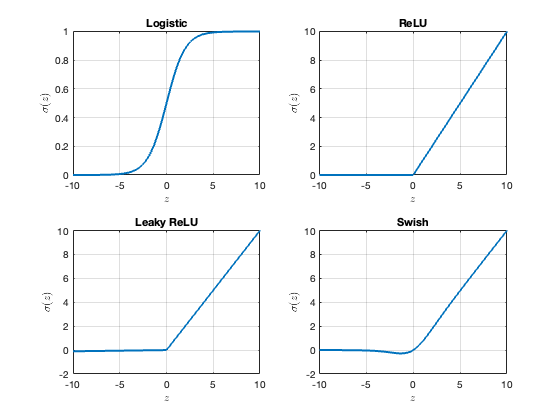

---
execute:
  echo: false
jupyter: mas2901
---

```{ojs}
bodyFont = getComputedStyle(document.body).fontFamily
```

# Machine Learning Models {#sec-ml-models-in-detail}

This section takes a deep dive into the two main classes of machine learning model, the <span class="xref-no-num">[linear model @sec-linear-model]</span> and <span class="xref-no-num">[neural networks @sec-nn]</span>

Along the way we will learn about the key (related) concepts of <span class="xref-no-num">[regularisation @sec-regularisation]</span>, <span class="xref-no-num">[featurisation @sec-featurisation]</span>, and <span class="xref-no-num">[dimensionality reduction @sec-dim-reduction]</span>.

::: {.remark #rem-calculus-notation}
### Calculus notation
For a suitably differentiable function $f : \mathbb{R}^d \rightarrow \mathbb{R}$ we let
$$
(\nabla f)(\mathbf{x}) = \left[ \begin{array}{c} \partial_{x_1} f(\mathbf{x}) \\ \vdots \\ \partial_{x_d} f(\mathbf{x}) \end{array} \right]
$$
denote the *gradient*, and for a suitably differentiable function $f : \mathbb{R}^d \rightarrow \mathbb{R}^d$ we let
$$
\nabla \cdot f = \partial_{x_1} f_1(\mathbf{x}) + \cdots + \partial_{x_d} f_d(\mathbf{x})
$$
denote the *divergence*.

The *Laplacian* is denoted $\Delta = \nabla \cdot \nabla$.

On occasion it will be helpful to emphasise which variable a differential operator is acting on, and we will use subscript notation such as $\nabla_{\mathbf{x}}$ to indicate action on the $\mathbf{x}$ argument.
:::


## Linear Model {#sec-linear-model}

Although we already encountered examples of linear models in the regression context (cf. @exm-linear-regression), here we precisely define it:

::: {.definition #def-linear-model}
### Linear Model
Let $\mathcal{X} = \mathbb{R}^d$ and $\mathcal{Z} = \mathbb{R}$. A **linear model** is a model of the form
$$
f_{\bm{\theta}}(\mathbf{x}) = \theta_1 \phi_1(\mathbf{x}) + \dots + \theta_p \phi_p(\mathbf{x})
$$
for some $\bm{\theta} = (\theta_1 , \cdots , \theta_p)^\top \in \mathbb{R}^p$ and some **feature** functions $\phi_i : \mathcal{X} \rightarrow \mathbb{R}$, $i \in \{1,\dots,p\}$.
:::

It is worth re-emphasising that this definition does not require the relationship between $\mathbf{x}$ and $f_{\bm{\theta}}(\mathbf{x})$ to be linear as in @eq-lin-reg. The "linearity" refers to linearity of $f_{\bm{\theta}}(\mathbf{x})$ with respect to the parameters $\bm{\theta} \in \mathbb{R}^p$.

For the moment we will suppose we are provided with appropriate feature functions $\phi_i : \mathcal{X} \rightarrow \mathbb{R}$; the issue of selecting an appropriate featurisation is discussed in @sec-featurisation. 

The vector-valued function $\phi : \mathcal{X} \rightarrow \mathbb{R}^p$ whose coordinate functions are the $\phi_i$ is called the **feature map** associated to the linear regression model.

To get started, we will generalise the calculations from @exr-sim-reg-model to an arbitrary linear model:


::: {#exr-least-squares}
### Empirical risk minimisation for the linear model

Consider training a linear model <span class="xref-no-num">[linear model @def-linear-model]</span> to perform regression with squared error loss $L(y,z) = (y - z)^2$.

Let $\bm{\Phi}$ be the $n \times p$ *design matrix* whose $(i,j)$th entry is $\phi_j(\mathbf{x}_i)$, and assume that $\bm{\Phi}$ has full column rank.
Show that the empirical risk minimiser $\hat{\bm{\theta}}$ is unique and equal to the least-square solution
$$
\hat{\bm{\theta}} = (\bm{\Phi}^\top \bm{\Phi})^{-1} \bm{\Phi}^\top \mathbf{y}
$${#eq-least-squares-est}
where $\mathbf{y} = (y_1,\dots,y_n)^\top \in \mathbb{R}^n$.

```{=html}
<details>
<summary><strong>Solution</strong></summary>
```

The empirical risk is
$$
\begin{align*}
\mathcal{R}_n(f_{\bm{\theta}}) & = \frac{1}{n} \sum_{i=1}^n L(y_i , f_{\bm{\theta}}(\mathbf{x}_i)) \\
& = \frac{1}{n} \sum_{i=1}^n (y_i - \phi(\mathbf{x}_i)^\top \bm{\theta} )^2 \\
& = \frac{1}{n} \| \mathbf{y} - \bm{\Phi} \bm{\theta} \|^2 \\
& = \frac{1}{n} [ \mathbf{y}^\top \mathbf{y} - 2 \bm{\theta}^\top \bm{\Phi}^\top \mathbf{y}   + \bm{\theta}^\top \bm{\Phi}^\top \bm{\Phi} \bm{\theta} ]
\end{align*}
$$
so that 
$$
\begin{align*}
\nabla_{\bm{\theta}} \mathcal{R}_n(f_{\bm{\theta}}) & = \frac{1}{n} [ - 2 \bm{\Phi}^\top \mathbf{y} + 2 \bm{\Phi}^\top \bm{\Phi} \bm{\theta} ] .
\end{align*}
$$
Since $\bm{\Phi}$ has full column rank it follows that $\bm{\Phi}^\top \bm{\Phi}$ is a positive definite (and thus invertible) matrix.
Thus the stationarity equation $\nabla_{\bm{\theta}} \mathcal{R}_n(f_{\bm{\theta}}) = \mathbf{0}$ has a unique solution 
$$
\begin{align*}
\hat{\bm{\theta}} = (\bm{\Phi}^\top \bm{\Phi})^{-1} \bm{\Phi}^\top \mathbf{y} 
\end{align*} 
$$
which we recognise as the usual least-squares formula for regression coefficients that you learned in school.
Note that the Hessian matrix $\nabla_{\bm{\theta}}^2 \mathcal{R}_n(f_{\bm{\theta}}) = \frac{2}{n} \bm{\Phi}^\top \bm{\Phi}$ is positive definite, so although $\hat{\bm{\theta}}$ was obtained as a solution of the stationary point equation it is indeed a global minimiser of the empirical risk.

```{=html}
</details>
```

:::

It is reassuring that least squares falls under the umbrella of empirical risk minimisation, but the value of having a general framework for supervised learning is that we can consider alternative loss functions as well.

One motivation for this is to consider the *robustness* of a linear model against *outliers*, or equivalently against an *adversarial attack* targeting one entry in the dataset.

In the case of the squared error loss, manipulating one data point $y_i$ can affect the learned parameters $\hat{\bm{\theta}}$ (and therefore also the predictions from the linear model) by an arbitrarily large amount.

This attack can be defeated by using the *absolute deviation* loss $L(y,y') = |y - z|$ instead.

The situation is fairly transparent for a linear model, but for neural networks it can occur that an almost imperceptible change (e.g. changing a few pixels of an image) can cause a neural network into drastically change its output; this idea has been exploited to develop several ingenious adversarial attacks, which you can read more about on [Wikipedia](https://en.wikipedia.org/wiki/Adversarial_machine_learning).


::: {#exr-absolute-deviation-loss}
### Robustness to outliers with the absolute deviation loss

Let $\{y_i\}_{i=1}^n \subset \mathbb{R}$ be a dataset where $n \geq 3$ is odd.
Consider the "trivial" machine learning model $\mathcal{F} = \mathbb{R}$ (i.e. there are no covariates $x_i$ in this setting, so rather than being functions the elements of $\mathcal{F}$ are constants).

Given a loss function $L : \mathcal{Y} \times \mathcal{Z} \rightarrow \mathbb{R}$, let $\mathcal{R}_n(\cdot)$ denote the empirical risk.

1. Find the empirical risk minimiser for (a) the squared error loss $L(y,z) = (y-z)^2$, and (b) the absolute deviation loss $L(y,z) = |y - z|$.

```{=html}
<details>
<summary><strong>Solution</strong></summary>
```

From @q-mean-est we already know that the empirical risk minimiser is the mean $f_n = \frac{1}{n} \sum_{i=1}^n y_i$ when the squared error loss function was used.
Thus it remains to consider the case where the absolute deviation loss is used.
For convenience, suppose (without loss of generality) that $y_1 \leq y_2 \leq \cdots \leq y_n$.
The median datapoint is then $y_m$ where $n = 2m-1$ (the median is unique when $n$ is odd).
Then, for $f \notin \{y_i\}_{i=1}^n$,
$$
\begin{align*}
    \partial_f \mathcal{R}_n(f) & = \frac{1}{n} \sum_{i=1}^n \partial_f | y_i - f | 
    = \frac{1}{n} \sum_{i=1}^n \left\{ \begin{array}{ll} -1 & \text{if } f < y_i \\ 1 & \text{if } f > y_i \end{array} \right.
\end{align*}
$$
which is negative when $f < y_m$ and positive when $f > y_m$. 
Thus, since the empirical risk $\mathcal{R}_n(\cdot)$ is continuous, it must be minimised at $f_n = y_m$, the median datapoint.

```{=html}
</details>
```

2. Determine whether or not the machine learning model is outlier robust when training is performed with (a) the squared error loss $L(y,z) = (y-z)^2$, and (b) the absolute deviation loss $L(y,z) = |y - z|$.

```{=html}
<details>
<summary><strong>Solution</strong></summary>
```

First consider the mean $f_n = \frac{1}{n} \sum_{i=1}^n y_i$.
Given some arbitrarily large value $F$, take any datapoint $y_i$ and replace it with a value larger than $n F - \sum_{j \neq i} y_j$ to see that $f_n > F$ can be attained.
Thus the mean is not outlier robust.
For the median $f_n = \text{median}(\{y_i\}_{i=1}^n)$, suppose again that (without loss of generality) that $y_1 \leq y_2 \leq \cdots \leq y_n$.
Since $n \geq 3$ the median is not $y_1$ or $y_n$, and thus changing either $y_1$ or $y_n$ will not change the median of $\{y_i\}_{i=1}^n$.
On the other hand, changing any one element from $\{y_i\}_{i=2}^{n-1}$ cannot change the fact that $f_n \in [y_1,y_n]$, so the median is outlier robust. 

```{=html}
</details>
```

:::

A trained machine learning model is said to be *outlier robust* if changing one datapoint $y_i$ does not enable an *arbitrarily large* change to the predictions from that model.


### Regularisation {#sec-linear-regularisation}

So far the only way to train a machine learning model that we have seen is via minimising the empirical risk (cf. @sec-erm). Even maximum likelihood estimation turned out to just be a special case of minimising the empirical risk (cf. @sec-max-like).

> Is this it?

Well, no; the aim of this section is to understand when empirical risk minimisation can fail, and what we can do instead.

::: {#exm-over-param}
### Over-parameterised model

Consider again the example of training a linear model using empirical risk minimisation with squared error loss as in @exr-least-squares, but now we suppose the $n \times p$ design matrix $\bm{\Phi}$ whose $(i,j)$th entry is $\phi_j(\mathbf{x}_i)$ does not have full column rank (we say the matrix is *rank deficient*).

The stationarity equation $\nabla_{\bm{\theta}} \mathcal{R}_n(f_{\bm{\theta}}) = \mathbf{0}$ then reads
$$
\frac{1}{n} [ - 2 \bm{\Phi}^\top \mathbf{y} + 2 \bm{\Phi}^\top \bm{\Phi} \bm{\theta} ] = \mathbf{0} 
$${#eq-stationary-lin-reg}
which has infinitely many solutions.

Indeed, since $\bm{\Phi}$ is rank deficient, the kernel $\mathrm{ker}(\bm{\Phi}) = \{\mathbf{v} \in \mathbb{R}^p : \bm{\Phi} \mathbf{v} = \mathbf{0}\}$ is a non-trivial subspace of $\mathbb{R}^p$ and $\bm{\theta} + \mathbf{v}$ solves @eq-stationary-lin-reg whenever $\bm{\theta}$ solves @eq-stationary-lin-reg and $\mathbf{v} \in \mathrm{ker}(\bm{\Phi})$.

An intuitive setting where $\bm{\Phi}$ is rank deficient is when the number $n$ of entries in the dataset is less than the degrees of freedom $p$ of the linear model (equivalently, we could say the linear model is *over-parametrised*).

In this situation the empirical risk does not provide enough information for us to uniquely train the machine learning model.

:::

A classical statistics course might advise against using statistical models that are over-parametrised, and interpret @exm-over-param as a cautionary tale of the non-uniqueness of the maximum likelihood estimator when the model is over-parametrised.

However, over-parametrised models are in fact *routinely* used in modern machine learning. One important reason for this is that it is practically easier to find a "good" set of parameters $\bm{\theta}$ when there are more degrees of freedom to play with; we will discuss optimisation in detail in @sec-stoch-opt.

Another important reason is that it can be "easier" to use a generic and very flexible machine learning model, as opposed to designing a bespoke model for a given task.

But how can we justify using over-parametrised models?

In particular, we know that over-fitting can occur when we try to train a flexible model by minimising the empirical risk (cf. @sec-perf-assess).

A widely-used solution is called **additive regularisation**, and it involves a changing the optimisation objective used for training through the addition of an additive component:

::: {.definition #def-additive-reg}
### Additive regularisation in empirical risk minimisation
Consider a *regulariser* $R : \mathcal{F} \rightarrow [0,\infty)$.
Then the *regularised* empirical risk minimisation estimator is
$$
\begin{align*}
    f_n \in \argmin_{f \in \mathcal{F}} \quad  \mathcal{R}_n(f) + \lambda_n R(f)
\end{align*}
$$
where $\lambda_n > 0$ controls the amount of regularisation that is performed, and could be $n$-dependent.
Equivalently, if the machine learning model is parametrised as $\mathcal{F} = \{f_{\bm{\theta}}\}_{\bm{\theta} \in \Theta}$, then we may view the regulariser as a function $R : \Theta \rightarrow [0,\infty)$ and write the parameters of the regularised empirical risk minimisation estimator as
$$
\hat{\bm{\theta}} \in \argmin_{\bm{\theta} \in \Theta} \quad \mathcal{R}_n(f_{\bm{\theta}}) + \lambda_n R(\bm{\theta}) .
$$
:::

Usually (but not always; see @exm-phys-informed) the regulariser $R(f)$ is a quantitative measure of the complexity of the function $f$; for example, the gradient (or *first order Sobolev*) regulariser
$$
R(f) = \int \|\nabla f(\mathbf{x})\|^2 \; \mathrm{d}\rho(\mathbf{x})  
$$ {#eq-sobolev-regulariser}
explicitly penalises functions $f$ that differ from a constant in the high probability regions of a given probability distribution $\rho$ on $\mathcal{X} = \mathbb{R}^p$.

In the case of a simple linear model $f_{\bm{\theta}}(\mathbf{x}) = \theta_1 x_1 + \cdots + \theta_p x_p$ we have $\nabla f_{\bm{\theta}}(\mathbf{x}) = \bm{\theta}$ and the Sobolev regulariser therefore can be equivalently written as $R(\bm{\theta}) = \|\bm{\theta}\|^2$.
Notice that $R(\bm{\theta})$ is strictly convex; this property can sometimes be important:

::: {#exm-over-param2}
### Over-parameterised model

In the setting of @exm-over-param, let $\hat{\bm{\theta}}$ be a minimiser of the empirical risk, so that the set of all empirical risk minimisers is $\Theta_{\min} = \hat{\bm{\theta}} + \mathrm{ker}(\bm{\Phi}) = \{\hat{\bm{\theta}} + \mathbf{v} : \mathbf{v} \in \mathrm{ker}(\bm{\Phi})\}$.

This is a linear subspace of $\Theta = \mathbb{R}^p$, and as such if $R(\cdot)$ is a strictly convex regulariser then there is a unique minimiser of $R(\cdot)$ on $\Theta_{\min}$; that is, the regularised empirical risk minimiser is uniquely defined.

(This argument works because the restriction of a strictly convex function to a linear subspace remains strictly convex.)

TODO: make a figure for this example

:::

Perhaps the most important example of a convex regulariser is $R(\bm{\theta}) = \|\bm{\theta}\|^2$, which we explore in detail in @sec-ridge-regression, but several other regularisers are also widely-used and we mention some of these in @sec-other-linear-reg.
Typically $\lambda_n \rightarrow 0$ as $n \rightarrow \infty$, since for large datasets the empirical risk $\mathcal{R}_n$ usually contains sufficient information to uniquely resolve the best performing machine learning model (e.g. in @exm-bayes-map-erm we have $\lambda_n = \frac{1}{n}$).

We already saw that maximum likelihood is a special case of empirical risk minimisation when the response $\mathbf{Y}$ is conditionally independent given the covariate $\mathbf{X}$; recall @exr-sim-reg-model in @sec-max-like.

It turns our that Bayesian inference (or, more precisely, the *maximum a posteriori estimator*) can be interpreted as *regularised* empirical risk minimisation in the same context:


::: {#exm-bayes-map-erm}
### Bayesian MAP estimator as regularised empirical risk minimisation

Consider again the situation where the responses $\mathbf{Y} | \mathbf{X} = \mathbf{x}$ are modelled as independent realisations from a parametric statistical model with density $p_{\bm{\theta}}(\cdot | \mathbf{x})$.
Recall that the likelihood associated to the training data $\{(\mathbf{x}_i,\mathbf{y}_i)\}_{i=1}^n$ is the function
$$
\bm{\theta} \mapsto \prod_{i=1}^n p_{\bm{\theta}}(\mathbf{y}_i | \mathbf{x}_i) .
$$
To perform a Bayesian analysis, let $p(\bm{\theta})$ be a *prior* density for the parameter $\bm{\theta} \in \Theta$, so that from Bayes' theorem the posterior distribution has density proportional (in $\bm{\theta}$) to
$$
p(\bm{\theta}) \prod_{i=1}^n p_{\bm{\theta}}(\mathbf{y}_i | \mathbf{x}_i) .
$$
The usual output of a Bayesian analysis is the posterior distribution itself, but sometimes it is convenient to summarise this distribution in terms of one or more summary statistics, the most common of which is the *maximum a posteriori* (MAP) estimator, defined as a mode of the posterior, i.e.
$$
\hat{\bm{\theta}} \in \argmax_{\bm{\theta} \in \Theta} p(\bm{\theta}) \prod_{i=1}^n p_{\bm{\theta}}(\mathbf{y}_i | \mathbf{x}_i) .
$$
Equivalently, by taking logarithms and by negating the sign of the objective function, the MAP estimator is
$$
\hat{\bm{\theta}} \in \argmin_{\bm{\theta} \in \Theta} \underbrace{ \frac{1}{n} \sum_{i=1}^n - \log p_{\bm{\theta}}(\mathbf{y}_i | \mathbf{x}_i) }_{\mathcal{R}_n(f_{\bm{\theta}}) } + \underbrace{ \frac{1}{n} }_{\lambda_n} \underbrace{ (- \log p(\bm{\theta}) ) }_{R(\bm{\theta})} 
$$ {#eq-map}
where, similarly to @sec-max-like we interpret $f_{\bm{\theta}}(\mathbf{x}) = p_{\bm{\theta}}(\cdot | \mathbf{x})$ as an element of $\mathcal{Z} = \mathcal{P}(\mathcal{Y})$ and $L(\mathbf{y}_i,f_{\bm{\theta}}(\mathbf{x}_i)) = - \log p_{\bm{\theta}}(\mathbf{y}_i | \mathbf{x}_i)$.
Here the regulariser $R(\bm{\theta})$ takes large values when $\bm{\theta}$ is associated with low prior probability, meaning that such values are *penalised* in the overall training objective.
Thus the MAP estimator minimises a regularised empirical risk.

:::

Regularisation does not need to simply come from a generic convex function; domain knowledge can also be used to usefully constrain a machine learning model:

::: {#exm-phys-informed}
### Physics-informed machine learning

Suppose we observe displacements $y_i \in [0,\infty)$ of a spring that is subject to forces $x_i \in [0,1]$, and we wish to learn a regression function $f$ such that $f(X)$ is a close approximation to the displacement $Y$ in general.

One can consider, for example, the squared error loss $L(y,z) = (y-z)^2$ and proceed in a purely data-driven manner.
However, from \emph{Hooke's Law} we know that the relationship between $X$ and $Y$ should be roughly proportional (for an idealised material in the elastic regime, at least).
To encode this physical knowledge we can employ a regulariser 
$$  
\begin{align*}
R(f) = f(0)^2 + \int_0^1 f''(x)^2 \; \mathrm{d}x  ,
\end{align*}
$$
for which the departure of $f$ from a proportionality relationship (i.e. $f(x) \propto x$) is explicitly penalised (cf. @q-phys-informed).

:::

Other kinds of physical knowledge that could be exploited as a regulariser include conservation of energy (e.g. if analysing data from a closed physical system), or rotation invariance (e.g. if the perspective from which the data were collected is immaterial).

Unfortunately, it is not always the case that including expert knowledge as a regulariser is helpful.
As a cautionary tale, in the early days of natural language processing it was assumed that linguistic and grammatical "rules" ought to be effective as regularisers for training a text-based machine learning model.

However, modern large language models (cf. @sec-practical-pytorch-models) have largely abandoned this idea in favour of an entirely data-driven approach, which has proven to be more successful.

Oftentimes the benefit from regularisation can be unclear at the outset, but the performance of a regulariser can always be assessed *post hoc* using methods such as cross-validation discussed in @sec-perf-assess.

#### Ridge Regression {#sec-ridge-regression}

The quadratic regulariser $R(\bm{\theta}) = \|\bm{\theta}\|^2$ is often a natural choice and appears also in mathematical applications of integral and differential equations, where it is known as *Tikhonov* regularisation:


::: {.definition #def-tikhonov}
### Tikhonov Regularisataion
For $\Theta = \mathbb{R}^p$ the *Tikhonov* regulariser is $R(\bm{\theta}) = \|\bm{\theta}\|^2$.
:::

The use of Tikhonov regularisation in the context of training a linear model is known as *ridge regression*:

::: {#exm-ridge-regression}
### Ridge Regression

Recall from @exr-least-squares the empirical risk associated with the linear model $f_{\bm{\theta}}$ in @def-linear-model:
$$
\begin{align*}
    \mathcal{R}_n(f_{\bm{\theta}}) = \frac{1}{n} \| \mathbf{y} - \bm{\Phi} \bm{\theta} \|^2
\end{align*}
$$
*Ridge regression* refers to the Tikhonov-regularised training objective
$$
\begin{align*}
\mathcal{R}_n(f_{\bm{\theta}}) + \lambda_n R(\bm{\theta}) 
& = \frac{1}{n} \| \mathbf{y} - \bm{\Phi} \bm{\theta} \|^2 + \lambda_n \| \bm{\theta} \|^2 
\end{align*}
$$
where $\lambda_n > 0$ is to be specified (see discussion next).
The regularised empirical risk minimiser satisfies the stationary point equation
$$
\begin{align*}
\mathbf{0} = \nabla_{\bm{\theta}} [ \mathcal{R}_n(f_{\bm{\theta}}) + \lambda_n R(\bm{\theta}) ] & = \frac{1}{n} ( - 2 \bm{\Phi}^\top \mathbf{y} + 2 \bm{\Phi}^\top \bm{\Phi} \bm{\theta} ) + 2 \lambda_n \bm{\theta}
\end{align*}
$$
and thus, at stationarity,
$$
\hat{\bm{\theta}} = (\bm{\Phi}^\top \bm{\Phi} + n \lambda_n \mathbf{I} )^{-1} \bm{\Phi}^\top \mathbf{y} . 
$${#eq-ridge}
Compared to the standard least squares estimator @eq-least-squares-est we have acquired the term $n \lambda_n \mathbf{I}$.

The inverse $(\bm{\Phi}^\top \bm{\Phi} + n \lambda_n \mathbf{I} )^{-1}$ is well-defined since the sum of a positive semi-definite matrix $\bm{\Phi}^\top \bm{\Phi}$ and a positive definite matrix $n \lambda_n I$ is positive definite, and can thus be inverted.
To confirm we have found a minimiser of the regularised empirical risk we can compute the Hessian matrix at $\hat{\bm{\theta}}$, which is 
$$
\nabla_{\bm{\theta}}^2 [ \mathcal{R}_n(f_{\bm{\theta}}) + \lambda_n R(\bm{\theta}) ] = 2 \left( \frac{1}{n} \bm{\Phi}^\top \bm{\Phi} + \mathbf{I} \right) , 
$$
and is positive definite by an analogous argument.

The key point to appreciate here is that $\hat{\bm{\theta}}$ is *always* well-defined, even if the number of data $n$ is less than the number of parameters $p$; as such, ridge regression is an explicit demonstration of the benefit of convex regularisation described in @exm-over-param2

:::

So regularisation can resolve the issue of non-uniqueness of the empirical risk minimiser and can do so without increasing the difficulty of the computations that we are required to perform (at least in the case of @exm-ridge-regression). 

It turns our that this issue can be addressed by careful selection of the parameter $\lambda_n$, which we recall controls the amount of regularisation that is applied.

To see this, consider the two limiting cases:

* As $\lambda_n \rightarrow 0$ the training objective becomes effectively just the empirical risk $\mathcal{R}_n(\cdot)$; i.e. functions $f$ that perform well on the training dataset are preferred.
* As $\lambda_n \rightarrow \infty$ the training objective becomes effectively just the regulariser $R(\cdot)$; i.e. simpler functions $f$ are preferred.

Since varying $\lambda_n$ spans a spectrum of models from most complex ($\lambda_n \rightarrow 0$) to least complex ($\lambda_n \rightarrow \infty$), a powerful strategy is to select $\lambda_n$ based on cross-validation as described in @sec-cross-val.

See @fig-ridge-coeff and @sec-practical-pytorch-models.

{#fig-ridge-coeff width=70%}

On the other hand, a Bayesian would posit a prior distribution without reference to any $\lambda_n$; this might be sub-optimal in general (e.g. if the subjective belief encoded in the prior is incorrect or unhelpful) but at least asymptotically (in $n$) this approach can be valid:


::: {#exm-bayes-as-ridge}
### Bayesian inference as ridge regression
In the setting of @exm-bayes-map-erm, take the prior for the parameter $\bm{\theta}$ to be $\mathcal{N}(\mathbf{0}, \sigma^2 \mathbf{I})$.
Then the implied regulariser is
$$
\begin{align*}
    R(\bm{\theta}) = - \log p(\bm{\theta}) = \frac{1}{2 \sigma^2} \|\bm{\theta}\|^2 + \mathrm{constant}
\end{align*}
$$
so that the Bayesian MAP estimator @eq-map is identical to the ridge regression estimator @eq-ridge with $\lambda_n = \frac{2}{\sigma^2 n}$.

Although predetermining $\lambda_n$ without reference to the dataset can be sub-optimal for the machine learning task, it can be shown that the ridge regression estimator @eq-ridge is *consistent*, meaning that it converges to the minimiser of the (population) risk $\mathcal{R}(\cdot)$ as $n \rightarrow \infty$.

Thus Bayesian MAP estimation with a Gaussian prior is at least consistent in this context.
:::

#### Other Convex Regularisers {#sec-other-linear-reg}

A generalisation of Tikhonov regularisation is obtained by replacing the Euclidean norm $\|\cdot\|$ on $\mathbb{R}^p$ with a norm
$$
\|\bm{\theta}\|_s = \left( \sum_{i=1}^p |\theta_i|^s \right)^{\frac{1}{s}}
$$ {#eq-lp-norm}
for some $1 \leq s \leq \infty$.

Special cases include the sum norm $\|\bm{\theta}\|_1 = \sum_{i=1}^p |\theta_i|$, the Euclidean norm $\|\bm{\theta}\|_2$ and the *maximum* norm $\|\bm{\theta}\|_\infty = \max \{ |\theta_i| : 1 \leq i \leq p\}$, which each give rise to convex regularisers (@q-convex-regularisation).

For $s < 1$ \eqref{eq: lp norm} does not define a valid norm, but in an unfortunate convention the notation $\|\cdot\|_s$ is still commonly used. The special $\|\bm{\theta}\|_0$ is interpreted as the number of non-zero entries in $\bm{\theta}$.

> Is this additional flexibility useful?

To motivate a positive answer, consider for a moment the computational challenges associated with a larger number of parameters $p$.

A call to the machine learning model $f_{\bm{\theta}}(\cdot)$ incurs a computational complexity $O(p)$ and this could be large; for example, modern neural networks can have billions of parameters, so that $p \approx 10^9$ (cf. @sec-nn).
Reducing the cost of calls to $f_{\bm{\theta}}(\cdot)$ is an important computational challenge in machine learning, and there are two main ways this is achieved.

The first of these is *quantisation*, meaning that the elements of $\bm{\theta}$ are stored in lower precision for faster computation.

For reference, GPU computation is typically performed in 32-bit *single precision* (roughly, 8 decimal places) while CPU computation is typically *double precision* (roughly 16 decimal places).

In modern machine learning, the elements of $\bm{\theta}$ are typically stored in 16-bit *half precision* during training, and then further quantised into 8-bits for future calls to the model.

The second solution is called *sparsity*; this means deliberately setting many of the elements of $\bm{\theta}$ to exactly $0$, so that computation involving these parameters can be completely ignored.

Sparsity is particularly simple to operationalise in the context of the linear model, as we shall see next:

::: {#exm-lasso}
### LASSO

Recall again from @exr-least-squares the empirical risk associated with the linear model $f_{\bm{\theta}}$ in @def-linear-model:
$$
\begin{align*}
    \mathcal{R}_n(f_{\bm{\theta}}) = \frac{1}{n} \| \mathbf{y} - \bm{\Phi} \bm{\theta} \|^2
\end{align*}
$$
The *least absolute shrinkage and selection operator* (or simply *LASSO*) refers to the $\|\cdot\|_1$ norm-regularised training objective
$$
\mathcal{R}_n(f_{\bm{\theta}}) + \lambda_n R(\bm{\theta}) = \frac{1}{n} \| \mathbf{y} - \bm{\Phi} \bm{\theta} \|^2 + \lambda_n \| \bm{\theta} \|_1 . 
$${#eq-lasso-obj}
In contrast to ridge regression (@exm-ridge-regression) we cannot differentiate through this regularised empirical risk to obtain an analytic expression for the minimiser $\hat{\bm{\theta}}$ because the derivative of the regulariser $\|\bm{\theta}\|_1$ is not everywhere defined.

Instead, convex optimisation is required to minimise @eq-lasso-obj.

The key insight into $\|\cdot\|_1$ regularisation is that it provides *automatic sparsification* where the number of non-zero entries in $\hat{\bm{\theta}}$ is controlled by $\lambda_n$.
Indeed, the (in general dense) least-squares solution is recovered when $\lambda_n \rightarrow 0$, while the fully sparse solution $\hat{\bm{\theta}} = \mathbf{0}$ is recovered when $\lambda_n \rightarrow \infty$. 

See @fig-ridge-coeff and @sec-practical-pytorch-models.

::: 


::: {.remark #rem-lasso-geometry}
### Geometry of the LASSO []{.advanced title="Non-Examinable Content"}

This remark is intended only for students who have taken MSP3809.

To understand why the LASSO sets entries of $\bm{\theta}$ exactly to $0$, we can interpret @eq-lasso-obj as a *Lagrangian* for the constrained problem
$$
\argmin_{\bm{\theta} \in \mathbb{R}^p} \quad \frac{1}{n} \| \mathbf{y} - \bm{\Phi} \bm{\theta} \|^2 \quad \mathrm{s.t.} \quad \|\bm{\theta}\|_1 \leq t_n 
$${#eq-lasso-convex}
where $\lambda_n \geq 0$ plays the role of a *Lagrange multiplier* to enforce the constraint $\|\bm{\theta}\|_1 - t \leq 0$.

(By *convex duality*, for each $t_n$ there exists a $\lambda_n$, and vice versa, such that @eq-lasso-obj and @eq-lasso-convex have the same solution.)

The contours of the objective $\frac{1}{n} \| \mathbf{y} - \bm{\Phi} \bm{\theta} \|^2$ are elliptical, while the constraint region $\|\bm{\theta}\|_1 \leq t_n$ has the form of a diamond, meaning that the typical point of intersection is a corner of the diamond; see @fig-geom-lasso

```{ojs}
//| fig-cap: Geometry of the LASSO. The elliptical contours (red) of the data-fit term intersect the constraint set $\|\theta\|_s \leq 1$ along the line $\theta_1 = 0$ when $s=1$ (LASSO; left), while they do not when $s = 2$ (ridge; right).
//| label: fig-geom-lasso
{
  const width = 600;
  const height = 300;
  const panelOffset = 300;
  
  const svg = d3.create("svg")
    .attr("viewBox", [0, 0, width, height])
    .attr("width", width)
    .attr("height", height);
  
  // Styling
  const contourCol = "#c44";
  const axisCol = "#aaa";
  const constraintCol = "#000";
  
  const scale = 80; // Scale factor to match TikZ units
  const cx1 = 150;
  const cx2 = cx1 + panelOffset;
  const cy = 180; // Baseline for axes
  
  // Helper: draw rotated ellipse
  function drawContours(parent, cx, cy) {
    // TikZ shift was (0.9, 1.55). In SVG, Y is inverted.
    const ellipseCenterX = cx + (0.9 * scale);
    const ellipseCenterY = cy - (1.55 * scale); 
    
    // TikZ rotate=25 is counter-clockwise. SVG rotate is clockwise.
    // So rotate=25 in TikZ becomes -25 in SVG.
    const g = parent.append("g")
      .attr("transform", `translate(${ellipseCenterX}, ${ellipseCenterY}) rotate(-25)`);
    
    // Radii from TikZ: (1.05, 0.45), (0.78, 0.33), (0.50, 0.18)
    g.append("ellipse").attr("rx", 1.05 * scale).attr("ry", 0.45 * scale)
      .attr("fill", "none").attr("stroke", contourCol).attr("stroke-width", 1.2);
    g.append("ellipse").attr("rx", 0.78 * scale).attr("ry", 0.33 * scale)
      .attr("fill", "none").attr("stroke", contourCol).attr("stroke-width", 1.2);
    g.append("ellipse").attr("rx", 0.50 * scale).attr("ry", 0.18 * scale)
      .attr("fill", "none").attr("stroke", contourCol).attr("stroke-width", 1.2);
  }
  
  // Helper: draw axes
  function drawAxes(parent, cx, cy) {
    parent.append("line")
      .attr("x1", cx - 1.6 * scale).attr("y1", cy)
      .attr("x2", cx + 1.6 * scale).attr("y2", cy)
      .attr("stroke", axisCol).attr("stroke-width", 1.5);
    parent.append("line")
      .attr("x1", cx).attr("y1", cy + 1.6 * scale)
      .attr("x2", cx).attr("y2", cy - 1.6 * scale)
      .attr("stroke", axisCol).attr("stroke-width", 1.5);
      
    parent.append("text").attr("x", cx + 1.65 * scale).attr("y", cy + 5)
      .attr("font-size", 14).text("θ₁");
    parent.append("text").attr("x", cx - 5).attr("y", cy - 1.65 * scale)
      .attr("font-size", 14).text("θ₂");
  }

  // --- Left Panel (L1) ---
  const left = svg.append("g");
  drawAxes(left, cx1, cy);
  
  // L1 Diamond: centered at (0,0), radius 1.0
  const s1 = 1.0 * scale;
  left.append("polygon")
    .attr("points", [[cx1, cy - s1], [cx1 + s1, cy], [cx1, cy + s1], [cx1 - s1, cy]].map(p => p.join(",")).join(" "))
    .attr("fill", "none").attr("stroke", constraintCol).attr("stroke-width", 1.5);
  
  drawContours(left, cx1, cy);

  // --- Right Panel (L2) ---
  const right = svg.append("g");
  drawAxes(right, cx2, cy);
  
  // L2 Circle: radius 0.95 to match TikZ
  right.append("circle")
    .attr("cx", cx2).attr("cy", cy).attr("r", 0.95 * scale)
    .attr("fill", "none").attr("stroke", constraintCol).attr("stroke-width", 1.5);
  
  drawContours(right, cx2, cy);

  // Panel Labels
  svg.append("text").attr("x", cx1).attr("y", height - 10).attr("text-anchor", "middle")
    .attr("font-weight", "500").text("LASSO (s=1)");
  svg.append("text").attr("x", cx2).attr("y", height - 10).attr("text-anchor", "middle")
    .attr("font-weight", "500").text("Ridge (s=2)");

  return svg.node();
}


```

This in turn corresponds to sparsity in the entries of $\bm{\theta}$.

:::

Beyond just reducing the computational burden of evaluating $f_{\bm{\theta}}(\cdot)$, sparsity can also help to promote *interpretability* of the trained machine learning model.
Indeed, the non-zero entries of $\bm{\theta}$ determine which of the entries of $\mathbf{X}$ are considered to be most relevant in predicting the response $Y$.


### Features {#sec-featurisation}

Given covariates $\mathbf{x}$ we want to understand what *features* $\phi_i(\mathbf{x})$ to include in our model. 

For example, if we are using a linear model we would want to select features such that
$$
f_{\bm{\theta}}(\mathbf{x}) = \theta_1 \phi_1(\mathbf{x}) + \dots + \theta_p \phi_p(\mathbf{x})
$$
performs well at the machine learning task.

In this context, a feature is any measurable property or characteristic of $\mathbf{x}$ that may be relevant to the task at hand.

::: {.definition #def-feature-space}
### Feature Space
The term *feature space* refers to the image of the *feature map* $\bm{\phi}(\mathbf{x}) = [\phi_1(\mathbf{x}) , \dots , \phi_p(\mathbf{x})]$ where $\mathbf{x} \in \mathcal{X}$.
:::

Feature space is a $p$-dimensional space where each dimension corresponds to a specific feature $\phi_i$. 
A datum $\mathbf{x}$ is represented in feature space as a vector $\bm{\phi}(\mathbf{x}) = [\phi_1(\mathbf{x}) , \dots , \phi_p(\mathbf{x})]$, so we can consider the feature space[^feature-space-note] to be a subset of $\mathbb{R}^p$.

The position of $\bm{\phi}(\mathbf{x})$ in feature space is determined by the values of its features $\phi_i(\mathbf{x})$, and this representation can help to understand the relationships between different data points $\mathbf{x} \in \mathcal{X}$.

Some features can be more useful than others for a given task; e.g. the price of a sandwich is usually more relevant to the task of choosing a sandwich for lunch compared to the colour of the packaging. 

Designing an appropriate feature space (a.k.a. **featurisation**) is a crucial step in solving a machine learning task:
For example, in classification we would hope that our features enable data from different classes to be clearly separated.

Or, in *clustering* (cf. @sec-unsupervised-learning) we would hope that similar data points tend to group together in feature space, allowing for identification of natural groupings within the dataset.

Due to the importance of featurisation we will discuss three different strategies:

* <span class="xref-no-num">[Variable Selection @sec-variable-selection]</span> 
* <span class="xref-no-num">[Dimensionality Reduction @sec-dim-reduction]</span> 
* <span class="xref-no-num">[Kernel Methods @sec-kernel-methods]</span> 

#### Variable Selection {#sec-variable-selection}

The simplest approach to featurisation in the case where $\mathbf{x}$ is a vector input is to use the coordinates of $\mathbf{x}$ itself as features, i.e. $\phi_i(\mathbf{x}) = x_i$.
Depending on the context this may or may not be a good idea; for example, if we are trying to predict tomorrow's stock price $y_{t+1}$ from historical price data $x_t, x_{t-1}, \dots$ then data from the distant past are unlikely to be relevant.
In such situations, *variable selection* can be useful.
This is a simple idea; use features corresponding to a subset of the coordinates of $\mathbf{x}$; i.e. $\phi_j(\mathbf{x}) = x_{i_j}$ for some relevant variables indexed by $i_1 , \dots , i_p \in \{1,\dots,p\}$.
For the stock price example, we may for example select only the $T$ most recent data $x_t , \dots , x_{t-T+1}$ to be the features in our machine learning model.
This is an example of *a priori* featurisation; we are using our prior knowledge of stock prices to select a featurisation that we hope will be appropriate for the machine learning task.

For many machine learning tasks it is far from clear what features may be useful.
Think about this; could you write down an explicit function of the pixel values of an RGB image which would be informative for the purpose of classifying washing machines from dishwashers?  Probably not!

In such settings it is desirable to use the data themselves to determine an appropriate featurisation for the given task.

In fact, we have already seen an example of *data-driven* variable selection in the form of the <span class="xref-no-num">[LASSO @exm-lasso]</span>.

Let's look at one more data-driven approach to variable selection, which is simple to implement:

::: {#exm-stepwise-variable-selection}
### Stepwise variable selection

Stepwise variable selection methods are sequential procedures to determine which among a candidate set of covariates $x_1,\dots,x_p$ should be included in a linear model. 
These methods aim to improve the model's performance by systematically adding or removing variables based on a performance criteria such as <span class="xref-no-num">[cross validation @sec-cross-val]</span>.

The two primary forms of stepwise selection are *forward selection* (start with no covariates and add one at a time until performance is no longer improved) and *backward elimination* (start with all covariates and remove one at a time until performance is no longer improved).

In each case there is a choice of which covariate to add/remove, and usually one takes a greedy approach of adding/removing the covariate which leads to the greatest performance improvement.
:::

Our main motivation for discussing variable selection is to set up a contrast with the next set of featurisation methods.
Indeed, while variable selection methods are widely used in statistical applications where the individual covariates $x_i$ are interpretable or carry special scientific interest (a setting that machine learners refer to as *tabular data*), for most machine learning tasks it is *unlikely that a good featurisation is axis-aligned*.

Rather, we will need to seek features that are either linear combinations $\phi_i(\mathbf{x}) = a_{i,1} x_1 + \dots + a_{i,d} x_d$ of covariates (cf. <span class="xref-no-num">[dimensionality reduction @sec-dim-reduction]</span>), or possibly even nonlinear functions $\phi_i(\mathbf{x})$ of covariates (cf. <span class="xref-no-num">[kernel methods @sec-kernel-methods]</span> and <span class="xref-no-num">[neural networks @sec-nn]</span>) if we want to unlock the full power of modern machine learning.


#### Dimensionality Reduction {#sec-dim-reduction}

In a literal sense, *dimensionality reduction* refers to taking a possibly high-dimensional input $\mathbf{x} \in \mathbb{R}^d$ and reducing it to a lower-dimensional feature vector $\bm{\phi}(\mathbf{x}) = [\phi_1(\mathbf{x}),\dots,\phi_p(\mathbf{x})] \in \mathbb{R}^p$ with $p < d$.
This can be helpful if the dimension of $\mathbf{x}$ is high; for example if $\mathbf{x}$ is a typical 12 megapixel RGB image taken on your phone camera then the dimension $d$ of $\mathbf{x}$ is $36 \times 10^6$.
For the purpose of this section we will focus on *linear* dimensionality reduction, where each feature $\phi_i(\mathbf{x}) = a_{i,1} x_1 + \dots + a_{i,d} x_d$ is formed as a linear combination of the entries of $\mathbf{x} \in \mathbb{R}^d$.
Using matrix notation, we can express the task of linear dimensionality reduction as the task of choosing a matrix $\mathbf{A} \in \mathbb{R}^{p \times d}$ such that the *feature map*
$$
    \bm{\phi}(\mathbf{x}) = \mathbf{A} \mathbf{x}
$${#eq-linear-feature-map}
is appropriate for the given machine learning task.

Since the scale of $\mathbf{A}$ is arbitrary, we impose a constraint that each row of $\mathbf{A}$ has unit norm; $\|\mathbf{a}_i\| = 1$ where $\mathbf{a}_i = [a_{i,1},\dots,a_{i,d}]^\top \in \mathbb{R}^d$.

The most popular linear dimensionality reduction technique is called *principal component analysis*.
To keep the presentation simple we will focus on the problem of finding a single linear feature $\phi_1$; that is, we seek the coefficients $\mathbf{a}_1 = [a_{1,1},\dots,a_{1,d}]^\top \in \mathbb{R}^d$.
The main idea in principal component analysis is to select $\mathbf{a}_1$ such that $\mathrm{Var}(\phi_1(\mathbf{X}))$ is maximised.

Intuitively, if $\mathrm{Var}(\phi_1(\mathbf{X}))$ is large then $\phi_1(\mathbf{X})$ "captures as much as possible of the variability of $\mathbf{X}$".

This is a *heuristic*; in a supervised learning setting the response data could be used to more directly determine the relevant "directions" $\mathbf{a}_1$, but one of the appealing features of principal component analysis (as we are about to see) is that it is quick an straightforward to implement.

Since the population distribution of $\mathbf{X}$ is not known in geneal, we must estimate $\mathrm{Var}(\phi_1(\mathbf{X}))$ from our dataset.

For simplicity we assume that the covariates are *centred* so that $\sum_j x_{i,j} = 0$ for each $i$.

Let 
$$
\begin{align*}
    \mathbf{D} = \left[ \begin{array}{ccc} x_{1,1} & \dots & x_{1,d} \\ \vdots & & \vdots \\ x_{n,1} & \dots & x_{n,d} \end{array} \right]
\end{align*}
$$
so that the sample variance[^sample-var-note] of $\{ \phi_1(\mathbf{x}_i) \}_{i=1}^n$ is
$$
\begin{align*}
    \frac{1}{n} \sum_{i=1}^n \phi_1(\mathbf{x}_i)^2 = \frac{1}{n} \sum_{i=1}^n (\mathbf{D} \mathbf{a}_1)^\top (\mathbf{D} \mathbf{a}_1) = \frac{1}{n} \sum_{i=1}^n \mathbf{a}_1^\top \mathbf{D}^\top \mathbf{D} \mathbf{a}_1 = \mathbf{a}_1^\top \mathbf{S}_n \mathbf{a}_1 , \qquad \mathbf{S}_n = \frac{1}{n} \mathbf{D}^\top \mathbf{D} .
\end{align*}
$$

Thus, we seek to maximise $\mathbf{a}_1^\top \mathbf{S}_n \mathbf{a}_1$ subject to $\|\mathbf{a}_1\| = 1$.

Constrained optimisation problems of this kind can be solved using Lagrange multipliers; since MSP3809 is not a prerequisite, the following proof is presented only for completeness and will not be examined:


::: {#prp-pc}
### First Principal Component
The constrained optimisation problem
$$
\begin{align*}
    \max_{\mathbf{a}_1 \in \mathbb{R}^d} \quad \mathbf{a}_1^\top \mathbf{S}_n \mathbf{a}_1 \qquad \text{s.t.} \qquad \|\mathbf{a}_1\| = 1 
\end{align*}
$$
is solved by taking $\mathbf{a}_1$ to be the normalised principal eigenvector of $\mathbf{S}_n$.

:::

::: {#prf-pc}
#### Not Examinable

To solve this we can use Lagrange multipliers; i.e. form the Lagrangian
$$
\begin{align*}
    \mathcal{L}(\mathbf{a}_1,\lambda_1) = \mathbf{a}_1^\top \mathbf{S}_n \mathbf{a}_1 - \lambda_1(\mathbf{a}_1^\top \mathbf{a}_1 - 1)
\end{align*}
$$
and solve for the stationary point $(\mathbf{a}_1,\lambda_1)$ defined by the simultaneous equations $\nabla_{\mathbf{a}_1} \mathcal{L}(\mathbf{a}_1,\lambda_1) = \mathbf{0}$ and $\nabla_{\lambda_1} \mathcal{L}(\mathbf{a}_1,\lambda_1) = 0$.

This leads to $\mathbf{S}_n \mathbf{a}_1 = \lambda_1 \mathbf{a}_1$ and $\|\mathbf{a}_1\| = 1$, and we deduce that the solution $\mathbf{a}_1$ is the normalised principal eigenvector of $\mathbf{S}_n$ and the Lagrange multiplier $\lambda_1$ is the associated eigenvalue.

:::

Hence, maximising the variance subject to the constraint $\|\mathbf{a}_1\| = 1$ leads to determining the eigenvector associated with the largest eigenvalue. 

The vector $\mathbf{a}_1$ is called the *first principal component* (@fig-pca; left panel).

The *second principal component* corresponds to the (normalised) eigenvector $\mathbf{a}_2$ associated to the second largest eigenvalue $\lambda_2$, and by properties of eigenvectors this will be orthogonal to the first principal component.
Subsequent principal components are similarly defined.
This amounts to an eigendecomposition of the sample covariance matrix $\mathbf{S}_n$:
$$
\begin{align*}
    \mathbf{S}_n = \sum_{i=1}^d \lambda_i \mathbf{a}_i \mathbf{a}_i^\top
\end{align*}
$$
Since the sample covariance matrix $\mathbf{S}_n$ converges to the population covariance matrix $\mathrm{Var}(\mathbf{X})$, it follows (informally) that the principal components $\{\mathbf{a}_i\}_{i=1}^d$ should converge to the (normalised) eigenvectors of the population covariance matrix $\mathrm{Var}(\mathbf{X})$ in the $n \rightarrow \infty$ limit.

Having calculated principal components, we can now visualise our data $\{\mathbf{x}_i\}_{i=1}^n$ in feature space by applying the feature map @eq-linear-feature-map (@fig-pca, right panel).
The *variance explained* by the $j$th principal component is defined as 
$$
\begin{align*}
    \frac{\lambda_j}{\sum_{i=1}^d \lambda_i} 
\end{align*}
$$
and the *total* variance explained by taking the first $p$ principal components is 
$$
\begin{align*}
    \frac{\sum_{j=1}^p \lambda_j}{\sum_{i=1}^d \lambda_i} .
\end{align*}
$$
Intuitively, if most of the variability in $\mathbf{X}$ is retained in the featurised version $\bm{\phi}(\mathbf{X})$, then we say that most of the variance is "explained".

Principal component analysis is based on linear features, but oftentimes *nonlinear* features are more informative for a given machine learning task.
Nonlinear methods for dimensionality reduction is an interesting topic beyond the scope of this module; an example of one such method is shown in @fig-manifold-hypothesis.

```{ojs}
//| fig-cap: Dimensionality reduction via principal component analysis. For illustration, in the left panel we extract principal components $\mathbf{a}_1$ and $\mathbf{a}_2$ from a two-dimensional dataset (filled circles), but dimensionality reduction techniques are intended for cases where $d \gg 1$. The corresponding feature space is shown in the right panel.
//| label: fig-pca

{
  const width = 600;
  const height = 280;
  const panelOffset = 300;
  
  const svg = d3.create("svg")
    .attr("viewBox", [0, 0, width, height])
    .attr("width", width)
    .attr("height", height);
  
  // Colours
  const dataCol = "#2a9d8f";
  const axisCol = "#333";
  const pcCol = "#b33";
  
  // Scale
  const scale = 60;
  const cx1 = 140;
  const cx2 = cx1 + panelOffset;
  const cy = 140;
  
  // Seeded random number generator (to match TikZ seed)
  function mulberry32(seed) {
    return function() {
      let t = seed += 0x6D2B79F5;
      t = Math.imul(t ^ t >>> 15, t | 1);
      t ^= t + Math.imul(t ^ t >>> 7, t | 61);
      return ((t ^ t >>> 14) >>> 0) / 4294967296;
    }
  }
  
  // Helper: draw axes with arrow
  function drawAxis(parent, x1, y1, x2, y2, label, labelPos = "end") {
    // Line
    parent.append("line")
      .attr("x1", x1).attr("y1", y1)
      .attr("x2", x2).attr("y2", y2)
      .attr("stroke", axisCol)
      .attr("stroke-width", 2)
      .attr("marker-end", "url(#arrowhead)");
    
    // Label
    if (labelPos === "end") {
      const isHorizontal = Math.abs(y2 - y1) < Math.abs(x2 - x1);
      parent.append("text")
        .attr("x", x2 + (isHorizontal ? 8 : 5))
        .attr("y", y2 + (isHorizontal ? 5 : -5))
        .attr("font-size", 14)
        .attr("font-style", "italic")
        .text(label);
    }
  }
  
  // Define arrowhead marker
  svg.append("defs").append("marker")
    .attr("id", "arrowhead")
    .attr("viewBox", "0 -5 10 10")
    .attr("refX", 8)
    .attr("refY", 0)
    .attr("markerWidth", 6)
    .attr("markerHeight", 6)
    .attr("orient", "auto")
    .append("path")
    .attr("d", "M0,-5L10,0L0,5")
    .attr("fill", axisCol);
  
  // Red arrowhead for PC vectors
  svg.select("defs").append("marker")
    .attr("id", "arrowhead-red")
    .attr("viewBox", "0 -5 10 10")
    .attr("refX", 8)
    .attr("refY", 0)
    .attr("markerWidth", 6)
    .attr("markerHeight", 6)
    .attr("orient", "auto")
    .append("path")
    .attr("d", "M0,-5L10,0L0,5")
    .attr("fill", pcCol);
  
  // === Left panel: Original data with PCs ===
  const leftPanel = svg.append("g");
  
  // Axes
  drawAxis(leftPanel, cx1 - 2.2 * scale, cy, cx1 + 2.2 * scale, cy, "X₁");
  drawAxis(leftPanel, cx1, cy + 2.0 * scale, cx1, cy - 2.0 * scale, "X₂");
  
  // Generate data points (correlated)
  const rng1 = mulberry32(99);
  const dataLeft = [];
  for (let i = 0; i < 30; i++) {
    const t = rng1() * 3 - 1.5;
    const xx = 0.8 * t + 0.5 * (rng1() - 0.5);
    const yy = 0.55 * t + 0.5 * (rng1() - 0.5);
    dataLeft.push([xx, yy]);
  }
  
  // Draw data points
  dataLeft.forEach(([x, y]) => {
    leftPanel.append("circle")
      .attr("cx", cx1 + x * scale)
      .attr("cy", cy - y * scale)
      .attr("r", 5)
      .attr("fill", dataCol)
      .attr("opacity", 0.9);
  });
  
  // Principal component vectors
  // PC1: roughly along the data direction
  leftPanel.append("line")
    .attr("x1", cx1 - 2 * scale).attr("y1", cy + 1.5 * scale)
    .attr("x2", cx1 + 2 * scale).attr("y2", cy - 1.5 * scale)
    .attr("stroke", pcCol)
    .attr("stroke-width", 2.5)
    .attr("marker-end", "url(#arrowhead-red)");
  leftPanel.append("text")
    .attr("x", cx1 + 2 * scale + 8).attr("y", cy - 1.5 * scale + 5)
    .attr("font-size", 14).attr("font-weight", "bold").attr("fill", pcCol)
    .text("a₁");
  
  // PC2: perpendicular
  leftPanel.append("line")
    .attr("x1", cx1 + 1.6 * scale).attr("y1", cy + 1.9 * scale)
    .attr("x2", cx1 - 1.6 * scale).attr("y2", cy - 1.9 * scale)
    .attr("stroke", pcCol)
    .attr("stroke-width", 2.5)
    .attr("marker-end", "url(#arrowhead-red)");
  leftPanel.append("text")
    .attr("x", cx1 - 1.6 * scale - 18).attr("y", cy - 1.9 * scale + 5)
    .attr("font-size", 14).attr("font-weight", "bold").attr("fill", pcCol)
    .text("a₂");
  
  // === Right panel: Transformed data ===
  const rightPanel = svg.append("g");
  
  // Axes
  drawAxis(rightPanel, cx2 - 2.2 * scale, cy, cx2 + 2.2 * scale, cy, "ϕ₁(X)");
  drawAxis(rightPanel, cx2, cy + 2.0 * scale, cx2, cy - 2.0 * scale, "ϕ₂(X)");
  
  // Generate transformed data (uncorrelated, spread along x-axis)
  const rng2 = mulberry32(99);
  const dataRight = [];
  for (let i = 0; i < 30; i++) {
    const t = rng2() * 3 - 1.5;
    const xx = t + 0.5 * (rng2() - 0.5);
    const yy = 0.5 * (rng2() - 0.5);
    dataRight.push([xx, yy]);
  }
  
  // Draw data points
  dataRight.forEach(([x, y]) => {
    rightPanel.append("circle")
      .attr("cx", cx2 + x * scale)
      .attr("cy", cy - y * scale)
      .attr("r", 5)
      .attr("fill", dataCol)
      .attr("opacity", 0.9);
  });
  
  return svg.node();
}
```


#### Kernel Methods[]{.advanced title="MAS8607 Content"} {#sec-kernel-methods}

Variable selection and dimensionality reduction are useful tools to control the size of feature space when data are limited.
On the other hand, given a sufficiently rich training dataset, we may want to include a large number of features in a linear model.
Taking this idea to its logical conclusion, we want to make sense of expressions like
$$
f_{\bm{\theta}}(\mathbf{x}) = \theta_1 \phi_1(\mathbf{x}) + \theta_2 \phi_2(\mathbf{x}) + \dots
$$
where for this to make sense we require the infinite series to be (absolutely) convergent.
Surprisingly, this is actually possible, as we will see by carefully examining empirical risk minimisation for the <span class="xref-no-num">[linear model @def-linear-model]</span>.

Suppose we wish to apply a linear model to a new input $\mathbf{x}_\star$.
For a linear model trained via empirical risk minimisation on the squared error loss, the resulting output is
$$
f_{\hat{\bm{\theta}}}(\mathbf{x}_\star) = \bm{\phi}(\mathbf{x}_\star)^\top \hat{\bm{\theta}}
= \bm{\phi}(\mathbf{x}_\star)^\top (\bm{\Phi}^\top \bm{\Phi})^{-1} \bm{\Phi}^\top \mathbf{y}
= \bm{\phi}(\mathbf{x}_\star)^\top \bm{\Phi}^\top (\bm{\Phi} \bm{\Phi}^\top)^{-1} \mathbf{y}
$$
where the empirical risk minimising parameter $\hat{\bm{\theta}}$ is @eq-least-squares-est and where we have used 
$$
\begin{align}
& \bm{\Phi}^\top = \bm{\Phi}^\top (\bm{\Phi} \bm{\Phi}^\top) (\bm{\Phi} \bm{\Phi}^\top)^{-1} \nonumber \\
& \implies (\bm{\Phi}^\top \bm{\Phi})^{-1} \bm{\Phi}^\top = \bm{\Phi}^\top (\bm{\Phi} \bm{\Phi}^\top)^{-1} . 
\end{align}
$${#eq-matrix-identity}
Note that the features $\phi_i$ enter only via the matrix product $\bm{\Phi} \bm{\Phi}^\top$, i.e. depending only on the inner product 
$$
[\bm{\Phi} \bm{\Phi}^\top]_{i,j} = \sum_l \phi_l(\mathbf{x}_i) \phi_l(\mathbf{x}_j) = \langle \bm{\phi}(\mathbf{x}_i) , \bm{\phi}(\mathbf{x}_j) \rangle
$${#eq-feature-inner-product}
in the <span class="xref-no-num">[feature space @def-feature-space]</span>.

The inner product $\langle \bm{\phi}(\mathbf{x}) , \bm{\phi}(\mathbf{x}') \rangle$ measures how "aligned" or "similar" the inputs $\mathbf{x}$ and $\mathbf{x}'$ are, according to the linear model.

Crucially, if we can "calculate this inner product directly" we may not need to enumerate the features $\phi_i$ at all.
In particular, we can make sense of @eq-feature-inner-product even if the number of features is infinite, as long as the infinite series is (absolutely) convergent!

To make this concrete, let $k : \mathcal{X} \times \mathcal{X} \rightarrow \mathbb{R}$ be defined as $k(\mathbf{x},\mathbf{x}') = \langle \bm{\phi}(\mathbf{x}) , \bm{\phi}(\mathbf{x}') \rangle$.
Also let $[\mathbf{K}]_{i,j} = k(\mathbf{x}_i , \mathbf{x}_j)$ and $[\mathbf{k}(\mathbf{x})]_i = k(\mathbf{x} , \mathbf{x}_i)$.

In this new notation 
$$
f_{\hat{\bm{\theta}}}(\mathbf{x}_\star) = \mathbf{k}(\mathbf{x}_\star) \mathbf{K}^{-1} \mathbf{y}
$$ {#eq-kernel-interpolant}
which makes clear that predictions $f_{\hat{\bm{\theta}}}(\mathbf{x}_\star)$ from the model can be computed if we can in turn compute with $k$, the feature space inner product[^kernel-notation].

> Can we do this without explicitly enumerating the features $\phi_i$?

Surprisingly, the answer is sometimes "yes":


::: {#exr-gaussian-kernel}
### Gaussian Kernel
Show that the *Gaussian* kernel
$$
k(x,x') = \exp( - \alpha (x-x')^2 ) 
$$
implements the following feature space inner product:
$$
k(x,y) = \sum_{l=0}^\infty \phi_l(x) \phi_l(x'), \qquad 
\phi_l(x) = \sqrt{ \frac{(2 \alpha )^l}{l!} } x^l \exp( - \alpha x^2 )   
$$
That is, we can work with an infinite feature space and yet a finite computational budget.

```{=html}
<details>
<summary><strong>Solution</strong></summary>
```
Expanding the square and using the Taylor expansion of the exponential,
$$
\begin{align*}
     k(x,y) & = \exp( - \alpha x^2 ) \exp( - \alpha y^2 ) \exp( 2 \alpha x y ) \\
            & = \exp( - \alpha x^2 ) \exp( - \alpha y^2 ) \sum_{l=0}^\infty \frac{(2 \alpha xy)^l}{l!} \\
            & = \sum_{l=0}^\infty \sqrt{ \frac{(2 \alpha )^l}{l!} }  x^l \exp( - \alpha x^2 )  \sqrt{ \frac{(2 \alpha )^l}{l!} } y^l \exp( - \alpha y^2 )  
\end{align*} 
$$
as claimed.

```{=html}
</details>
```

:::

This is all very well, but what does it *mean* to compute @eq-kernel-interpolant when the number of features is larger than the size of the training dataset?

In the case of the <span class="xref-no-num">[Gaussian kernel @exr-gaussian-kernel]</span> we would be attempting to fit the linear model
$$
f_{\bm{\theta}}(x) = \sum_{l=0}^\infty \theta_l \sqrt{ \frac{(2 \alpha )^l}{l!} } x^l \exp( - \alpha x^2 )  ,
$$
which has an *infinite* number of parameters $\bm{\theta} = (\theta_l)_{l=0}^\infty$, to a finite training dataset.

From @sec-linear-regularisation, we already know about the dangers of over-fitting and the need for regularisation in this context. Indeed, we can generally expect to exactly *interpolate* the training dataset when we have infinitely many degrees of freedom in our model.

<span class="xref-no-num">[Tikhonov regularisation @def-tikhonov]</span> provides an answer; indeed, consider the regularised objective
$$
\argmin_{\bm{\theta} \in \mathbb{R}^\infty } \quad \mathcal{R}_n(f_{\bm{\theta}}) + \lambda_n \|\bm{\theta}\|^2 
$${#eq-tik-kern}
where we interpret $\|\bm{\theta}\|^2$ as $\sum_l \theta_l^2$ whenever this series is convergent.
Since this is an over-parametrised model, there exists an (infinite dimensional) subspace $\Theta_{\min}$ of parameters for which $\mathcal{R}_n(f_{\bm{\theta}}) = 0$ for all $\bm{\theta} \in \Theta_{\min}$ (cf. @exm-over-param2).

For $n > p$ the solution to @eq-tik-kern is given by <span class="xref-no-num">[ridge regression @exm-ridge-regression]</span>, but now we are interested in the case where $p = \infty$ and $n < \infty$, so let's compute the solution to @eq-tik-kern in that context.

That is, we wish to solve
$$
\argmin_{\bm{\theta}} \quad \|\bm{\theta}\|^2 \quad \text{s.t.} \quad \mathcal{R}_n(f_{\bm{\theta}}) = 0.  
$${#eq-minimal-norm}
To do so we can construct the Lagrangian
$$
\begin{align*}
    \mathcal{L}(\bm{\theta},\lambda) = \|\bm{\theta}\|^2 + \lambda \mathcal{R}_n(f_{\bm{\theta}})
    = \|\bm{\theta}\|^2 + \frac{\lambda}{n} \| \mathbf{y} - \bm{\Phi} \bm{\theta} \|^2
\end{align*}
$$
and solve the stationary point equations $\nabla_{\bm{\theta}} \mathcal{L}(\bm{\theta},\lambda) = \mathbf{0}$ and $\nabla_\lambda \mathcal{L}(\bm{\theta},\lambda) = 0$.
The first equation is
$$
\begin{align*}
    \nabla_{\bm{\theta}} \mathcal{L} & = 2 \bm{\theta} + \frac{\lambda}{n} \left(-2 \bm{\Phi}^\top \mathbf{y} + 2 \bm{\Phi}^\top \bm{\Phi} \bm{\theta} \right) = \mathbf{0} \\
    & \implies \quad
    \bm{\theta} = \frac{\lambda}{n} \left(\mathbf{I} + \frac{\lambda}{n} \bm{\Phi}^\top \bm{\Phi} \right)^{-1} \bm{\Phi}^\top \mathbf{y}
    = \left( \frac{n}{\lambda} \mathbf{I} +  \bm{\Phi}^\top \bm{\Phi} \right)^{-1} \bm{\Phi}^\top \mathbf{y}
\end{align*}
$$
while the second equation is satisfied when $\lambda \rightarrow \infty$, since in this limit $\bm{\theta} = (\bm{\Phi}^\top \bm{\Phi})^{-1} \bm{\Phi}^\top \mathbf{y}$ and[^uniqueness-note] from @eq-matrix-identity,
$$
\begin{align*}
    \mathbf{y} - \bm{\Phi} \bm{\theta} & =  \mathbf{y} - \bm{\Phi} ( \bm{\Phi}^\top \bm{\Phi} )^{-1} \bm{\Phi}^\top \mathbf{y} \\
    & = \mathbf{y} - \bm{\Phi} \bm{\Phi}^\top (\bm{\Phi} \bm{\Phi}^\top)^{-1} \mathbf{y} = \mathbf{0} .
\end{align*}
$$
Thus we have shown that the solution to @eq-minimal-norm is 
$$
\begin{align*}
    \hat{\bm{\theta}} & = (\bm{\Phi}^\top \bm{\Phi})^{-1} \bm{\Phi}^\top \mathbf{y}
    = \bm{\Phi}^\top (\bm{\Phi} \bm{\Phi})^\top \mathbf{y}
\end{align*}
$$
and predictions based on the associated linear model 
$$
\begin{align*}
f_{\hat{\bm{\theta}}}(\mathbf{x}_\star) = \bm{\phi}(\mathbf{x}_\star) \hat{\bm{\theta}}
= \bm{\phi}(\mathbf{x}_\star) \bm{\Phi}^\top (\bm{\Phi} \bm{\Phi})^\top \mathbf{y} 
= \mathbf{k}(\mathbf{x}_\star) \mathbf{K}^{-1} \mathbf{y} 
\end{align*}
$$
are exactly the predictions @eq-kernel-interpolant when we express each term using the $k$ notation previously described.

Thus we can consider @eq-kernel-interpolant to be the natural generalisation of ridge regression to the setting where the number of features $p$ is (possibly much) larger than the size $n$ of the training dataset. For self-explanatory reasons, @eq-kernel-interpolant is commonly called a *minimal norm interpolant*.

Now that we have seen how to make sense of linear models with a large or infinite number of features, it is natural to ask whether there are any examples beside @exr-gaussian-kernel where the feature map inner produce can be directly computed. While the Gaussian kernel is unusual in admitting an *explicit* feature map, there are plenty of examples where we can directly compute an *implicitly defined* feature map inner product.

This is essentially the concept of a **kernel**:


::: {.definition #def-kernel}
### Kernel

A bivariate function $k : \mathcal{X} \times \mathcal{X} \rightarrow \mathbb{R}$ is said to be a **kernel** on a set $\mathcal{X}$ if it is

1. **Symmetric:** $k(\mathbf{x},\mathbf{y}) = k(\mathbf{y},\mathbf{x})$ for all $\mathbf{x}, \mathbf{y} \in \mathcal{X}$
2. **Positive semi-definite:** for all $w_1,\dots,w_n \in \mathbb{R}$, $\mathbf{x}_1,\dots,\mathbf{x}_n \in \mathcal{X}$, and $n \in \mathbb{N}$, it holds that 
  $$
  \sum_{r=1}^n \sum_{s = 1}^n w_r w_s k(\mathbf{x}_r , \mathbf{x}_s) \geq 0 .
  $$

:::

This second property of a kernel is closely related to the concept from linear algebra:

A matrix $\mathbf{K} \in \mathbb{R}^{n \times n}$ is said to be *positive semi-definite* if $\mathbf{w}^\top \mathbf{K} \mathbf{w} \geq 0$ for all $\mathbf{w} \in \mathbb{R}^n$, and we write $\mathbf{K} \succeq 0$.
If the inequality is strict for all $\mathbf{w} \neq \mathbf{0}$, we say that the matrix $\mathbf{K}$ is *strictly positive definite* and write $\mathbf{K} \succ 0$.

Thus the second property in @def-kernel states that all matrices $\mathbf{K}$ of the form $[\mathbf{K}]_{i,j} = k(\mathbf{x}_i, \mathbf{x}_j)$ are positive semi-definite for all choices of $\mathbf{x}_1,\dots,\mathbf{x}_n \in \mathcal{X}$ and $n \in \mathbb{N}$.


::: {#exm-kernel-finite-set}
### Kernel on a finite set

Let $\mathcal{X} = \{\mathbf{x}_1,\dots,\mathbf{x}_n\}$ be a finite set.
Then *any* function $k : \mathcal{X} \times \mathcal{X} \rightarrow \mathbb{R}$ can be identified with the matrix $\mathbf{K}$ with entries $[\mathbf{K}]_{i,j} = k(\mathbf{x}_i,\mathbf{x}_j)$, containing all of the values taken by that function on all elements $(\mathbf{x}_i,\mathbf{x}_j)$ in the domain $\mathcal{X} \times \mathcal{X}$.

It is clear that such a function is a kernel if and only if $\mathbf{K}$ is a symmetric and positive semi-definite matrix.

:::

The next example shows that a feature map inner product is a kernel.
For simplicity we suppose the feature space is finite-dimensional but the argument can be generalised:


::: {#exr-finite-dim-rkhs}
### Finite-dimensional kernel
Let $\{\phi_1,\dots,\phi_p\}$ be a finite set of real-valued functions on a (possibly infinite) set $\mathcal{X}$.

Show that $k(\mathbf{x},\mathbf{y}) = \sum_{i=1}^p \phi_i(\mathbf{x}) \phi_i(\mathbf{y})$ is a kernel on $\mathcal{X}$.

```{=html}
<details>
<summary><strong>Solution</strong></summary>
```

Clearly $k$ is symmetric.

For all $w_1,\dots,w_n \in \mathbb{R}$, all $\mathbf{x}_1,\dots,\mathbf{x}_n \in \mathcal{X}$, and $n \in \mathbb{N}$, we have that
$$
\begin{align*}
\sum_{r=1}^n \sum_{s=1}^n w_r w_s k(\mathbf{x}_r , \mathbf{x}_s) 
& = \sum_{r=1}^n \sum_{s=1}^n w_r w_s \sum_{i=1}^p \phi_i(\mathbf{x}_r) \phi_i(\mathbf{x}_s) \\
& = \sum_{i=1}^p \left( \sum_{r=1}^n w_r \phi_i(\mathbf{x}_r) \right) \left( \sum_{s=1}^n w_s \phi_i(\mathbf{x}_s) \right) \\
& = \sum_{i=1}^p \left( \sum_{r=1}^n w_r \phi_i(\mathbf{x}_r) \right)^2  \geq 0 ,
\end{align*}
$$
so that $k$ is also positive semi-definite and thus a kernel.

```{=html}
</details>
```

:::

::: {#exr-bochner-kernel}
### Bochner kernels

Let $k$ be a kernel of the form $k(\mathbf{x},\mathbf{x}') = \psi(\mathbf{x} - \mathbf{x}')$ where $\psi : \mathbb{R}^d \rightarrow \mathbb{R}$ is continuous and bounded[^stationary-kernel] with $\psi(\mathbf{0}) = 0$.

A famous result called *Bochner's theorem* states that we can represent $k$ in the *spectral form* 
$$
k(\mathbf{x},\mathbf{x}') = \int e^{\sqrt{-1} \langle \bm{\omega} , \mathbf{x} - \mathbf{x}' \rangle} \mathrm{d}\Lambda(\bm{\omega}) 
$${#eq-bochner}
where $\Lambda$ is a probability distribution on $\mathcal{X} = \mathbb{R}^d$.

Intuitively, the probability distribution $\Lambda$ (which is called the *spectral density* of $k$) determines the relative importance of the *frequencies* $\bm{\omega}$ when measuring the similarity between two inputs $\mathbf{x}$ and $\mathbf{x}'$ using the kernel.

In fact, we can view $\Lambda$ as a Fourier transform of the kernel.

Show that @eq-bochner indeed defines a kernel.

```{=html}
<details>
<summary><strong>Solution</strong></summary>
```

Since symmetry is clear, we just check positive semi-definiteness; to this end recall that for a complex number $z$, $\bar{z}$ denotes its complex conjugate.

Then,
$$
\begin{align*}
\sum_{r=1}^n \sum_{s=1}^n w_r w_s k(\mathbf{x}_r , \mathbf{x}_s) 
& = \sum_{r=1}^n \sum_{s=1}^n w_r w_s \int e^{\sqrt{-1} \langle \bm{\omega} , \mathbf{x}_r - \mathbf{x}_s \rangle} \mathrm{d}\Lambda(\bm{\omega}) \\
& = \int \sum_{r=1}^n w_r e^{\sqrt{-1} \langle \bm{\omega} , \mathbf{x}_r \rangle} \sum_{s=1}^n w_s e^{\sqrt{-1} \langle \bm{\omega} , - \mathbf{x}_s \rangle} \mathrm{d}\Lambda(\bm{\omega}) \\
& = \int \sum_{r=1}^n w_r e^{\sqrt{-1} \langle \bm{\omega} , \mathbf{x}_r \rangle} \overline{ \sum_{s=1}^n w_s e^{\sqrt{-1} \langle \bm{\omega} , \mathbf{x}_s \rangle} } \mathrm{d}\Lambda(\bm{\omega}) \\
& = \int \left| \sum_{r=1}^n w_s e^{\sqrt{-1} \langle \bm{\omega} , \mathbf{x}_r \rangle} \right|^2 \mathrm{d}\Lambda(\bm{\omega}) \geq 0
\end{align*}
$$
as required.

So @eq-bochner is a kernel.

```{=html}
</details>
```

:::

There are many known examples of kernels, for instance the *inverse multi-quadric* kernel $k(\mathbf{x} , \mathbf{x}') = (\sigma^2 + \|\mathbf{x} - \mathbf{x}'\|^2)^{-1}$ and the Matérn-$\frac{1}{2}$ kernel $k(\mathbf{x},\mathbf{x}') = \exp(-\|\mathbf{x} - \mathbf{x}'\|_1)$; many more examples can be found in @berlinet2011reproducing.


::: {.thm #thm-mercer}
### Mercer's theorem
Let $k : \mathcal{X} \times \mathcal{X} \rightarrow \mathbb{R}$ be a continuous kernel on $\mathcal{X} = \mathbb{R}^d$ with $\int k(\mathbf{x},\mathbf{x}) \mathrm{d}\mathbf{x} < \infty$.
Then there exists a representation
$$
k(\mathbf{x},\mathbf{x}') = \sum_{i=1}^\infty \phi_i(\mathbf{x}) \phi_i(\mathbf{x}') 
$$
where each $\phi_i$ is continuous, and the above series converges absolutely and uniformly on compact subsets of $\mathcal{X}$.
:::

So, although we do not know exactly what the feature space looks like for the inverse multi-quadric kernel (for example), we do know that it exists and we can compute its feature space inner product. 

The moral here is that it is possible to create rich feature spaces and yet retain tractable computation by using an appropriate kernel.


```{ojs}
//| classes: flex-center
//| fig-cap: "Illustrating kernel methods. A kernel corresponds to a feature space that can be high- or even infinite-dimensional. The underlying structure of a dataset often becomes clearer when 'lifted' into a higher-dimensional space; in this illustration the red and blue points are separated by a complicated curve, but after mapping into an appropriate feature space the red and blue points can be linearly separated."
//| label: fig-kernel

kernelFigure = {
  const width = 800;
  const height = 420;
  
  // Theme-aware colors
  const bluePoint = "var(--brand-blue, #3b82f6)";
  const redPoint = "var(--brand-red, #ef4444)";
  const planeColor = "var(--brand-teal, #14b8a6)";
  const lineColor = "var(--fg-muted, #6b7280)";
  const arrowColor = "currentColor";
  
  const svg = d3.create("svg")
    .attr("viewBox", [0, 0, width, height])
    .attr("width", width)
    .attr("height", height)
    .style("background", "transparent")
    .style("font-family", bodyFont);
  
  // Arrow marker
  const defs = svg.append("defs");
  defs.append("marker")
    .attr("id", "arrow-phi")
    .attr("viewBox", "0 0 10 10")
    .attr("refX", 8)
    .attr("refY", 5)
    .attr("markerWidth", 5)
    .attr("markerHeight", 5)
    .attr("orient", "auto")
    .append("path")
    .attr("d", "M 0 0 L 10 5 L 0 10 z")
    .attr("fill", arrowColor);
  
  // Shared 3D projection settings
  const xAxis = {x: 1, y: 0.3};
  const yAxis = {x: -0.7, y: 0.4};
  const zAxis = {x: 0, y: -1};
  
  function to3DScreen(origin, p3) {
    return {
      x: origin.x + p3.x * xAxis.x + p3.y * yAxis.x + p3.z * zAxis.x,
      y: origin.y + p3.x * xAxis.y + p3.y * yAxis.y + p3.z * zAxis.y
    };
  }
  
  // Function to draw a "flat" ellipse that lies on the z=0 plane
  function drawFlatEllipse(g, origin, p, r, fillColor) {
    const sp = to3DScreen(origin, {x: p.x, y: p.y, z: p.z || 0});
    
    const axisX = {x: xAxis.x * r, y: xAxis.y * r};
    const axisY = {x: yAxis.x * r * 0.7, y: yAxis.y * r * 0.7};
    
    const numPoints = 24;
    const ellipsePoints = [];
    for (let i = 0; i < numPoints; i++) {
      const angle = (i / numPoints) * 2 * Math.PI;
      const ex = sp.x + axisX.x * Math.cos(angle) + axisY.x * Math.sin(angle);
      const ey = sp.y + axisX.y * Math.cos(angle) + axisY.y * Math.sin(angle);
      ellipsePoints.push([ex, ey]);
    }
    
    g.append("path")
      .attr("d", d3.line().curve(d3.curveCardinalClosed)(ellipsePoints))
      .attr("fill", fillColor);
    
    return sp;
  }
  
  // Function to draw a 3D sphere
  function draw3DSphere(g, origin, p, r, fillColor) {
    const sp = to3DScreen(origin, p);
    g.append("circle")
      .attr("cx", sp.x)
      .attr("cy", sp.y)
      .attr("r", r)
      .attr("fill", fillColor);
    return sp;
  }
  
  // ===== LEFT PANEL: Input Space =====
  const leftOrigin = {x: 100, y: 300};
  const planeSize = 140;
  
  const leftPlaneCorners = [
    {x: 0, y: 0, z: 0},
    {x: planeSize, y: 0, z: 0},
    {x: planeSize, y: planeSize, z: 0},
    {x: 0, y: planeSize, z: 0}
  ].map(p => to3DScreen(leftOrigin, p));
  
  svg.append("polygon")
    .attr("points", leftPlaneCorners.map(p => `${p.x},${p.y}`).join(" "))
    .attr("fill", "var(--bg-subtle, #f8fafc)")
    .attr("fill-opacity", 0.5)
    .attr("stroke", lineColor)
    .attr("stroke-width", 1.5);
  
  const bluePointsInput = [
    {x: 10, y: 20}, {x: 25, y: 8}, {x: 50, y: 5},
    {x: 80, y: 10}, {x: 100, y: 25}, {x: 110, y: 50},
    {x: 105, y: 80}, {x: 90, y: 105}, {x: 60, y: 115},
    {x: 30, y: 108}, {x: 12, y: 85}, {x: 8, y: 55}
  ];
  
  const redPointsInput = [
    {x: 45, y: 45}, {x: 70, y: 40}, {x: 85, y: 55},
    {x: 80, y: 75}, {x: 60, y: 85}, {x: 40, y: 78},
    {x: 35, y: 58}, {x: 55, y: 60}, {x: 65, y: 65}
  ];
  
  const center = {x: 60, y: 60};
  const boundaryPoints = [];
  for (let angle = 0; angle <= 2 * Math.PI + 0.1; angle += 0.15) {
    const r = 35 + 5 * Math.sin(3 * angle);
    boundaryPoints.push({
      x: center.x + r * Math.cos(angle),
      y: center.y + r * Math.sin(angle),
      z: 0
    });
  }
  
  const screenBoundary = boundaryPoints.map(p => to3DScreen(leftOrigin, p));
  svg.append("path")
    .attr("d", d3.line().x(d => d.x).y(d => d.y).curve(d3.curveCardinalClosed)(screenBoundary))
    .attr("fill", "none")
    .attr("stroke", lineColor)
    .attr("stroke-width", 2)
    .attr("stroke-dasharray", "5,3");
  
  const leftPointsGroup = svg.append("g");
  bluePointsInput.forEach(p => {
    drawFlatEllipse(leftPointsGroup, leftOrigin, p, 7, bluePoint);
  });
  
  const redScreenPositionsLeft = [];
  redPointsInput.forEach((p, i) => {
    const sp = drawFlatEllipse(leftPointsGroup, leftOrigin, p, 7, redPoint);
    redScreenPositionsLeft.push({input: p, screen: sp, index: i});
  });
  
  svg.append("text")
    .attr("x", leftOrigin.x)
    .attr("y", 150)
    .attr("text-anchor", "middle")
    .attr("fill", "currentColor")
    .attr("font-weight", "600")
    .attr("font-size", 14)
    .text("a) Input Space");
  
  // ===== RIGHT PANEL: Feature Space (3D) =====
  const rightOrigin = {x: 480, y: 320};
  const boxSize = 140;
  
  const backEdges = [
    [{x: 0, y: boxSize, z: 0}, {x: 0, y: boxSize, z: boxSize}],
    [{x: boxSize, y: boxSize, z: 0}, {x: boxSize, y: boxSize, z: boxSize}],
    [{x: 0, y: boxSize, z: 0}, {x: boxSize, y: boxSize, z: 0}],
    [{x: 0, y: boxSize, z: boxSize}, {x: boxSize, y: boxSize, z: boxSize}],
  ];
  
  backEdges.forEach(([p1, p2]) => {
    const s1 = to3DScreen(rightOrigin, p1);
    const s2 = to3DScreen(rightOrigin, p2);
    svg.append("line")
      .attr("x1", s1.x).attr("y1", s1.y)
      .attr("x2", s2.x).attr("y2", s2.y)
      .attr("stroke", lineColor)
      .attr("stroke-width", 1)
      .attr("stroke-opacity", 0.4)
      .attr("stroke-dasharray", "3,3");
  });
  
  const midEdges = [
    [{x: 0, y: 0, z: boxSize}, {x: 0, y: boxSize, z: boxSize}],
    [{x: boxSize, y: 0, z: boxSize}, {x: boxSize, y: boxSize, z: boxSize}],
    [{x: 0, y: 0, z: boxSize}, {x: boxSize, y: 0, z: boxSize}],
  ];
  
  midEdges.forEach(([p1, p2]) => {
    const s1 = to3DScreen(rightOrigin, p1);
    const s2 = to3DScreen(rightOrigin, p2);
    svg.append("line")
      .attr("x1", s1.x).attr("y1", s1.y)
      .attr("x2", s2.x).attr("y2", s2.y)
      .attr("stroke", lineColor)
      .attr("stroke-width", 1)
      .attr("stroke-opacity", 0.5)
      .attr("stroke-dasharray", "3,3");
  });
  
  function featureMap(p) {
    const cx = 60, cy = 60;
    const dx = p.x - cx, dy = p.y - cy;
    const dist = Math.sqrt(dx*dx + dy*dy);
    const maxDist = 60;
    const z = Math.max(0, (1 - dist/maxDist)) * 120 + 10;
    return {
      x: p.x * (boxSize / 120),
      y: p.y * (boxSize / 120),
      z: z
    };
  }
  
  const bluePoints3D = bluePointsInput.map(p => ({...featureMap(p), color: bluePoint, isRed: false, input: p}));
  const redPoints3D = redPointsInput.map(p => ({...featureMap(p), color: redPoint, isRed: true, input: p}));
  
  bluePoints3D.sort((a, b) => (b.y - a.y));
  redPoints3D.sort((a, b) => (b.y - a.y));
  
  // Separating plane corners
  const planeZ = 70;
  const planeTilt = 15;
  const planeCorners3D = [
    {x: 0, y: 0, z: planeZ - planeTilt},
    {x: boxSize, y: 0, z: planeZ + planeTilt},
    {x: boxSize, y: boxSize, z: planeZ + planeTilt + 10},
    {x: 0, y: boxSize, z: planeZ - planeTilt + 10}
  ];
  const planeScreenCorners = planeCorners3D.map(p => to3DScreen(rightOrigin, p));
  
  // LAYER 1: Draw blue points (below the plane)
  const rightPointsGroup = svg.append("g");
  bluePoints3D.forEach(p3 => {
    draw3DSphere(rightPointsGroup, rightOrigin, p3, 7, p3.color);
  });
  
  // LAYER 2: Draw plane FILL only (semi-transparent, no stroke)
  svg.append("polygon")
    .attr("points", planeScreenCorners.map(p => `${p.x},${p.y}`).join(" "))
    .attr("fill", planeColor)
    .attr("fill-opacity", 0.35)
    .attr("stroke", "none");
  
  // LAYER 3: Draw red points (above the plane)
  const redScreenPositionsRight = [];
  redPoints3D.forEach(p3 => {
    const sp = draw3DSphere(rightPointsGroup, rightOrigin, p3, 7, p3.color);
    redScreenPositionsRight.push({input: p3.input, p3d: p3, screen: sp});
  });
  
  // LAYER 4: Draw plane STROKE only (on top of everything for clean edge)
  svg.append("polygon")
    .attr("points", planeScreenCorners.map(p => `${p.x},${p.y}`).join(" "))
    .attr("fill", "none")
    .attr("stroke", planeColor)
    .attr("stroke-width", 1.5);
  
  // Front box edges
  const frontEdges = [
    [{x: 0, y: 0, z: 0}, {x: boxSize, y: 0, z: 0}],
    [{x: 0, y: 0, z: 0}, {x: 0, y: boxSize, z: 0}],
    [{x: 0, y: 0, z: 0}, {x: 0, y: 0, z: boxSize}],
    [{x: boxSize, y: 0, z: 0}, {x: boxSize, y: boxSize, z: 0}],
    [{x: boxSize, y: 0, z: 0}, {x: boxSize, y: 0, z: boxSize}],
  ];
  
  frontEdges.forEach(([p1, p2]) => {
    const s1 = to3DScreen(rightOrigin, p1);
    const s2 = to3DScreen(rightOrigin, p2);
    svg.append("line")
      .attr("x1", s1.x).attr("y1", s1.y)
      .attr("x2", s2.x).attr("y2", s2.y)
      .attr("stroke", lineColor)
      .attr("stroke-width", 1.5)
      .attr("stroke-opacity", 0.8);
  });
  
  svg.append("text")
    .attr("x", rightOrigin.x)
    .attr("y", 150)
    .attr("text-anchor", "middle")
    .attr("fill", "currentColor")
    .attr("font-weight", "600")
    .attr("font-size", 14)
    .text("b) Feature Space");
  
  // ===== CURVED ARROW with φ =====
  const chosenLeftPoint = redScreenPositionsLeft[7];
  const chosenRightPoint = redScreenPositionsRight.find(
    rp => rp.input.x === chosenLeftPoint.input.x && rp.input.y === chosenLeftPoint.input.y
  );
  
  const arrowStart = chosenLeftPoint.screen;
  const arrowEnd = chosenRightPoint.screen;
  
  const arrowControl1 = {x: arrowStart.x + 50, y: arrowStart.y - 60};
  const arrowControl2 = {x: arrowEnd.x - 50, y: arrowEnd.y - 60};
  
  svg.append("path")
    .attr("d", `M ${arrowStart.x} ${arrowStart.y} C ${arrowControl1.x} ${arrowControl1.y}, ${arrowControl2.x} ${arrowControl2.y}, ${arrowEnd.x} ${arrowEnd.y}`)
    .attr("fill", "none")
    .attr("stroke", arrowColor)
    .attr("stroke-width", 2)
    .attr("marker-end", "url(#arrow-phi)");
  
  // φ label at Bezier midpoint
  const t = 0.5;
  const bezierMidX = Math.pow(1-t,3)*arrowStart.x + 3*Math.pow(1-t,2)*t*arrowControl1.x + 3*(1-t)*t*t*arrowControl2.x + t*t*t*arrowEnd.x;
  const bezierMidY = Math.pow(1-t,3)*arrowStart.y + 3*Math.pow(1-t,2)*t*arrowControl1.y + 3*(1-t)*t*t*arrowControl2.y + t*t*t*arrowEnd.y;
  
  svg.append("text")
    .attr("x", bezierMidX)
    .attr("y", bezierMidY - 10)
    .attr("text-anchor", "middle")
    .attr("fill", "currentColor")
    .attr("font-size", 22)
    .attr("font-style", "italic")
    .text("φ");
  
  return svg.node();
}
```

*Kernel methods* form a rich topic in machine learning, with textbook treatments including @berlinet2011reproducing and @paulsen2016introduction.

Regression and classification are two examples of machine learning tasks where kernel methods are successfully used.
These methods work because the intrinsic structure of the data can often be more easily understood in high-dimensional feature spaces; see @fig-kernel

However, unlike in <span class="xref-no-num">[variable selection @sec-variable-selection]</span> and <span class="xref-no-num">[dimensionality reduction @sec-dim-reduction]</span>, the feature space associated to a kernel is fully determined by the kernel, *not* learned from the dataset.

This is probably the biggest limitation of kernel methods; considerable insight is needed to select a kernel that is appropriate for the task at hand.

The usual solution is *kernel learning*; selecting a parametric family of kernels $\{k_{\bm{\psi}}\}_{\bm{\psi} \in \Psi}$ and then learning $\bm{\psi} \in \Psi$ from the training dataset. Yet specifying a parametric family of kernels $\{k_{\bm{\psi}}\}_{\bm{\psi} \in \Psi}$ can still be difficult, and in these cases neural networks offer an attractive alternative to kernel methods by enabling automatic data-driven featurisation, as we will explore next. 


## Neural Networks {#sec-nn}

Recall that we first met neural networks in @exm-neural-network.

Roughly speaking, a neural network is a parametric machine learning model for which the mapping from $\mathbf{x}$ to $f_{\bm{\theta}}(\mathbf{x})$ can be highly complicated and nonlinear, depending on factors such as the number of *layers*, the number of *connections*, and the type of *activation functions* that are used.

In this section we are going to take a closer look at neural networks, focusing first on  <span class="xref-no-num">[activation functions @sec-activation]</span>, then turning to <span class="xref-no-num">[architectures @sec-architectures]</span> (meaning the structure defined by the nodes and connections of the network).

### Activation Functions {#sec-activation}

Neural networks were originally proposed as a mathematical model for how the human brain might process information; each node in the network was interpreted as a *neuron* (a nerve cell that transmits information through electrical signals; @fig-neuron).

In biology a neuron "fires" when the total electrical stimulation from other neurons reaches a specific threshold, causing a rapid change in the neuron's electrical charge. 
If the threshold is met, the neuron fires at full strength, sending a signal that can cause the next neuron to fire, allowing for communication throughout the nervous system.

]](figures/neuron.jpg){#fig-neuron width=70%}

This "firing" behaviour can be captured using a simple activation function
$$
  \sigma(z) = \left\{ \begin{array}{ll} 1 & \text{if } z \geq 1 \\ 0 & \text{if } z < 1 \end{array} \right. .  
$${#eq-binary-activation}
Even such a simple rule ("fire if the input is $> 1$") is enough to perform logical deductive reasoning.
For example, suppose our inputs are $\mathbf{x} \in \{0,1\}^2$, and we wish for a neuron to fire if either $x_1 = 1$ or $x_2 = 1$.
This desired behaviour is called an *OR gate* and we can express this functionality in a *truth table*:

| $x_1$ | $x_2$ | $\mathrm{OR}(x_1,x_2)$ |
|:---:|:---:|:---:|
| 0 | 0 | 0 |
| 1 | 0 | 1 |
| 0 | 1 | 1 |
| 1 | 1 | 1 |

: Truth table for the OR gate. {#tbl-or-gate}

A simple neural network that implements the OR gate is as follows:
$$
 \mathbf{x} \mapsto \sigma ( x_1 + x_2 )
$$
Recalling that neural networks allow also for weighted combinations of inputs, we can construct other logic gates, such as
$$
\mathbf{x} \mapsto \sigma\left( \frac{x_1}{2} + \frac{x_2}{2}  \right)
$${#eq-neural-AND}
which implements the *AND gate*:

| $x_1$ | $x_2$ | $\mathrm{AND}(x_1,x_2)$ |
|:---:|:---:|:---:|
| 0 | 0 | 0 |
| 1 | 0 | 0 |
| 0 | 1 | 0 |
| 1 | 1 | 1 |

: Truth table for the AND gate. {#tbl-and-gate}

Chaining together neurons into a *neural network* can enable more complicated logical deductions to be performed. For example, consider the *XOR gate* (the "X" stands for "eXclusive", meaning that we exclude the combination $x_1 = x_2 = 1$ from the set of activating inputs):

| $x_1$ | $x_2$ | $\mathrm{XOR}(x_1,x_2)$ |
|:---:|:---:|:---:|
| 0 | 0 | 0 |
| 1 | 0 | 1 |
| 0 | 1 | 1 |
| 1 | 1 | 0 |

: Truth table for the XOR gate. {#tbl-xor}

It is not possible to construct a XOR gate with a single neuron, but we can do so with a neural network. For example, the $L = 3$ layer neural network
$$
\begin{align*}
	\mathbf{x} \mapsto \sigma\left( 1 - \frac{1}{2} \sigma\left( \frac{x_1}{2} + \frac{x_2}{2} \right) - \frac{1}{2} \sigma\left(1 - \frac{x_1}{2} - \frac{x_2}{2} \right) \right)
\end{align*}
$$
implements XOR.

Notice that XOR logic is only possible because the activation function @eq-binary-activation is *nonlinear*; this is a key distinguishing property of neural networks compared to the linear model. Indeed, a neural network with a linear activation function would just be a linear model!

Such binary (or *Boolean*) logic is a convenient way for us to understand the reasoning capabilities of neural networks, but it is not well-suited to most machine learning tasks.
This is due to two main factors:

* First, the input data $\mathbf{x}$ are not binary in general; for example $\mathbf{x}$ could be a vector of real-valued covariates in a regression or classification task, or grayscale pixel values in an image input.
* Second, the "on or off" nature of the simple activation function @eq-binary-activation introduces discontinuities; if we perturbed the coefficients in @eq-neural-AND by even a very small amount, e.g. replacing $\frac{1}{2}$ by $\frac{1}{2} - \epsilon$ for $0 < \epsilon \ll 1$, then we would no longer have an AND gate. This poses a barrier to gradient-based training; we will discuss training further in @sec-implicit-reg-nn.

As a result, the activation functions $\sigma(\cdot)$ that are most commonly used in machine learning applications are *continuous* functions, meaning that the output of a neural network is a continuous function of the input (since the composition of continuous functions is again a continuous function).

In fact, we have already met one example of a continuous activation function, the logistic activation function in @eq-logistic
$$
\sigma(z) = \frac{1}{1 + e^{-z}} 
$$
The logistic function maps the input $z$ continuously into $(0,1)$. 
This property is particularly useful for binary classification problems, such as @exm-logistic-classifier. 

However, the gradient $\sigma'(z)$ vanishes as $|z| \rightarrow \infty$, which can cause problems during gradient-based training because the empirical risk $\mathcal{R}_n(f_{\bm{\theta}})$ can become almost constant in distant regions of the parameter space $\Theta$ (cf. @sec-implicit-reg-nn).

To achieve both nonlinearity and non-vanishing gradient, the *rectified linear unit (ReLU)* activation function is commonly used:
$$
\sigma(z) = \max(0, z) 
$$
The ReLU activation function addresses the vanishing gradient problem by allowing positive values of $z$ to pass through unchanged, while negative values are set to $0$. 

However, it can suffer from the *dying ReLU problem*, where for a poor choice of the weights and bias parameters the neuron permanently outputs $0$, which is wasteful. 

Several alternatives have been proposed which carry the benefits of nonlinearity and non-vanishing gradient while also avoiding the dying ReLU problem. One is the softplus, which we saw in @eq-softplus. Another, the *leaky ReLU*
$$
\sigma(z) = \left\{ \begin{array}{ll}  z & \text{if } z > 0 \\ \alpha z & \text{if } z \leq 0 \end{array} \right.
$$
for some $0 < \alpha \ll 1$.

This variant of ReLU allows a small, non-zero, constant gradient ($\alpha$) when the input is negative, helping to keep the neurons active, mitigating the dying ReLU problem to some extent.
As another example, the *swish* activation function
$$
\sigma(z) = \frac{z}{1 + e^{-z}}
$$
was developed by researchers at Google. This activation function is different to the other examples we have seen because it is non-monotonic; empirically this appears to be a beneficial property in certain tasks.

These activation functions are illustrated in @fig-activations.

{#fig-activations width=70%}

Choosing the right activation function is more of an art than a science, and can be an important factor in determining the performance of a neural network. 

The choice usually depends on the specific task being solved, and empirical guidance from small prototyping experiments is often useful. 

### Network Architectures []{.advanced title="Non-Examinable content"} {#sec-architectures}

The other important aspect to designing a neural network is the *architecture*, meaning the structure defined by the nodes and connections of the network.
In @exm-neural-network we saw an example of the most standard neural network architecture, the fully-connected feed-forward neural network.
However, just as the choice of activation function should be task-specific, the neural network architecture should also be optimised for the given task.

Our understanding of neural networks has advanced significantly over recent decades, and there is substantial guidance on which architectures tend to perform well for specific machine learning tasks.  For example, tasks involving images often employ a *convolutional* architecture in combination with fully-connected feed-forward layers, as in @fig-cnn.

This *deep convolutional neural network* can be understood as the combination of two qualitatively different smaller neural networks, chained together like "building blocks" to construct a larger, more expressive neural network.
In the remainder we will take a brief look at some of the most common building blocks.

```{ojs}
//| fig-cap: An example of a *deep convolutional neural network* (CNN). The input layer corresponds to the pixels of an image, while the output layer will depend on the specific machine learning task (e.g. a real-valued predictor for a regression task, or class probabilities for a classification task).
//| label: fig-cnn

{
  const width = 750;
  const height = 320;
  
  const svg = d3.create("svg")
    .attr("viewBox", [0, 0, width, height])
    .attr("width", width)
    .attr("height", height);
  
  // Layer configuration
  const layers = [5, 5, 4, 3, 2, 4, 4, 3];
  const NC = 6; // number of convolutional layers (first NC-1 connections are convolutional)
  
  // Colours
  const inputCol = "#4a9c6d";
  const convCol = "#e89c40";
  const hiddenCol = "#4a6fa5";
  const outputCol = "#b54a4a";
  const connectCol = "#666";
  
  // Scale and positioning
  const xScale = 80;
  const yScale = 45;
  const xOffset = 60;
  const cy = height / 2;
  const nodeR = 14;
  
  // Get node colour based on layer
  function getNodeStyle(layerIdx) {
    if (layerIdx === 0) return { fill: "#c8e6c9", stroke: inputCol };
    if (layerIdx < NC - 1) return { fill: "#fde8c8", stroke: convCol };
    if (layerIdx < layers.length - 1) return { fill: "#c8d6e8", stroke: hiddenCol };
    return { fill: "#e8c8c8", stroke: outputCol };
  }
  
  // Get y positions for nodes in a layer
  function getYPositions(n) {
    return d3.range(n).map(i => cy + (i - (n - 1) / 2) * yScale);
  }
  
  // Get x position for a layer
  function getX(layerIdx) {
    return xOffset + layerIdx * xScale;
  }
  
  // Draw background regions
  // Convolutional region (trapezoid)
  const convPath = [
    [getX(1) - 30, cy - 130],
    [getX(1) - 30, cy + 130],
    [getX(NC - 1) + 30, cy + 80],
    [getX(NC - 1) + 30, cy - 80]
  ];
  svg.append("polygon")
    .attr("points", convPath.map(p => p.join(",")).join(" "))
    .attr("fill", convCol)
    .attr("fill-opacity", 0.08)
    .attr("stroke", convCol)
    .attr("stroke-opacity", 0.4)
    .attr("stroke-width", 1)
    .attr("rx", 5);
  
  // Fully connected region (rectangle)
  svg.append("rect")
    .attr("x", getX(NC - 1) + 50)
    .attr("y", cy - 100)
    .attr("width", xScale * 1.8)
    .attr("height", 200)
    .attr("fill", hiddenCol)
    .attr("fill-opacity", 0.08)
    .attr("stroke", hiddenCol)
    .attr("stroke-opacity", 0.4)
    .attr("stroke-width", 1)
    .attr("rx", 5);
  
  // Draw connections first (so nodes are on top)
  for (let l = 1; l < layers.length; l++) {
    const prevY = getYPositions(layers[l - 1]);
    const currY = getYPositions(layers[l]);
    const x1 = getX(l - 1);
    const x2 = getX(l);
    
    if (l < NC - 1) {
      // Convolutional connections (local connectivity)
      for (let i = 0; i < layers[l]; i++) {
        const isPooling = layers[l - 1] > layers[l];
        for (let offset = -1; offset <= 1; offset++) {
          const j = i + offset;
          // Skip if pooling layer and offset > 0, or if j out of bounds
          if (isPooling && offset > 0) continue;
          if (j < 0 || j >= layers[l - 1]) continue;
          
          svg.append("line")
            .attr("x1", x1 + nodeR).attr("y1", prevY[j])
            .attr("x2", x2 - nodeR).attr("y2", currY[i])
            .attr("stroke", connectCol)
            .attr("stroke-width", 1)
            .attr("stroke-opacity", 0.6);
        }
      }
    } else {
      // Fully connected
      for (let i = 0; i < layers[l]; i++) {
        for (let j = 0; j < layers[l - 1]; j++) {
          svg.append("line")
            .attr("x1", x1 + nodeR).attr("y1", prevY[j])
            .attr("x2", x2 - nodeR).attr("y2", currY[i])
            .attr("stroke", connectCol)
            .attr("stroke-width", 0.8)
            .attr("stroke-opacity", 0.5);
        }
      }
    }
  }
  
  // Draw nodes
  for (let l = 0; l < layers.length; l++) {
    const yPositions = getYPositions(layers[l]);
    const x = getX(l);
    const style = getNodeStyle(l);
    
    yPositions.forEach(y => {
      svg.append("circle")
        .attr("cx", x)
        .attr("cy", y)
        .attr("r", nodeR)
        .attr("fill", style.fill)
        .attr("stroke", style.stroke)
        .attr("stroke-width", 2);
    });
  }
  
  // Labels
  svg.append("text")
    .attr("x", getX(0)).attr("y", 35)
    .attr("text-anchor", "middle")
    .attr("font-size", 13)
    .attr("fill", inputCol)
    .selectAll("tspan")
    .data(["input", "layer"])
    .join("tspan")
    .attr("x", getX(0))
    .attr("dy", (d, i) => i === 0 ? 0 : 15)
    .text(d => d);
  
  svg.append("text")
    .attr("x", (getX(1) + getX(NC - 2)) / 2).attr("y", 35)
    .attr("text-anchor", "middle")
    .attr("font-size", 13)
    .attr("fill", "#b87333")
    .selectAll("tspan")
    .data(["convolutional", "layers"])
    .join("tspan")
    .attr("x", (getX(1) + getX(NC - 2)) / 2)
    .attr("dy", (d, i) => i === 0 ? 0 : 15)
    .text(d => d);
  
  svg.append("text")
    .attr("x", (getX(NC - 1) + getX(layers.length - 2)) / 2 + 25).attr("y", 35)
    .attr("text-anchor", "middle")
    .attr("font-size", 13)
    .attr("fill", hiddenCol)
    .selectAll("tspan")
    .data(["fully-connected", "layers"])
    .join("tspan")
    .attr("x", (getX(NC - 1) + getX(layers.length - 2)) / 2 + 25)
    .attr("dy", (d, i) => i === 0 ? 0 : 15)
    .text(d => d);
  
  svg.append("text")
    .attr("x", getX(layers.length - 1) + 10).attr("y", 35)
    .attr("text-anchor", "middle")
    .attr("font-size", 13)
    .attr("fill", outputCol)
    .selectAll("tspan")
    .data(["output", "layer"])
    .join("tspan")
    .attr("x", getX(layers.length - 1) + 10)
    .attr("dy", (d, i) => i === 0 ? 0 : 15)
    .text(d => d);
  
  return svg.node();
}
```

- A *feedforward* neural network is the simplest type of neural network wherein connections between the nodes do not form a cycle. For a simple one-layer network, the output can be computed as:
  $$
  \sigma(\mathbf{W} \mathbf{x} + \mathbf{b})
  $$ {#eq-ff-layer}
  where $\mathbf{x}$ is the input vector, $\mathbf{W}$ is a (dense) weight matrix, $\mathbf{b}$ is the bias vector, and $\sigma$ is the activation function (cf. @fig-fully-connected-closer).

- A *convolutional* neural network (often abbreviated to *CNN*) is a common choice for image processing, video analysis, and other tasks where spatial hierarchies are advantageous. They use *convolutional layers* that apply filters to input data, as illustrated in @fig-cnn-illustration. The mathematical formula is identical to @eq-ff-layer but now the weight matrix $\mathbf{W}$ is sparse; the output of each cell in the convolutional layer depends only on a small number of neighbouring pixels from the input.

  ![Illustrating a convolutional layer. The input image (blue) is shown on the lower row, while the output (turquoise) is shown on the upper row. The result is a coarser version of the original image, to which a nonlinear activation is then (coordinatewise) applied. [[source]](https://arxiv.org/abs/1603.07285)](figures/CNN.png){#fig-cnn-illustration}

- To avoid numerical instability when constructing deep neural networks, a common trick is to use a *normalisation* layer (interpreted coordinatewise)
  $$
  \mathbf{x} \mapsto \frac{ \mathbf{x} - \mu }{ \sqrt{\sigma^2 + \epsilon} }
  $$
  where $\mu$ is the mean of the entries in $\mathbf{x}$, $\sigma^2$ is the variance of the entries in $\mathbf{x}$, and $0 < \epsilon \ll 1$ is a small positive constant to avoid division by $0$.

- For text data a *tokeniser* layer takes a finite passage of text $\mathbf{x}$ as input and converts it into a finite string of integers, each integer encoding a small sequence of characters called a *token* that appeared in the text. A simple example of tokenisation is *word tokenisation*, i.e.

  | This | product | is | amazing | , | but | the | delivery | was | late | . |
  |:----:|:-------:|:--:|:-------:|:-:|:---:|:---:|:--------:|:---:|:----:|:-:|
  | 325  | 5362    | 72 | 57321   | 131 | 21325 | 341 | 89124  | 137 | 537  | 17 |

  The set of all tokens is called the *vocabulary* of the tokenizer, and the number $d$ of tokens in the vocabulary is called the *size* of the vocabulary.

- An *embedding* layer takes as input a string of tokens (i.e. integers) and outputs (or *embeds*) this string into a Euclidean space $\mathbb{R}^{d'}$ with $d' \ll d$. This is achieved by turning each token (i.e. integer $m$) into its associated *one hot* vector
  $$
  \mathbf{e}_m = (0 , \dots , 0 , \underbrace{1}_{\text{$m$th coordinate}} , 0 , \dots , 0)^\top
  $$
  and applying a low-rank projection to obtain $\bar{\mathbf{e}}_m = \mathbf{P} \mathbf{e}_m$ where $\mathbf{P}$ is a projection matrix of size $\mathbb{R}^{d' \times d}$. The embedding vectors $\bar{\mathbf{e}}_m$ are recorded along with the position that these tokens occurred in the original text.

- A *self-attention head* is designed to weigh the importance of different tokens in a sequence relative to others. A simple example of self-attention is reading a sentence where your brain focuses on the most important words to understand the meaning. For instance, when reading the sentence, *she is eating a green apple*, your attention focuses on *eating* to predict a food word will follow, and on *apple* to understand the object being eaten. This idea can be replicated using neural networks by computing *attention scores*, enabling the model to focus on specific parts of the input when making predictions. The attention score for a token whose embedding is $\bar{\mathbf{e}}$ is calculated as
  $$
  \mathrm{softmax}\left(\frac{\bar{\mathbf{e}} \bar{\mathbf{e}}^\top }{\sqrt{d'}}\right) \bar{\mathbf{e}}
  $$ {#eq-attention}
  where $\bar{\mathbf{e}}$ has dimension $d'$. Here $[\mathrm{softmax}(\mathbf{v})]_i = e^{v_i} / \sum_j e^{v_j}$ is the *softmax* function, which is applied row-wise to the matrix $\bar{\mathbf{e}} \bar{\mathbf{e}}^\top$ in @eq-attention. The $j$th component of @eq-attention is interpreted as "how much attention" should be paid to the $j$th coordinate in the embedding space when one is interested in tokens relevant to $\bar{\mathbf{e}}$.

- An *unembedding* layer is an approximate inverse of the embedding layer; this is necessarily approximate when the dimension $d'$ of the embedding is lower than the size of the vocabulary $d$. Given an embedded vector $\bar{\mathbf{e}}$, an unembedding layer returns
  $$
  \boldsymbol{\sigma} = \sigma(\mathbf{W} \bar{\mathbf{e}} + \mathbf{b})
  $$
  where $\mathbf{W}$ is a $d \times d'$ weight matrix and $\sigma$ is an activation function mapping into $(0,1)$, such as @eq-logistic. The $m$th entry $\sigma_m$ in the output vector $\boldsymbol{\sigma}$ is interpreted as being proportional to the probability that token $m$ gave rise to the embedding $\bar{\mathbf{e}}$.

The *transformer*, introduced in @vaswani2017attention, revolutionised the field of natural language processing (the now famous acronym GPT stands for *generative pretrained transformer*). The term *transformer* refers to a specific neural network architecture which combines many of the above building blocks; an outline is shown in @fig-transformer.

Though we do not have time to unpack the transformer in detail, we highlight the use of *multi-head* attention to capture different types of dependencies and relationships within the data. This involves running multiple self-attention layers in parallel and then concatenating their outputs. The transformer architecture has had a profound recent impact on natural language processing; its innovative use of self-attention and ability to handle long-range dependencies marks a significant departure from previous sequential models.

]](figures/transformer.png){#fig-transformer width=70%}

### Regularisation {#sec-regularisation}

Although the exact number of parameters in popular neural network models such as Chat GPT 4.0 is typically a corporate secret, some estimates put the number of parameters at approximately $1.8 \times 10^{12}$.

This is an *enormous* number of parameters, but one should bear in mind also the enormous size of the training dataset (which, controversially, is also an undisclosed corporate secret; see @sec-ethics).

Nevertheless, the importance of regularisation in most practical applications of neural networks is widely appreciated, if not mathematically well-understood.

This section discusses separately <span class="xref-no-num">[explicit regularisation @sec-explicit-reg-nn]</span> and <span class="xref-no-num">[implicit regularisation @sec-implicit-reg-nn]</span> in the neural network context.

#### Explicit Regularisation {#sec-explicit-reg-nn}

**Explicit** regularisation refers to deliberate changes to the optimisation objective aimed at improving performance of the trained machine learning model at the motivating machine learning task.

Examples of explicit regularisation include:

- **Additive regularisation**, as we encountered in @def-additive-reg. For example, the regulariser $R(\bm{\theta}) = \|\bm{\theta}\|^2$ is often used, where $\bm{\theta}$ collects together all free parameters in the neural network.
- **Dropout** is a heuristic that amounts to additive regularisation using the $\|\cdot\|_0$ "norm" applied to the weight matrices $\mathbf{W}$ of the neural network; cf. @exm-lasso. That is, some (typically randomly selected) entries of the weight matrices $\mathbf{W}$ are forced to be $0$, restricting the approximation capacity of the neural network.
-  **Architecture choice**, for example the use of normalisation layers, inherently help to control the expressivity of the neural network output.
 
Explicit regularisation is routinely used in machine learning applications.

Its transparent nature has led to many mathematical results attempting to explain the benefits of different forms of explicit regularisation on various machine learning tasks.

#### Implicit Regularisation {#sec-implicit-reg-nn}

In contrast to explicit regularisation, *implicit* regularisation refers to the phenomenon where certain properties of the training process inherently prevent overfitting, without explicitly changing the training objective or the architecture of the neural network:


- **Imperfect optimisation.** Optimisation over a high-dimensional parameter space $\Theta$ is usually extremely difficult, and though we can easily write down training objectives (e.g. additively regularised empirical risk minimisation, as in @def-additive-reg) we cannot in general expect to find the global minimiser of such objectives.
  Instead, we can expect to find a *local* minimum of the training objective, and not all local minima are equally good when it comes to performance of the machine learning model. 
  An important phenomenon often observed in training large machine learning models is that *wide* minima (i.e. where changing the parameters a little does not affect the model performance much) tend to be associated with better performance compared to *sharp* minima (i.e. where changing the parameters a little can lead to a huge change in performance of the machine learning model); see @fig-minima.
  The default class of numerical methods used to train machine learning models are based on *stochastic optimisation* (cf. @sec-stoch-opt), and their stochastic nature can have a regularising effect. 
  This noise in effect prevents the optimiser from settling into sharp minima that are often associated with overfitting. 
- Counter-intuitively, **overparameterised networks**, i.e., networks with more parameters than training data points, often lead to better generalisation performance. This is attributed to the ability of large networks to explore different paths during optimisation, with the result that the optimiser is more likely to find shallow minima.
- **Stopping the training process** (i.e. the optimisation; cf. @sec-stoch-opt) early, when performance on a validation set starts degrading, can be seen as implicit regularisation by preventing overfitting to the training dataset.

Implicit regularisation is a critical aspect of neural network training, and can even allow models to achieve good generalisation performance without explicit regularisation in some cases.

Compared to explicit regularisation, implicit regularisation is theoretically less well-understood.

{#fig-minima width=70%}

### Featurisation {#sec-data-featurisation}

At the end of @sec-kernel-methods we bemoaned the difficulty in selecting an appropriate feature space and advertised neural networks as an attractive way to obtain a data-driven feature space. But what is this data-driven feature space?

Consider an $L$-layer fully-connected feed-forward network from @exm-neural-network:

$$
f_{\theta}(\mathbf{x}) = \mathbf{W}^{(L)} \sigma( \mathbf{W}^{(L-1)} \sigma( \cdots \sigma( \mathbf{W}^{(1)} \mathbf{x} + \mathbf{b}^{(1)} ) \cdots ) + \mathbf{b}^{(L-1)} ) + \mathbf{b}^{(L)}
$$

where $\theta$ collects together the weight matrices $\mathbf{W}^{(l)}$ and bias vectors $\mathbf{b}^{(l)}$ for $l = 1,\dots,L$. In a small slight of hand, denote the feature map
$$
\phi(\mathbf{x}) = \begin{bmatrix} \phi_1(\mathbf{x}) \\ \vdots \\ \phi_p(\mathbf{x}) \end{bmatrix} = \sigma( \mathbf{W}^{(L-1)} \sigma( \cdots \sigma( \mathbf{W}^{(1)} \mathbf{x} + \mathbf{b}^{(1)} ) \cdots )
$$
so that the $L$-layer fully-connected feed-forward network can be viewed as a linear model 
$$
f_{\theta}(\mathbf{x}) = \mathbf{W}^{(L)} \phi(\mathbf{x}) + \mathbf{b}^{(L)}
$$
where the features $\phi$ in turn depend on the weight matrices $\mathbf{W}^{(l)}$ and bias vectors $\mathbf{b}^{(l)}$ for $l = 1,\dots,L-1$. After training, we obtain values for the parameters $\{\mathbf{W}^{(l)}, \mathbf{b}^{(l)}\}_{l=1}^{L-1}$ that are driven by the dataset, and in this sense the feature map $\phi$ (and the individual features $\phi_i$) are data-dependent. Thus neural networks automatically select features that are data-dependent.

In some settings it can be valuable to look more closely at the features to see what patterns have been learned from the dataset. This is not always straight forward, and *interpretable machine learning* is very much an active research topic at the moment. Let's take the famous MNIST handwritten digit classification task as an example; see @fig-mnist.

Conceptually, at least, one can consider visualising a learned feature $\phi_i$ by visualising the input image $\mathbf{x}$ that maximises the value of the feature $\phi_i(\mathbf{x})$ (possibly subject to a constraint so that a maximum is well-defined; e.g. each pixel should take a value between $0$ and $1$). Examples of learned features from MNIST are displayed in @fig-mnist-features. One can interpret the features as being specialised edge and stroke detectors; for example, one feature may be looking for the downward stroke on the number $1$. Specifying such features by hand would be difficult, or tedious at best.

{#fig-mnist width=70%}

]](figures/mnist-features.png){#fig-mnist-features width=70%}

[^kernel-notation]:
    The letter $k$ is going to stand for **kernel**; more on that in @def-kernel.

[^uniqueness-note]:
    Strictly speaking we should also show that the solution we found was the unique stationary point and minimiser of $\mathcal{L}(\bm{\theta},\lambda)$, but for brevity we gloss over this point.

[^stationary-kernel]:
    Such a kernel is called *translation invariant*.

[^sample-var-note]:
    Notice that $\mathbf{S}_n$ is the sample covariance matrix of the data $\{\mathbf{x}_i\}_{i=1}^n$, and therefore $\mathbf{S}_n$ converges to the population covariance matrix $\mathrm{Var}(\mathbf{X})$ in the $n \rightarrow \infty$ limit.
  
[^feature-space-note]:
    This is why it is called a *space* rather than a *set*; it inherits the mathematical structure of $\mathbb{R}^p$.