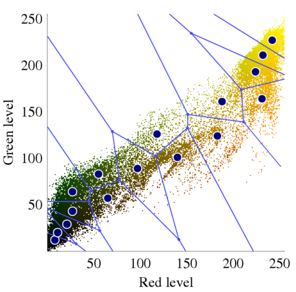
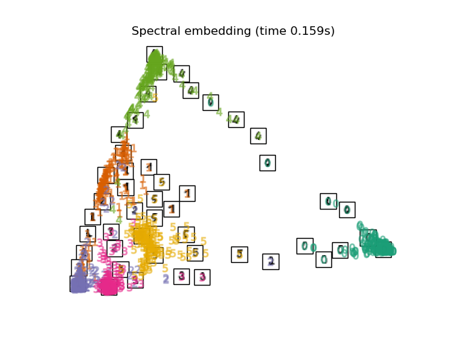
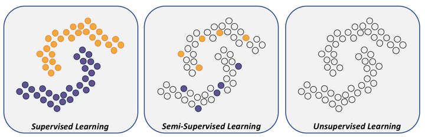
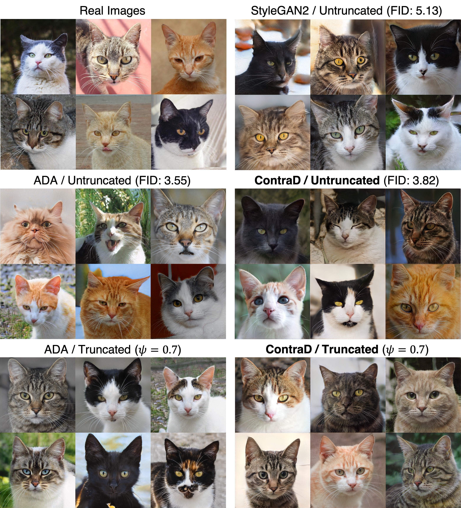

---
execute:
  echo: false
jupyter: mas2901
---

# Beyond Supervised Learning

This module primarily focuses on *supervised* learning, meaning that to each input $\mathbf{X}$ there is an associated *label* $\mathbf{Y}$ that provides information on the quality of the output from a machine learning model $f(\mathbf{X})$ via the loss function $L(\mathbf{Y},f(\mathbf{X}))$.
Supervised learning is mathematically well-defined and amenable to an advanced theoretical treatment; for strong postgraduate students we recommend the recent textbook of @bach2024learning.

However, there are other important tasks which cannot be cast as supervised learning, typically because one has no access to labels $\mathbf{Y}$ (*unsupervised* learning; @sec-unsupervised-learning) or partial access to labels (*semi-supervised* learning; @sec-semi-supervised-learning).
One of the most important and interesting unsupervised learning tasks is *generative modelling*, and we dedicate @sec-generative-modelling to an in-depth look at this task.

## Unsupervised Learning {#sec-unsupervised-learning}

Unsupervised learning refers to analysis of unlabelled data to identify patterns, structures, or relationships without any guidance or explicit instructions on the correct output. Instead of relying on predefined categories, the aim is to autonomously discover groupings or hidden structures within the data, often through techniques such as *clustering* (which we discuss here) or *dimensionality reduction* (which we discuss in @sec-dim-reduction). 

Clustering involves grouping a set of data points into *clusters*, such that data within the same cluster are more similar to each other than to data in different clusters. 
This technique is widely applied in areas such as genomics (to identify different genetic populations within a patient cohort), image analysis (to select an appropriate colour palette; cf. @exm-flower), and in commerce (to target advertising to consumers with similar profiles), where understanding the natural groupings of data can support decision-making and insight.

Suppose we have data $\{\mathbf{x}_i\}_{i=1}^n \subset \mathbb{R}^d$ that we wish to divide into $k$ different sub-groups, or *clusters*[^transformation-comment].

That is, to each datum $\mathbf{x}_i$ we seek to associated a label $y_i \in \{1,\dots,k\}$, such that data with the same label are more similar to each other compared to data with a different label.
As an example, we can consider the optimisation task
$$ 
 \argmin_{y_1,\dots,y_n} \; \sum_{i=1}^n \sum_{j=1}^n 1_{y_i = y_j} \|\mathbf{x}_i - \mathbf{x}_j\|^2 ,    
$${#eq-kmeans}
where the aim is to select labels $\{y_i\}_{i=1}^n$ for which the sum of squared distances between data in the same cluster is minimised[^kmeans-comment].

Unfortunately, this is a computationally hard optimisation when $n$ or $k$ are large, because the number of potential label assignments is $k^n$, meaning that an exhaustive search can be impractical.

A simple and popular heuristic algorithm for approximately solving @eq-kmeans is called *$k$-means*.
The basic idea is that each cluster is represented by a *centroid* $\mathbf{c}_i \in \mathbb{R}^d$, which is the mean location of the data within that cluster, and the location of the centroids are optimised, together with the cluster assignments, so that a surrogate loss function
$$ 
 L \equiv L(\{\mathbf{c}_i\}_{i=1}^k , \{y_j\}_{j=1}^n) = \sum_{j=1}^n \| \mathbf{x}_j - \mathbf{c}_{y_j} \|^2
$$
is approximately minimised.

Let's randomly initialise the centroids at some values $\{\mathbf{c}_i\}_{i=1}^k \subset \mathbb{R}^d$.
Then we perform **coordinate descent** on $L$; i.e., the following optimisation steps are iteratively performed:

1.  **Minimise $L$ with respect to $\{y_j\}_{j=1}^n$ while holding $\{\mathbf{c}_i\}_{i=1}^k$ fixed:**
    It is straightforward to see that this is achieved when each data point $\mathbf{x}_j$ is assigned to the nearest centroid:
    
    $$y_j \in \argmin_{i} \|\mathbf{x}_j - \mathbf{c}_i \|^2$$
    
    Here, $y_j$ is the index of the centroid to which data point $\mathbf{x}_j$ is assigned (if there is more than one nearest centroid, just pick one at random for the assignment).

2.  **Minimise $L$ with respect to $\{\mathbf{c}_i\}_{i=1}^k$ while holding $\{y_j\}_{j=1}^n$ fixed:**
    Since $L$ is a quadratic function of each $\mathbf{c}_i$, we can differentiate $L$ and solve for the unique stationary point:
    
    $$
    \begin{aligned}
        \frac{\partial L}{\partial \mathbf{c}_i} & = \frac{\partial}{\partial \mathbf{c}_i}  \sum_{j=1}^n \| \mathbf{x}_j - \mathbf{c}_{y_j} \|^2 \\
        & = \frac{\partial}{\partial \mathbf{c}_i}  \sum_{j=1}^n \mathbb{1}_{\{y_j = i\}} \| \mathbf{x}_j - \mathbf{c}_i \|^2 \\
        & =  \sum_{j=1}^n \mathbb{1}_{\{y_j = i\}} \frac{\partial}{\partial \mathbf{c}_i}  \| \mathbf{x}_j - \mathbf{c}_i \|^2 \\
        & =  \sum_{j=1}^n \mathbb{1}_{\{y_j = i\}}  [ - 2 (\mathbf{x}_j - \mathbf{c}_i) ] \\
        & = - 2 \sum_{j=1}^n \mathbb{1}_{\{y_j = i\}}  \mathbf{x}_j + 2 \sum_{j=1}^n \mathbb{1}_{\{y_j = i\}} \mathbf{c}_i 
    \end{aligned}
    $$
    
    and so
    
    $$\frac{\partial L}{\partial \mathbf{c}_i} = \mathbf{0} \implies \mathbf{c}_i = \frac{\sum_{j=1}^n \mathbb{1}_{\{y_j = i\}} \mathbf{x}_j}{\sum_{j=1}^n \mathbb{1}_{\{y_j = i\}}}$$
    
    i.e., $\mathbf{c}_i$ is taken to be the mean location of the data currently assigned to the $i$th cluster.
  
These two steps are repeated until the centroids no longer change significantly, or a predefined number of iterations is reached.
Once the algorithm has terminated, the final cluster assignments are reported.

:::{#exm-flower}
### Colour quantisation

In computer graphics, $k$-means clustering is frequently used for colour quantisation in image compression. 
By reducing the number of colours used to represent an image, file sizes can be significantly reduced without a noticeable loss of visual quality. 

For example, consider the image of a flower with millions of colours in the left panel of @fig-flower. 
By applying $k$-means clustering with $k = 16$  the image can be represented using a limited palette of only 16 colours, resulting in a compressed version that requires less storage space.

::: {#fig-flower layout-ncol=2}
{width="50%"}

{width="35%"}

An application of $k$-means clustering to identify $k = 16$ representative colours than can be used to compress the image of a flower in the left panel. (For illustrative purposes the blue colour channel has been removed.) The blue lines indicate the cluster boundaries; i.e. the locations that lie exactly half way between the two nearest centroids (blue circles). The regions circumscribed by the blue lines are called *Voronoi cells*. [[source](https://en.wikipedia.org/wiki/K-means_clustering)]
:::

It is worth emphasising that $k$-means clustering is not guaranteed to solve @eq-kmeans; it is sensitive to the initial placement of centroids and may result in different clusters for different initialisations. 
Therefore, it is often run multiple times with different initial seeds to find a stable solution. 

Additionally, the value of $k$ (the number of clusters) should be chosen carefully, and several heuristics have been developed.
This module will not discuss selecting $k$, but you can read about different strategies on [Wikipedia](https://en.wikipedia.org/wiki/Determining_the_number_of_clusters_in_a_data_set) if you are interested.

:::

## Semi-supervised Learning {#sec-semi-supervised-learning}

Suppose that we wish to undertake a supervised learning task (cf. @def-supervised-learning-task) but unfortunately only a small number of the labels $\mathbf{y}_i$ have been recorded in the training dataset.

This is called a **semi-supervised** learning task.
In an extreme case, suppose we with to perform binary classification (i.e. into two classes) of data based on their covariates $\{\mathbf{x}_i\}_{i=1}^n \subset \mathbb{R}^d$, but only *two* data have their true labels recorded.

> Can anything at all be achieved?

Surprisingly, the answer is sometimes "yes", and the key idea here is called the **manifold hypothesis**:

::: {#def-manifold-hyp}
### Manifold hypothesis
The **manifold hypothesis** suggests that possibly high-dimensional data $\{\mathbf{x}_i\}_{i=1}^n \subset \mathbb{R}^d$ can be effectively represented in a lower-dimensional space, most often a **smooth manifold** embedded in $\mathbb{R}^d$. 

:::

::: {#exm-manifold-hypothesis-images}
### Manifold hypothesis for image data

For example, images of handwritten digits (see @fig-mnist) may lie close to a low-dimensional manifold that captures most of the variations of those digits, despite their high-dimensional pixel representation; see @fig-manifold-hypothesis.

:::

::: {#fig-manifold-hypothesis layout-ncol=1}
{width="70%"}

An illustration of how images of hand-drawn digits can be mapped onto a lower-dimensional manifold without significant loss of information content.  
[[source](https://scikit-learn.org/stable/auto_examples/manifold/plot_lle_digits.html)]
:::

The unlabelled data are therefore *not* useless in cases where the manifold hypothesis holds; they can be leveraged to learn the manifold, reducing the dimension (and therefore the difficulty) of the learning task.
This is closely related to the concept of featurisation, discussed in @sec-data-featurisation.

::: {#exm-label-propagation}
### Label propagation for a binary classification task

@fig-spirals illustrates a setting in which we can perform binary classification when only a handful of labels are recorded in the training dataset.
The term *label propagation* is sometimes used to capture the idea that information from labelled data spreads to unlabelled data based on their proximity on the manifold.

:::

::: {#fig-spirals}
{width="70%"}

Illustrating supervised, semi-supervised, and unsupervised learning.  
[[source](https://teksands.ai/blog/semi-supervised-learning)]
:::

It is common to *assume* that the manifold hypothesis holds in tasks such as image classification, natural language processing and medical diagnosis, where data are typically high-dimensional.
In many real-world problems, data have a much lower *effective dimension* than their *notional dimension* (cf. @sec-dim-reduction), and modern machine learning models are often designed to discover and exploit this underlying low-dimensional manifold.

## Generative Modelling {#sec-generative-modelling}

One of the most important tasks in unsupervised learning is **generative modelling**; given a dataset $\{\mathbf{x}_i\}_{i=1}^n \subset \mathbb{R}^d$ we seek a probability distribution $P \in \mathcal{P}(\mathbb{R}^d)$ for which (a) the $\mathbf{x}_i$ "look like typical samples" from $P$, and (b) further "new" samples can be generated from $P$, which are distinct from those $\mathbf{x}_i$ in the dataset.
Of course, you have seen this task already in MAS2901 or MAS8601 when you used a method like maximum likelihood to fit a statistical model (e.g. a normal distribution) to a given dataset.

The main distinction between classical statistical modelling and generative modelling in machine learning is the complexity of the dataset; for example, each $\mathbf{x}_i$ could represent the image of a cat, and we want to learn a probability distribution $P$ for which "typical" samples from $P$ look like cats; a normal distribution is clearly going to be inadequate for this task.
This poses two main challenges to "traditional" statistical modelling; we cannot expect to write down a suitable statistical model by hand, and even if we could then it may not make sense to train such a model using maximum likelihood:

::: {#rem-fail-ml}
### Failure of maximum likelihood under the manifold hypothesis []{.advanced title="MAS8607 Content"} 

Suppose we are in a setting where data $\{\mathbf{x}_i\}_{i=1}^n$ lie on a lower-dimensional manifold $M \subset \mathbb{R}^d$ (for example, $M$ is the manifold of images of cats, a subspace of the space of all images; see @def-manifold-hyp).
Suppose further that we have a “good” parametric statistical model $P_{\boldsymbol{\theta}}$ that is aware of the manifold; that is, the density $p_{\boldsymbol{\theta}}(\mathbf{x})$ is zero for $\mathbf{x} \in \mathbb{R}^d \setminus M$ (we say that $P_{\boldsymbol{\theta}}$ is *supported* on $M$).
Then the density $p_{\boldsymbol{\theta}}(\cdot)$ must necessarily take the value $\infty$ on $M$, meaning that the maximum likelihood estimator is not well defined[^failure-of-mle-note].

:::

Despite the apparent challenges of generative modelling, we now have machine learning models and ways to train them that can perform astonishingly well at this task; see @fig-gan.
In this section we are going to learn more about modern generative models (@sec-generative-models) and how they are trained (@sec-training-generative-models).

::: {#fig-gan}
{width="80%"}

Illustrating a generative model. [[source](https://arxiv.org/abs/2103.09742)]
:::

### Generative Models {#sec-generative-models}

A natural first question is:

> What sort of model could we write down that has the capacity to generate realistic samples? 

One can keep in mind image data as motivation, but the concept of a generative model is general. As such, we distinguish at a high level between the two main approaches:

::: {#def-simulation-based-models}
### Simulation-based models

Recall that sometimes it is easier to reason with random variables than with probability distributions (cf. @recap-probabilistic-calculus).
To this end, let $f_{\boldsymbol{\theta}} : \mathbb{R}^c \rightarrow \mathbb{R}^d$ be a parametric function and define a random variable by
$$
\mathbf{X} = f_{\boldsymbol{\theta}}(\mathbf{Z}),
$$
where $\mathbf{Z}$ is a simple random variable that can be easily sampled, such as
$$
\mathbf{Z} \sim \mathcal{N}(\mathbf{0}, \mathbf{I}).
$$
The distribution of $\mathbf{X}$ then defines a generative model $P_{\boldsymbol{\theta}}$, parametrised by $\boldsymbol{\theta}$.
For obvious reasons, such a generative model is called *simulation-based*.

:::

::: {#def-energy-based-models}
### Energy-based models

Alternatively, we may proceed based on densities and define the density of our generative model $P_{\boldsymbol{\theta}}$ as
$$
p_{\boldsymbol{\theta}}(\mathbf{x})
\propto
\exp\!\big(- f_{\boldsymbol{\theta}}(\mathbf{x})\big),
$$
for some function $f_{\boldsymbol{\theta}} : \mathbb{R}^d \rightarrow \mathbb{R}$, which again could be a neural network.
Such a generative model is called *energy-based* because of an analogy from physics, in which $P_{\boldsymbol{\theta}}$ is viewed as a *Gibbs measure* and $f_{\boldsymbol{\theta}}(\mathbf{x})$ corresponds to the *energy* of the configuration $\mathbf{x} \in \mathbb{R}^d$.

:::

Simulation-based models are easy to sample from by design, but depending on $f_{\bm{\theta}}$ it can be hard to compute quantities relating to the density function of the model, for example as you would need for maximum likelihood.
On the other hand, energy-based models provide direct access to the density function by design (up to a normalisation constant), but it can require complicated numerical methods to sample from the model (such as Markov chain Monte Carlo, which you may have met in MAS3929 or MAS8600).

In either case, the expressive capacity of the generative model depends on the expressive capacity of the function $f_{\bm{\theta}}$; for challenging applications $f_{\bm{\theta}}$ may need to be extremely flexible, for the example in @fig-gan the function $f_{\bm{\theta}}$ was a deep neural network.

### Training Generative Models {#sec-training-generative-models}

#### Adversarial Training {#sec-adversarial-training}

Simulation-based models are conveniently designed for generating samples, but do not provide explicit access to the density function $p_{\boldsymbol{\theta}}$ (or derived quantities, such as its gradient).
As such, ideas such as maximum likelihood cannot easily be implemented, irrespective of how well these methods for training may work (cf. @rem-fail-ml).
Instead, to guide the selection of the model parameters $\boldsymbol{\theta}$, we need another way to judge whether samples $\mathbf{X}$ from the model $P_{\boldsymbol{\theta}}$ are “similar” or not to those of the training dataset $\{\mathbf{x}_i\}_{i=1}^n$.
How are we going to achieve this?

Taking image data as an example, it does not make sense to compare $\mathbf{X}$ and $\mathbf{x}_i$ through Euclidean distance $\lVert \mathbf{X} - \mathbf{x}_i \rVert$ because we do not expect our artificially generated image $\mathbf{X}$ to be similar pixel-by-pixel to an image $\mathbf{x}_i$ in the training dataset.
(If it were, we would have simply *memorised* the training dataset, which is not in the spirit of fitting a generative model.)
What makes a cat picture a cat picture is not the pixel-by-pixel information content; it is the appearance of fur, whiskers, and the general air of disdain. How can we capture these aspects of $\mathbf{X}$?

The solution is to recall the concept of *featurisation*.
Consider a feature map (cf. @def-feature-space)
$$
\boldsymbol{\phi}(\mathbf{x})
=
\begin{bmatrix}
\phi_1(\mathbf{x}) \\
\vdots \\
\phi_p(\mathbf{x})
\end{bmatrix}
$$
and the associated *discrepancy*
$$
D_{\boldsymbol{\phi}}(P_{\boldsymbol{\theta}})
=
\left\|
\int
\boldsymbol{\phi}(\mathbf{x})\, p_{\boldsymbol{\theta}}(\mathbf{x}) \, \mathrm{d}\mathbf{x}
-
\frac{1}{n}\sum_{i=1}^n \boldsymbol{\phi}(\mathbf{x}_i)
\right\|.
$${#eq-discrepancy}

If we were able to find features $\phi_1, \dots, \phi_p$ that codify the “essence” of cats, then we could seek the parameter values $\boldsymbol{\theta}$ for which the discrepancy $D_{\boldsymbol{\phi}}(P_{\boldsymbol{\theta}})$ is minimised.
That is, we could ensure that the samples $\mathbf{X}$ from our generative model $P_{\boldsymbol{\theta}}$ most closely resemble the dataset in the respects that count.

For example, if $\phi_1(\mathbf{x})$ is whisker length and $\phi_2(\mathbf{x})$ is squared whisker length, then minimising $D_{\boldsymbol{\phi}}(P_{\boldsymbol{\theta}})$ would amount to matching the first and second moment (equivalently, mean and variance) of whisker length between our generative model and the dataset.
But how could we hope to find features that are so specifically engineered to capture the relevant aspects of the dataset?

The key, as we have already seen (cf. @sec-featurisation), is to use *data-driven* features, and one way to do this is to select features *adversarially*:
$$
D_{\Phi}(P_{\boldsymbol{\theta}})
=
\sup_{\boldsymbol{\phi} \in \Phi}
D_{\boldsymbol{\phi}}(P_{\boldsymbol{\theta}}).
$${#eq-gan}

Here the supremum is taken over some appropriate set $\Phi$ of possible feature functions $\boldsymbol{\phi}$.

We can interpret @eq-gan as a two-player game:

Player 1 simulates artificial samples from their model $P_{\boldsymbol{\theta}}$, and Player 2 has to pick features $\boldsymbol{\phi}$ that will help them to detect which samples are artificial and which are real.
Typically we do not want to employ a human to act as Player 2, so a natural idea is to replace Player 2 by a classifier whose feature map $\boldsymbol{\phi}$ can be trained to maximally distinguish between the artificial and real samples; for example, $\boldsymbol{\phi}$ can be a deep neural network[^adversarial-training-note].

The resulting framework for training simulation-based models is called a *generative adversarial network* (or **GAN**).
Until around 2020, generative adversarial networks were among the state of the art for generating realistic images; the example in @fig-gan was produced in this way in 2021.
However, a step change in generative model performance occurred around 2020, and the state of the art are now (extensions of) energy-based models, as we will discuss next.

::: {#rem-adversarial-power}
### The power of adversarial training

Adversarial training of a machine learning model is a powerful idea that enables simpler or pre-trained machine learning models to assist with the training of more sophisticated machine learning models.

For example, although [AlphaGo @exm-alphago] was initially trained on historical game data, it was honed and refined by playing millions of games against itself.

:::

#### Score Matching[]{.advanced title="MAS8607 Content"}  {#sec-score-matching}

The challenge of working with energy-based models $p_{\bm{\theta}}(\mathbf{x}) \propto \exp( - f_{\bm{\theta}}(\mathbf{x}) )$ is that the normalisation constant
$$
\begin{align*}
    Z_{\bm{\theta}} = \int \exp( - f_{\bm{\theta}}(\mathbf{x}) ) \mathrm{d} \mathbf{x}
\end{align*}
$$
is in general an analytically intractable integral.
This is a real problem; if we wanted to find the parameters $\bm{\theta}$ that maximise the likelihood we cannot simply find the $\bm{\theta}$ that maximises 
$$
\bm{\theta} \mapsto \prod_{i=1}^n \exp( - f_{\bm{\theta}}(\mathbf{x}_i))
$$ 
because there is also a $\bm{\theta}$ dependence in the neglected normalisation constant.
However, there is a clever way to circumvent working directly with this normalising constant, which is to notice that its *Stein score* can be computed without the normalising constant:

::: {.definition #def-stein-score}
### Stein score

Let $P$ be a probability distribution with density $p$ on $\mathbb{R}^d$. The **Stein score** of $P$ is
$$
s_P(\mathbf{x}) = (\nabla \log p)(\mathbf{x})
$$
where here $\nabla$ denotes the gradient with respect to the $\mathbf{x}$ argument.

:::

The Stein score is names after Charles Stein (1920-2016), who popularised the use of the Stein score as a theoretical tool (initially for proving central limit theorems) in the 1970s; computational and machine learning applications of the Stein score are a more recent development.
For an energy-based model $P_{\bm{\theta}}$ the Stein score is
$$ 
 s_{P_{\bm{\theta}}}(\mathbf{x}) =  (\nabla \log p)(\mathbf{x}) = \nabla_{\mathbf{x}} \{ - f_{\bm{\theta}}(\mathbf{x}) - \log Z_{\bm{\theta}} \} = - \nabla_{\mathbf{x}} f_{\bm{\theta}}(\mathbf{x})   
$${#eq-energy-stein-score}
which can be computed without access to the intractable normalising constant $Z_{\bm{\theta}}$.
Critically, a Stein score $s_P$ fully characterises the associated distribution $P$:

:::{#prp-stein-score}
Let $P$ and $Q$ have Stein scores $s_P$ and $s_Q$.
Then $s_P$ and $s_Q$ are everywhere equal if and only if $P$ and $Q$ are equal.
:::

::: {#prf-pc}
#### Not Examinable

The equality of Stein scores is equivalent to the constancy of the ratio of the densities $p$ and $q$ for $P$ and $Q$, since 
$$
s_P(\mathbf{x}) - s_Q(\mathbf{x}) = \nabla_{\mathbf{x}} \log \left( \frac{p(\mathbf{x})}{q(\mathbf{x})} \right) .
$$ 
Further, the ratio $p/q$ is constant if and only if $p$ and $q$ are equal, since $p/q = C$ if and only if $p(\mathbf{x}) = C q(\mathbf{x})$ for all $\mathbf{x}$, and since both $p$ and $q$ integrate to $1$ this situation can only occur when $C = 1$.

:::

@prp-stein-score suggests a convenient approach to training an energy-based model $P_{\bm{\theta}}$; we can try to "match" the Stein score of $P_{\bm{\theta}}$ to the Stein score of the true data-generating distribution.
However, we do not have access to the Stein score of the data-generating distribution, we only have a training dataset $\{\mathbf{x}_i\}_{i=1}^n$ consisting of samples from it.

> How then can we proceed?

The solution is essentially a clever application of integration-by-parts[^recap-note], due to @hyvarinen2005estimation. 

:::{#prp-manip-stein-score}
### Manipulating the Stein score[]{.advanced title="Non-Examinable content"} 

Let $P$ and $Q$ be distributions on $\mathbb{R}^d$ with densities $p$ and $q$, respectively.
Assuming $q(\mathbf{x}) (\nabla \log p)(\mathbf{x})$ vanishes (uniformly) as $\|\mathbf{x}\| \rightarrow \infty$,
$$ 
 \int \| s_P(\mathbf{x}) - s_Q(\mathbf{x}) \|^2 \mathrm{d}Q(\mathbf{x}) = \int \|(\nabla \log p)(\mathbf{x})\|^2 + 2 (\Delta \log p)(\mathbf{x}) \; \mathrm{d}Q(\mathbf{x}) + C_Q   
$${#eq-hyvarinen}
where $C_Q$ depends on $Q$ but not on $P$.

:::

:::{#prf-manip-stein-score}
### Not Examinable

From the *divergence theorem* (i.e. multivariate integration-by-parts; see e.g. MSP2801),
$$
\begin{align*}
    \int \langle \nabla \log p , \nabla \log q \rangle \; \mathrm{d}Q & = \int \left\langle (\nabla \log p)(\mathbf{x}) , \frac{(\nabla q)(\mathbf{x})}{q(\mathbf{x})} \right\rangle \; q(\mathbf{x}) \; \mathrm{d}\mathbf{x} \\
    & = \int \langle (\nabla \log p)(\mathbf{x}) , (\nabla q)(\mathbf{x}) \rangle \; \mathrm{d}\mathbf{x} \\
    & = \int q(\mathbf{x}) (\Delta \log p)(\mathbf{x}) \; \mathrm{d}\mathbf{x} \\
    & = \int (\Delta \log p)(\mathbf{x}) \; \mathrm{d}Q(\mathbf{x})
\end{align*}
$$
where the boundary term that appears in integration-by-parts vanishes since we assumed $q(\mathbf{x}) (\nabla \log p)(\mathbf{x}) \rightarrow \mathbf{0}$ uniformly as $\|\mathbf{x}\| \rightarrow \infty$.
Thus
$$
\begin{align*}
    \int \| s_P(\mathbf{x}) - s_Q(\mathbf{x}) \|^2 \mathrm{d}Q(\mathbf{x}) & = \int \underbrace{ \langle \nabla \log p , \nabla \log p \rangle }_{\|(\nabla \log p)(\mathbf{x})\|^2} - 2 \langle \nabla \log p , \nabla \log q \rangle + \underbrace{ \langle \nabla \log q , \nabla \log q \rangle }_{\text{independent of $P$}} \; \mathrm{d}Q \\
    & = \int \|(\nabla \log p)(\mathbf{x})\|^2 + 2 (\Delta \log p)(\mathbf{x}) \; \mathrm{d}Q(\mathbf{x}) + C_Q
\end{align*}
$$
as required.

:::

That is, we *can* indeed train our energy-based model by matching Stein scores, and we do this by minimising the right hand side of @eq-hyvarinen from @prp-manip-stein-score where $P$ is $P_{\bm{\theta}}$ and where $Q$ is replaced by the empirical distribution of the dataset:

:::{#def-score-matching}
### Score matching
Given a dataset $\{\mathbf{x}_i\}_{i=1}^n$ and a generative model $P_{\bm{\theta}}$, the *score matching* estimator is
$$ 
 \argmin_{\bm{\theta} \in \Theta} \quad \frac{1}{n} \sum_{i=1}^n \|(\nabla \log p_{\bm{\theta}})(\mathbf{x}_i)\|^2 + 2 (\Delta \log p_{\bm{\theta}})(\mathbf{x}_i)   
$${#eq-score-matching-obj}

:::

The quantities appearing in @def-score-matching can indeed be calculated for energy-based models, due to @eq-energy-stein-score.
Score matching and maximum likelihood estimation happen to yield the same result when training a normal generative model (cf. @q-score-matching-ml), but in general these objectives can be different.

Score matching has been around since at least @hyvarinen2005estimation, and has been widely used in statistics to circumvent intractable normalisation constants $Z_{\bm{\theta}}$.

However, the optimisation landscape for score matching in @eq-score-matching-obj can be difficult to navigate, and this limited its potential.

A breakthrough occurred around 2020, when @ho2020denoising and @songdenoising had the idea of constructing a sequence of relaxed optimisation problems, where one first solves an easier problem and leverages the solution to inform the next problem in the sequence, eventually enabling the original problem to be solved:

:::{#exm-denoising-diffusions}
### Denoising diffusions[]{.advanced title="Non-Examinable content"}

Let $P_0$ be the distribution from which the dataset $\{\mathbf{x}_i\}_{i=1}^n$ are considered to have been sampled.
Construct a sequence $(P_t)_{t > 0}$ of probability distributions, such that if $\mathbf{X}_t \sim P_t$ and $\mathbf{Z} \sim \mathcal{N}(\mathbf{0},\mathbf{I})$, then $\mathbf{X}_t + (s-t) \mathbf{Z} \sim P_s$ for all $s \geq t$ (one can interpret such a construction as a *diffusion process*, but we do not need this detail).
Each $P_t$ can be regarded as a *noisy* version of the data-generating distribution, where we have taken the original data points $\mathbf{x}_i$ and added independent Gaussian noise; see @fig-denosing-diffusion.

For large $t$, say $t = T$, the distribution $P_T$ will be approximately equal to $\mathcal{N}(\mathbf{0},T\mathbf{I})$ and the associated Stein score will be approximately $- \mathbf{x} / T$, which can be easily matched using e.g. a linear model.
The crucial observation is that the Stein score function of $P_s$ is easier to match compared to the Stein score function of $P_t$ whenever $s \geq t$.
Thus we can start by matching the Stein score for $P_T$ and gradually work backward until we have an accurate approximation to the Stein score of $P_0$.
This idea has become known as *denoising*, referring to working backward from the noisy $P_T$ to the noiseless $P_0$.
Using this approach, score matching can achieve state-of-the-art performance in complex generative modelling tasks.
A prominent example of denoising diffusions is *Stable Diffusion*, which attracted much attention when it was publicly released by Stability AI in 2022.

:::

]](figures/diffusion.png){#fig-denosing-diffusion width=70%}

[^transformation-comment]:
    If data are not real vector-valued, we can proceed by first *embedding* the data into $\mathbb{R}^d$ using an appropriate transformation $\phi(\mathbf{x}_i) \in \mathbb{R}^d$.

[^kmeans-comment]:
    To avoid a trivial solution in @eq-kmeans we would need to insist on having at least one data point in each cluster.

[^recap-note]:
    Recall that $\Delta = \nabla \cdot \nabla$ denotes the Laplacian @rem-calculus-notation. Recall also that $\int \cdots \mathrm{d}Q$ denotes expectation with respect to $Q$; @recap-notation-expectation.

[^failure-of-mle-note]:
    The mathematical explanation for this requires measure theory, but intuitively $M$ has “size” zero in $\mathbb{R}^d$, and so the only way for the statistical model to assign unit probability mass is for $p_{\boldsymbol{\theta}}$ to take infinite values on $M$.

[^adversarial-training-note]:
    We can also replace the discrepancy in @eq-discrepancy with a measure of classification error and directly optimise that.